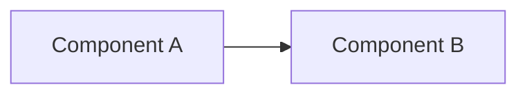

# NNNN. <Title>

- Status: proposed
- Date: YYYY-MM-DD

## Context and Problem Statement

<Что вынудило принимать решение. Какая проблема, какие ограничения, что уже пробовали.>

## Considered Options

- Option A — <короткое описание>
- Option B — <короткое описание>
- Option C — do nothing / отложить

## Decision Outcome

Chosen option: **"<Option X>"**, because <обоснование в 1-3 предложения>.

### Consequences

- Good: <что станет лучше>
- Bad: <что станет хуже / какие риски принимаем>
- Neutral: <что просто меняется>

## Diagram

<Опционально, но рекомендуется для архитектурных ADR. Только Mermaid.>

## Links

- <ссылка на PR/issue/обсуждение, если есть>
- <ссылка на смежные ADR>
