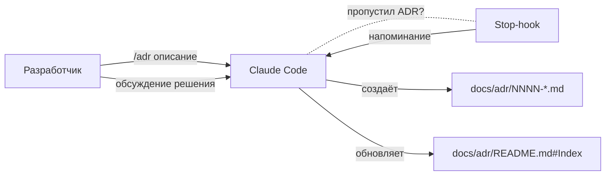

# 0001. Record architecture decisions

- Status: accepted
- Date: 2026-05-02

## Context and Problem Statement

Проект log-viewer на старте: впереди много архитектурных развилок (state management, парсер логов, схема хранения, стриминг, виртуализация и т.д.). Без явной фиксации причин выбора через несколько месяцев будет невозможно понять «почему так», и любая попытка отрефакторить упрётся в потерянный контекст.

Нужен лёгкий, текстовый, версионируемый формат — чтобы решения жили рядом с кодом и проходили через PR-ревью.

## Considered Options

- **MADR (Markdown Any Decision Records)** — современный markdown-формат, разделы Status / Context / Considered Options / Decision Outcome / Consequences. Поддерживает диаграммы Mermaid из коробки markdown'а.
- **Nygard ADR** — оригинальный шаблон Майкла Найгарда: Title / Status / Context / Decision / Consequences. Чуть проще, но без раздела «Considered Options» — теряется обоснование выбора между альтернативами.
- **Внешняя wiki/Notion** — гибче, но отрывается от кода и не проходит code review.
- **Не вести ADR вообще** — самый дешёвый старт, но именно та проблема, которую мы и решаем.

## Decision Outcome

Chosen option: **"MADR"**, because разделы «Considered Options» и явные «Consequences» помогают зафиксировать обоснование, а не только сам факт выбора. Хранится в `docs/adr/` рядом с кодом, проходит обычный PR-ревью.

Дополнительно:

- Каталог: **`docs/adr/`** (строчная `d`, конвенция Node/JS).
- Шаблон: [0000-template.md](0000-template.md).
- Гайд для разработчиков: [README.md](README.md).
- Создание автоматизировано через слэш-команду `/adr` в Claude Code.
- Stop-hook напоминает, если архитектурное решение принято в разговоре, но ADR не создан.
- Любые диаграммы в ADR и `docs/**` — только Mermaid (версионируется как текст, рендерится на GitHub).

### Consequences

- Good: Решения переживают ротацию людей и контекст не теряется. PR-ревью видит и код, и обоснование одновременно.
- Good: Mermaid-only позволяет ревьюить диаграммы как обычный текст и не плодить бинарные ассеты.
- Bad: Лёгкий накладной расход на создание ADR. Митигация — `/adr` делает это в одну команду.
- Neutral: Появляется новая зависимость инфраструктуры — `jq` для Stop-hook'а (см. CLAUDE.md → Tooling).

## Diagram

## Links

- [docs/adr/README.md](README.md) — гайд по работе с ADR в проекте.
- [.claude/commands/adr.md](../../.claude/commands/adr.md) — реализация слэш-команды.
- [.claude/hooks/adr-reminder.sh](../../.claude/hooks/adr-reminder.sh) — Stop-hook.
- [MADR](https://adr.github.io/madr/) — спецификация формата.
