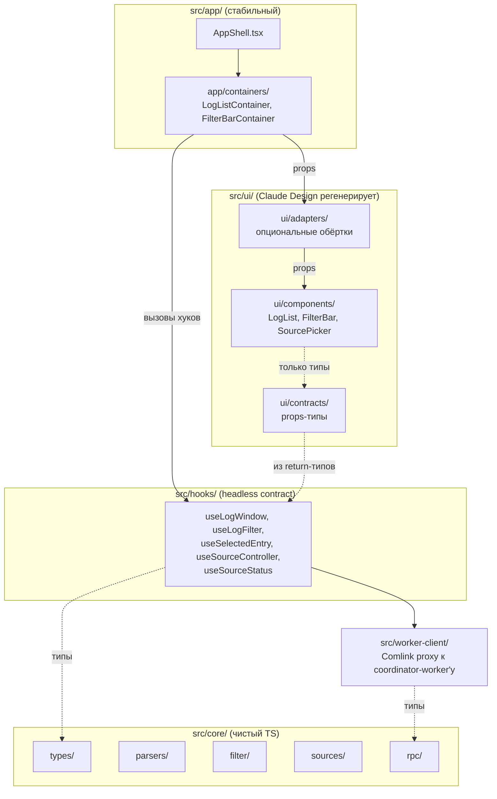

# 0002. Headless architecture: core / hooks / ui / app, container-dumb split

- Status: accepted
- Date: 2026-05-02

## Context and Problem Statement

UI-слой проекта планируется генерировать через Claude Design — внешний инструмент, эмитящий TSX-компоненты. Эти компоненты будут перегенерироваться многократно по мере итераций над дизайном. Если поведение (парсинг, фильтрация, состояние, источники) перемешать с презентацией, каждая регенерация UI потребует переноса/восстановления логики — это убивает экономику использования Claude Design.

Нужна архитектура, в которой:
- Логика и презентация физически разнесены и связаны через **стабильный TS-контракт**.
- При регенерации UI диффы локальны: только в `ui/components/`. Хуки, ядро, оркестрация worker'ов не трогаются.
- Контракт явный и проверяется компилятором — мисматч ловится при сборке, а не в рантайме.

Ограничения:
- Стек уже зафиксирован: React 19 + TypeScript + Vite 8 ([CLAUDE.md](../../CLAUDE.md)).
- Логика крупная — будет жить в worker'ах (см. [ADR-0003](0003-worker-centric-topology.md)), но связь с React-слоем и контракт UI обсуждаются здесь.

## Considered Options

- **Headless с container/dumb split** — `core/` (чистый TS) + `hooks/` (тонкий React-glue) + `ui/components/` (только props) + `app/containers/` (единственный шов хуков и UI).
- **Compound components / hooks-в-презентационном** — UI-компоненты сами вызывают `useFilteredEntries` и т.п. Меньше файлов, но Claude Design эмитит JSX без знания о хуках, и каждая регенерация рискует потерять/переименовать вызовы.
- **MVVM с ViewModel-классами на компонент** — сильная типизация, но избыточно для React-приложения и не даёт никакого выигрыша поверх хуков.
- **Атомарный/реактивный фреймворк (jotai/Recoil) как контракт** — UI подписывается на атомы. Проблема: Claude Design не знает имена атомов — связь снова неявная.

## Decision Outcome

Chosen option: **«Headless с container/dumb split»**, потому что это единственный вариант, где регенерируемый UI остаётся чистой функцией от props, а контракт фиксируется TypeScript-интерфейсами хуков и проверяется компилятором при каждом билде.

### Слои и правила импорта

| Слой              | Что внутри                                                                                  | Что НЕ может импортировать                |
|-------------------|----------------------------------------------------------------------------------------------|--------------------------------------------|
| `src/core/`       | Доменные типы, парсеры, фильтр, source-адаптеры, RPC-контракты. Чистый TS.                    | `react`, `hooks`, `ui`, `app`, worker-API |
| `src/workers/*/`  | Worker-реализации (см. [ADR-0003](0003-worker-centric-topology.md)).                         | `react`, DOM main-thread, `ui`            |
| `src/worker-client/` | Main-thread прокси к coordinator-worker'у.                                                | —                                          |
| `src/hooks/`      | React-glue. Возвращаемые типы — это и есть **headless contract**.                            | `ui`                                       |
| `src/ui/components/` | Презентационные компоненты. Регенерируются Claude Design. Только props.                  | `hooks`, `core`, `workers`                |
| `src/ui/adapters/`   | Тонкие обёртки, мостящие props контракта в форму, которую сгенерил Claude Design.        | то же, что `ui/components/`               |
| `src/app/containers/` | **Единственный шов**: containers вызывают хуки и рендерят `ui/components/`.             | —                                          |

Правила импорта планируем закрепить ESLint `no-restricted-imports` на этапе стабилизации (см. план реализации, шаг 22).

### Headless contract

Контракт между логикой и UI — return-типы хуков. Они стабильны между регенерациями UI. Ключевые хуки:

- `useLogWindow` → `{ totalCount, getRow(i), setVisibleRange(from,to), version, isLoading }` — для виртуализированного списка.
- `useLogFilter` → `{ filter, setFilter, resetFilter }`.
- `useSelectedEntry` → `{ selected, selectedId, select(id) }`.
- `useSourceController` → `{ addFile, addDirectory, addText, addUrl, addStream, remove, reIndex }`.
- `useSourceStatus` → `{ sources }`.

Расширение контракта = новый хук, **не** расширение return-типа существующего.

### Container/dumb split

Containers (в `app/containers/`) — единственное место, где хуки встречают UI:

```tsx
export function LogListContainer() {
  const { getRow, totalCount, setVisibleRange, version } = useLogWindow();
  const { selectedId, select } = useSelectedEntry();
  return <LogList totalCount={totalCount} getRow={getRow}
                  onVisibleRangeChange={setVisibleRange}
                  selectedId={selectedId} onSelect={select} key={version} />;
}
```

Презентационные компоненты — чистые от хуков, кроме локального UI-state (`useRef`, открыт/закрыт, фокус и т.п.).

### Adapter-слой для несовпадающих props

Если Claude Design эмитит компонент с `items` вместо `entries` или `onClick` вместо `onSelect` — добавляем тонкую обёртку в `ui/adapters/`, **не правим сгенерированный файл** (он будет регенерироваться). Containers всегда импортируют через `ui/adapters/`. Если шейпы совпадают — adapter = re-export.

Если adapter растёт за ~30 строк — переделываем промпт под контракт, не лечим обёрткой.

### Consequences

- Good: регенерация UI требует руками только опционального адаптера. `git diff hooks/ core/ workers/ app/containers/` после регенерации — пусто. Это и есть критерий успеха архитектуры.
- Good: ядро и worker'ы юнит-тестируются изолированно (см. план реализации, §11). UI намеренно не покрывается юнит-тестами — регенерация инвалидировала бы их.
- Good: layering легко проверить ESLint-правилом — нарушения видны на CI, а не на ревью.
- Bad: больше файлов на каждый UI-регион (container + dumb + опционально adapter). Для ~6–10 компонентов — терпимо, окупается каждой регенерацией.
- Bad: **hook signature creep** — каждое расширение return-типа существующего хука = breaking change для UI. Нужна дисциплина: добавлять новый хук, не расширять старый.
- Neutral: появляется новая папка `ui/adapters/` и `ui/contracts/` — лёгкая когнитивная нагрузка на нового контрибьютора, лечится README в `ui/`.

## Diagram



## Links

- [docs/plans/headless-worker-architecture.md](../plans/headless-worker-architecture.md) — план внедрения, секции §2, §6, §9, §10.
- [ADR-0003](0003-worker-centric-topology.md) — топология worker'ов, к которой обращаются хуки.
- [ADR-0007](0007-state-management-zustand.md) — реализация хука-контракта поверх ядра.
