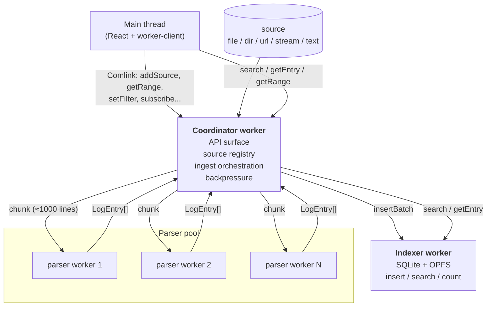

# 0003. Worker-centric topology: coordinator + parser pool + indexer

- Status: accepted
- Date: 2026-05-02

## Context and Problem Statement

PWA log-viewer должен переваривать файлы в сотни МБ (потенциально >1М записей), индексировать их в БД и держать UI-поток отзывчивым во время этого. Также планируются стрим-источники (WebSocket/SSE), генерирующие тысячи записей/сек. Парсинг и SQLite/FTS5-индексация — CPU-bound операции, выполнение их в main thread заморозит UI.

Web Workers — единственный браузерный примитив для off-main-thread compute. Вопрос: как разнести роли между worker'ами и через какой контракт связать их с приложением.

Ограничения:
- OPFS (Origin Private File System), нужный для SQLite-персистентности (см. [ADR-0005](0005-sqlite-fts5-opfs-index.md)), доступен **только из dedicated worker'ов** — main thread напрямую с ним работать не может.
- SQLite — single-writer; параллельная запись из нескольких worker'ов небезопасна.
- Хочется минимизировать поверхность API на главном потоке: чем меньше API-точек, тем стабильнее контракт для headless-архитектуры (см. [ADR-0002](0002-headless-architecture.md)).

## Considered Options

- **Coordinator + parser pool + indexer worker (предлагаемая)** — один worker-«фасад» (coordinator), к которому обращается приложение; пул parser-worker'ов для CPU-bound разбора чанков; отдельный indexer-worker, владеющий SQLite/OPFS.
- **Один монолитный worker** — вся логика в одном worker'е. Просто, но парсинг блокирует операции БД, теряется параллелизм CPU.
- **Прямые worker'ы из main thread без coordinator'а** — main создаёт parser-pool и indexer напрямую. Минус: главный поток теперь оркестрирует pipeline, держит state, обрабатывает backpressure. Это как раз то, что мы выносим в worker'ы.
- **SharedWorker** для shared state между вкладками — добавляет сложность (versioning, lifecycle), а кросс-табовая работа всё равно требует Web Locks для безопасности SQLite. Откладывается, см. план §«Дополнительно J».

## Decision Outcome

Chosen option: **«Coordinator + parser pool + indexer worker»**.

- **Coordinator worker** — единственная точка контакта приложения с worker-стороной. Главный поток видит ровно один Comlink-прокси (см. [ADR-0004](0004-comlink-rpc-with-custom-pool.md)). Внутри: реестр источников, in-flight задач, оркестрация pipeline (source → chunks → parser-pool → indexer), backpressure.
- **Parser pool** — N одинаковых worker'ов, `N = Math.min(navigator.hardwareConcurrency - 1, 4)`. Coordinator round-robin'ом раздаёт чанки строк. Парсинг идёт параллельно, индексация — последовательно (single-writer).
- **Indexer worker** — владеет SQLite-БД в OPFS. Все операции (insert/search/count/getEntry) проходят через него. На MVP — последовательное обслуживание; разделение read/write на отдельные worker'ы — после MVP, если понадобится.
- **Stream-источники (WS/SSE)** живут в coordinator'е: I/O-bound, не имеет смысла отдельный worker. Парсинг полученных строк всё равно отгружается в pool.

### Pipeline

```
adapter.open()                   ← coordinator открывает источник
  → ReadableStream<string>
  → LineSplitter (TransformStream<string,string>, разделитель \n + remainder)
  → Chunker (1000 lines или 100 ms)
  → parser-pool.parse(chunk)     ← round-robin по N worker'ам, параллельно
  → entries: LogEntry[]
  → indexer.insertBatch(entries)
  → emit progress подписчикам
```

Backpressure: ограниченная очередь pending-batches в coordinator'е (default 8). Если indexer не успевает — coordinator приостанавливает чтение source-stream через `ReadableStreamDefaultReader.read()` (естественный pull). Для стримов с drop-oldest политикой — отбрасываем старые чанки.

### Consequences

- Good: главный поток видит один API. Контракт стабилен, легко мокать в тестах, легко расширять (новый источник = новая ветка в `addSource`, не новый worker).
- Good: парсинг параллелится на N ядер; UI остаётся отзывчивым на файлах в сотни МБ.
- Good: indexer изолирован → SQLite single-writer соблюдён без блокировок и lock-ов.
- Bad: больше worker'ов = выше «холодный старт» (загрузка JS-чанков N+2 worker'ов). Митигация: lazy-init parser pool при первом источнике; indexer — при первом обращении.
- Bad: каждое сообщение через границу worker'а — postMessage с serialization. Митигация: батчирование (1000 entries/чанк), а на hot-path при необходимости — hand-rolled batched messages (см. план §7).
- Bad: отладка распределённого pipeline сложнее одного потока. Митигация — diag-logger с проксированием в main (см. план §«Дополнительно E»).
- Neutral: добавляется слой `worker-client/` на главном потоке — чисто инфраструктурный.

### Open follow-ups

- Read/write разделение в indexer'е — отдельный read-only worker, если main-thread search'и начнут конкурировать с inserts. Не нужно на MVP.
- Хочется ли выделять отдельный `stream-worker` для WS/SSE? Сейчас нет; ревизия — если найдём I/O-конкуренцию.
- Cross-tab safety — пока через `<SingleTabGuard />` + `BroadcastChannel`; полноценный leader election на `Web Locks API` — после MVP (план §«Дополнительно J»).

## Diagram



## Links

- [docs/plans/headless-worker-architecture.md](../plans/headless-worker-architecture.md) — план внедрения, секции §1, §4, §7.
- [ADR-0002](0002-headless-architecture.md) — headless-архитектура, к которой подключается этот worker-слой.
- [ADR-0004](0004-comlink-rpc-with-custom-pool.md) — RPC между main и worker'ами.
- [ADR-0005](0005-sqlite-fts5-opfs-index.md) — индекс/БД, владельцем которого является indexer worker.
