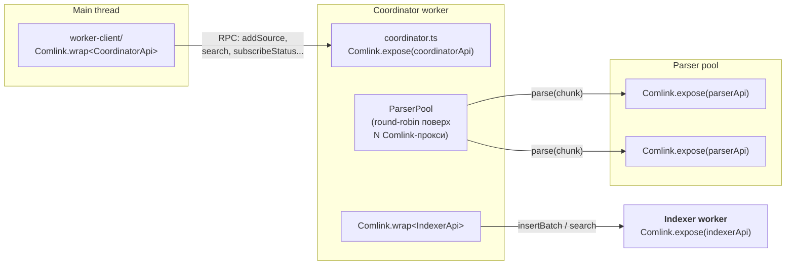

# 0004. Comlink + тонкий custom pool wrapper для RPC main↔worker

- Status: accepted
- Date: 2026-05-02

## Context and Problem Statement

Топология ([ADR-0003](0003-worker-centric-topology.md)) требует RPC между:

- Главным потоком и coordinator worker'ом — типизированный API, подписки на статус/прогресс, передача `File`/`FileSystemDirectoryHandle`.
- Coordinator'ом и pool из N parser worker'ов — round-robin раздача чанков строк, ожидание `LogEntry[]`.
- Coordinator'ом и indexer worker'ом — батчевые `insertBatch`, поисковые `search`/`count`/`getEntry`.

Нужен механизм, который:

- Сохранит TypeScript-типизацию через границу worker'а (RPC-вызов `coordinator.search(...)` должен компилироваться с теми же типами, что и реализация).
- Поддержит подписки (callbacks для статусов и change-notifications).
- Поддержит `Transferable` (на будущее — `ArrayBuffer` для горячих путей).
- Не привнесёт жирной зависимости — это PWA, важен размер бандла.
- Даст ясный отладочный путь — Worker DevTools, обычные `postMessage`, без магии.

## Considered Options

- **Comlink (~3 KB) + тонкий pool-wrapper (≈30 строк round-robin поверх N Comlink-прокси)** — типизированные прокси (`worker.method()` как `await`), `Comlink.transfer`, callbacks через `Comlink.proxy`.
- **Hand-rolled `postMessage` RPC** — discriminated-union сообщения + correlation IDs. ~150 строк boilerplate'а на типизацию, ошибки, abortable-вызовы.
- **threads.js / workerpool (~10 KB)** — готовый pool из коробки + RPC. Больше API-поверхности и зависимостей.
- **rpc-anywhere / typed-rpc** — типизированный RPC поверх postMessage, но без Transferable-friendly API и активность пакетов слабее.

## Decision Outcome

Chosen option: **«Comlink + тонкий custom pool-wrapper»**, плюс **hand-rolled batched messages для hot path** (отдельным шагом, после MVP).

### Что решает Comlink

- `Comlink.expose(api)` в worker'е → `Comlink.wrap<Api>(worker)` в main → типизированный прокси.
- TS-типы протекают через границу автоматически (общий `core/rpc/*.contract.ts`, см. `src/core/rpc/`).
- `Comlink.transfer(buffer, [buffer])` — для zero-copy `ArrayBuffer`/`Transferable`.
- `Comlink.proxy(callback)` — для подписок (`subscribeStatus`, `subscribeChanges`).
- `File` и `FileSystemDirectoryHandle` структурно-клонируемы, передаются нормально.

### Что решает custom pool-wrapper

```ts
export class ParserPool {
  private workers: Comlink.Remote<ParserApi>[] = [];
  private rr = 0;
  constructor(size: number) {
    for (let i = 0; i < size; i++) {
      const w = new Worker(new URL('../../parser/index.ts', import.meta.url), { type: 'module' });
      this.workers.push(Comlink.wrap<ParserApi>(w));
    }
  }
  async parse(lines: ReadonlyArray<string>) {
    return this.workers[this.rr++ % this.workers.length].parse(lines, ...);
  }
}
```

~30 строк, без зависимостей, под наш сценарий идеально. Work-stealing — оптимизация на потом, если parse-time на чанке окажется сильно неравномерным.

### Cancellation

Comlink не передаёт `AbortSignal` через границу worker'а из коробки. Используем шаблон с taskId:

- Main создаёт локальный `AbortController`, шлёт `taskId` в RPC-вызов.
- Coordinator держит `Map<taskId, AbortController>` внутри worker'а.
- При abort на main — отдельный `coordinator.cancel(taskId)`-вызов отзывает контроллер внутри.

Это шаблон закрепляется в `src/worker-client/cancellation.ts` и хелпере `withCancellation(taskId)` в coordinator'е (см. план §«Дополнительно A»).

### Hot path и отступление в hand-rolled messages

`coordinator → indexer` на каждом батче делает `await indexer.insertBatch(entries)`. На батчах в 1000 entries (~10 RPC/сек) overhead Comlink'а несущественен. Если на стрим-источнике с очень высокой частотой это станет узким местом — заводим **отдельный MessageChannel** напрямую parser↔indexer с кастомным batched-message форматом (без Comlink). Остальные каналы остаются на Comlink. Это локальная оптимизация после MVP, не выбор архитектуры.

### Consequences

- Good: ~3 KB бандла на типизированный RPC, прозрачный отладочный путь.
- Good: контракты живут в `src/core/rpc/*.contract.ts` и переиспользуются обеими сторонами — компилятор ловит мисматч.
- Good: pool-обёртка под наш сценарий — 30 строк, мы их понимаем целиком, никакой магии.
- Bad: Comlink не даёт нам cancellation/abort из коробки — пишем свой taskId-шаблон. Стоит дёшево, но это одна точка дисциплины.
- Bad: на per-call latency Comlink проигрывает голому postMessage. Митигация — батчирование на уровне pipeline (1000 entries/чанк), при необходимости — отдельный канал на hot path.
- Bad: ошибки через границу worker'а Comlink сериализует ограниченно (теряет prototype, кастомные поля). Заводим `RpcError` в контрактах и нормализуем на стороне coordinator'а.
- Neutral: Comlink — внешняя зависимость, придётся следить за совместимостью при обновлениях. Маленькая поверхность API минимизирует риск.

## Diagram



## Links

- [docs/plans/headless-worker-architecture.md](../plans/headless-worker-architecture.md) — план внедрения, §7 (worker'ы и RPC).
- [ADR-0003](0003-worker-centric-topology.md) — топология, под которую этот RPC.
- [src/core/rpc/](../../src/core/rpc/) — контракты RPC: `coordinator.contract.ts`, `parser.contract.ts`, `indexer.contract.ts`.
- [Comlink](https://github.com/GoogleChromeLabs/comlink) — библиотека.
