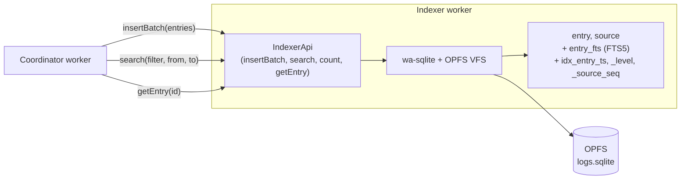

# 0005. SQLite (wa-sqlite) + FTS5 в OPFS как индекс/БД для логов

- Status: accepted
- Date: 2026-05-02

## Context and Problem Statement

Поиск по логам — основная UX-функция приложения. Нужна возможность:
- Полнотекстовый поиск по `message` / `raw` (типичные кейсы: «найти все строки с request-id `abc-123`», «все ошибки за последние 5 минут»).
- Range-фильтры по `timestamp` (временной диапазон), `level` (severity), `sourceId`.
- Структурные предикаты по парсенным полям (`fields_json`).
- Работа на наборах в десятки тысяч — миллионы записей с приемлемой латентностью (FTS-запрос < 500 мс на 1М записей — целевой бюджет).
- Персистентность между перезагрузками страницы (см. [ADR-0006](0006-persistence-strategy.md) — каталог-источники должны переживать reload).

Контекст: логика индексации и поиска живёт в indexer worker'е ([ADR-0003](0003-worker-centric-topology.md)). Главный поток к данным напрямую не обращается, всё через RPC.

## Considered Options

- **SQLite (wa-sqlite) + FTS5 в OPFS** — WASM-сборка SQLite со встроенным FTS5, хранится в Origin Private File System.
- **MiniSearch / FlexSearch + IndexedDB для метаданных** — in-memory full-text индекс (5–30 KB), structured queries (timestamp/level) пишем сами поверх IndexedDB.
- **Чистый IndexedDB (без FTS-библиотеки)** — own indexes по `timestamp` / `level` / `source`, full-text реализуем поверх (n-граммы / token postings) — много кода, ниже качество.
- **DuckDB-WASM** — мощный SQL-движок с аналитикой. Бандл ~10 МБ, для линейного «найти строку» — оверкилл.

## Decision Outcome

Chosen option: **«SQLite (wa-sqlite) + FTS5 в OPFS»**, потому что это единственный вариант, дающий range-queries И полнотекст в одном движке с понятной семантикой и встроенной персистентностью.

### Почему именно wa-sqlite и OPFS

- **wa-sqlite** — официально поддерживаемый WASM-порт SQLite с pluggable VFS, в том числе **OPFS VFS**, который даёт честную персистентность с производительностью, близкой к нативному SQLite.
- **OPFS** доступен только из dedicated worker'ов — это совпадает с топологией [ADR-0003](0003-worker-centric-topology.md), где indexer и так живёт в worker'е.
- Конкретный пакет (`wa-sqlite` upstream / `@vlcn.io/wa-sqlite-wasm` / `sqlocal`-обёртка) **не фиксируется этим ADR** — выбор делается на этапе 7 плана внедрения после прототипирования. Архитектурно важна связка SQLite + FTS5 + OPFS, а не конкретный npm-пакет.

### Схема (упрощённо)

```sql
CREATE TABLE source (
  id TEXT PRIMARY KEY,
  kind TEXT NOT NULL,
  name TEXT NOT NULL,
  meta_json TEXT,
  indexed_at INTEGER,
  entry_count INTEGER DEFAULT 0
);

CREATE TABLE entry (
  id TEXT PRIMARY KEY,
  source_id TEXT NOT NULL REFERENCES source(id) ON DELETE CASCADE,
  seq INTEGER NOT NULL,
  ts INTEGER,                  -- nullable
  level TEXT NOT NULL,
  message TEXT NOT NULL,
  raw TEXT NOT NULL,
  fields_json TEXT
);
CREATE INDEX idx_entry_source_seq ON entry(source_id, seq);
CREATE INDEX idx_entry_ts ON entry(ts);
CREATE INDEX idx_entry_level ON entry(level);

CREATE VIRTUAL TABLE entry_fts USING fts5(
  message, raw,
  content='entry', content_rowid='rowid',
  tokenize='unicode61 remove_diacritics 2'
);
-- + триггеры синхронизации FTS с entry (стандартный паттерн SQLite FTS5)
```

`LogFilter` транслируется в SQL в `src/core/filter/query.ts`:
- `levels` → `WHERE level IN (...)`
- `timeRange` → `WHERE ts BETWEEN ? AND ?`
- `sources` → `WHERE source_id IN (...)`
- `query` (mode `fts`) → `JOIN entry_fts ON ... WHERE entry_fts MATCH ?`
- `query` (mode `substring`) → `WHERE message LIKE ?` (медленно — UI рекомендует FTS на больших объёмах)

### Миграции — с первого дня

`PRAGMA user_version` + ordered list миграций в `src/workers/indexer/db/migrations.ts`. Без версионирования при первой эволюции схемы пользователи с persisted DB получат «failed to open». См. план §«Дополнительно B».

### Consequences

- Good: range и FTS — в одном движке, без склеивания двух инструментов.
- Good: SQL — известный язык, легко расширять (новые поля, индексы, миграции).
- Good: OPFS-персистентность «бесплатна»: записал — переживает reload.
- Good: бэнчмарки указывают на 50–100k inserts/sec на batch'ах — попадаем в наши perf-бюджеты.
- Bad: WASM-бандл ~600 KB – 1 MB. На первой загрузке заметно. Митигация: lazy-init indexer'а при первом обращении (а не при старте app), `globPatterns` Workbox'а расширяется на `wasm` ([vite.config.ts](../../vite.config.ts)) — иначе offline-first сломается.
- Bad: SQLite — single-writer. На большой стриминговой нагрузке search-запросы будут конкурировать с inserts. Митигация (на потом): отдельный read-only worker.
- Bad: OPFS — Chrome 102+, Safari 16+, Firefox 111+. Старые версии не поддерживаются. Fallback: in-memory режим без персистентности (для PWA — деградация, но приложение работает).
- Bad: `LIKE '%word%'` без индекса = full table scan — substring-mode допустим только на малых объёмах. Документируем в UI.
- Neutral: придётся вести SQL-схему, миграции, prepared statements. Привычная инженерная работа.

## Diagram



## Links

- [docs/plans/headless-worker-architecture.md](../plans/headless-worker-architecture.md) — план внедрения, §3, §7, §8.
- [ADR-0003](0003-worker-centric-topology.md) — indexer worker, владеющий этой БД.
- [ADR-0006](0006-persistence-strategy.md) — что и как переживает reload (BD + FileSystemHandle'ы).
- [wa-sqlite](https://github.com/rhashimoto/wa-sqlite) — апстрим WASM SQLite с pluggable VFS.
- [SQLite FTS5](https://www.sqlite.org/fts5.html) — спецификация модуля.
