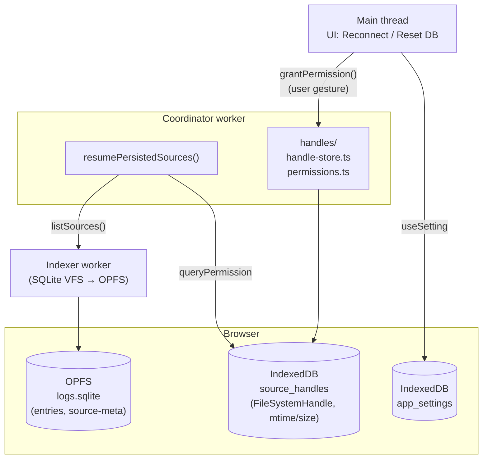

# 0006. Persistence strategy: дифференцированная по типу источника

- Status: accepted
- Date: 2026-05-02

## Context and Problem Statement

Источники логов в приложении неоднородны по природе:

- **`file`** — `File`-объект из `<input type="file">` или drag-and-drop. После reload объект теряется (нет постоянной ссылки).
- **`directory`** — `FileSystemDirectoryHandle` через `showDirectoryPicker` (File System Access API). **Сам handle структурно-клонируем и хранится в IndexedDB** — после reload можно re-открыть ту же папку (после подтверждения permission'а пользователем).
- **`text`** — вставленный текст. Самодостаточный.
- **`url`** — внешний HTTP-эндпоинт. Воспроизводимо новым `fetch`'ем при наличии URL.
- **`stream`** — WebSocket/SSE. По природе live-данные, не реиграется.

Полностью «всё персистить» — упрёмся в OPFS-квоту на больших файлах и плодим дубли. «Ничего не персистить» — обесценивает PWA: пользователь грузит каталог на 500 МБ, обновляет страницу, теряет работу. Нужна **дифференцированная стратегия**, явно по типу источника.

Дополнительно: `requestPermission()` для FileSystemHandle'а требует **user gesture** — перерасшифровка прав после reload должна быть инициирована кликом, не фоновым кодом.

## Considered Options

- **Дифференцированная стратегия (предлагаемая)** — для каждого `LogSource['kind']` своя политика; индекс БД (entries) в OPFS, FileSystemHandle'ы в IndexedDB, остальное при необходимости в БД.
- **Persist-всё-всегда** — все entries и все source-метаданные в OPFS. Простота, но: огромные БД на длинных логах и live-стримах; дубли raw-данных, к которым уже есть persisted handle.
- **In-memory only** — ничего не переживает reload. Простейшая модель, но обесценивает PWA на больших источниках.
- **«User opt-in для каждой сессии»** — пользователь явно жмёт «Save session» → выгружаем snapshot. Гибко, но больше UX-работы и хуже out-of-the-box опыт.

## Decision Outcome

Chosen option: **«Дифференцированная стратегия»**. Каждый источник переживает reload ровно в той мере, в которой это технически бесплатно и осмысленно для пользователя.

### Политика по типам

| Источник    | Что персистится                            | Где                                | Поведение после reload                                                                                                                                                               |
| ----------- | ------------------------------------------ | ---------------------------------- | ------------------------------------------------------------------------------------------------------------------------------------------------------------------------------------ |
| `file`      | Entries в SQLite (только если user opt-in) | OPFS (`logs.sqlite`)               | На MVP: source исчезает (нет handle для re-open). После MVP — `entry_raw_ref` для отложенного re-open через persisted handle ([ADR-0005](0005-sqlite-fts5-opfs-index.md), §H плана). |
| `directory` | `FileSystemDirectoryHandle` + entries      | IndexedDB (handle), OPFS (entries) | App спрашивает permission → если granted, сравнивает `mtime`/`size` индексированных файлов с актуальными → инкрементальный re-index.                                                 |
| `text`      | Не персистится                             | —                                  | Source исчезает.                                                                                                                                                                     |
| `url`       | Не персистится по умолчанию                | —                                  | Source исчезает (URL можно сохранить отдельной фичей «pinned URL» — после MVP).                                                                                                      |
| `stream`    | Не персистится (live-data)                 | —                                  | Source исчезает.                                                                                                                                                                     |

### Где какое хранилище и почему

- **OPFS — для SQLite-БД.** Нужен SQLite VFS, доступный только в worker'ах ([ADR-0005](0005-sqlite-fts5-opfs-index.md)). Именно туда уходит `logs.sqlite` со всеми entries и source-метаданными.
- **IndexedDB — для FileSystemHandle.** SQLite handle сериализовать не сможет; IndexedDB же поддерживает structured clone объектов handle'а. Ключ-значение хранилище в отдельной IndexedDB-БД `source_handles`:

  ```ts
  interface PersistedSourceHandle {
    sourceId: SourceId;
    kind: 'directory' | 'file';
    name: string;
    handle: FileSystemDirectoryHandle | FileSystemFileHandle;
    indexedFiles?: Array<{ path: string; size: number; mtime: number }>;
  }
  ```

- **localStorage не используется** для core-данных (квоты ~5 МБ, sync API). Для пользовательских настроек — отдельная IndexedDB-БД `app_settings` (см. план §«Дополнительно D»).

### Resume-сценарий после reload

1. App стартует, `WorkerClientProvider` поднимает coordinator-client.
2. `coordinator.resumePersistedSources()` читает SQLite (records of `source`) и IndexedDB (handles).
3. Для каждого handle: `await handle.queryPermission({ mode: 'read' })`.
   - `granted` → запускаем re-validation: для каталога итерируемся, сравниваем `indexedFiles[].mtime`/`.size` с актуальными → инкрементальный re-index дельты.
   - `prompt` → возвращаем source в массиве `needsPermission`. UI показывает «Reconnect to <name>» кнопку. Клик → `coordinator.grantPermission(id)` → внутри coordinator'а `await handle.requestPermission()`. Если granted — re-validation; иначе — error-status.
   - `denied` → error-status, UI предлагает удалить или re-pick.

### Capability detection и fallback

`directory`-источник доступен только в браузерах с File System Access API (`'showDirectoryPicker' in window`). На Safari iOS и других — тип скрываем в UI. Persistence для других источников не зависит от FS Access API.

### Quotas и Reset

OPFS-квота непредсказуема (Chrome ~60% диска, Safari ~1 ГБ). Поэтому:

- `coordinator.estimateStorage()` показывает текущее потребление и разбивку по источникам.
- UI «Очистить базу» / «Удалить источник» доступен из Settings (см. план §«Дополнительно C»).
- На старте один раз: `navigator.storage.persist()` — снижает риск, что браузер прибьёт OPFS под давлением.

### Consequences

- Good: `directory`-источники переживают reload, что и делает приложение PWA-достойным.
- Good: для file/text/url/stream нет лишних дублей в БД — БД содержит только индекс. На больших файлах это критично для квоты.
- Good: явная политика, описанная в этом ADR — не «как-то там сложилось», а правило, которое легко проверить и поменять (например, через 6 месяцев решим persist'ить URL-источники — добавим колонку и кейс).
- Bad: разные хранилища (OPFS + IndexedDB) увеличивают cognitive load. Митигация — handle-store изолирован в `src/workers/coordinator/handles/`.
- Bad: permission-flow завязан на user gesture; легко ошибиться async-цепочкой и потерять gesture-токен. Митигация — UI-кнопка вызывает handler напрямую, без промежуточных await'ов до `requestPermission()`.
- Bad: incremental re-index по `mtime` — эвристика. Если приложение, генерирующее логи, не обновляет `mtime` (редко, но бывает) — застрянем на старой версии. Митигация — кнопка «Force re-index» в UI.
- Neutral: появляется отдельная IndexedDB БД `source_handles`. Стандартная практика, ревьюеры найдут в DevTools.

### Open follow-ups

- `entry_raw_ref` для очень длинных строк (`raw > ~2 KB` хранить как `(file_id, offset, length)` обратно в исходный handle) — после MVP (план §«Дополнительно H»).
- Watching изменений каталога без user-driven refresh — File System Access API не имеет нативного watcher'а. Polling по `mtime` — простой, но не realtime. Откладываем.
- «Pinned URL»-источники с настраиваемым refresh — после MVP, отдельный ADR.

## Diagram



## Links

- [docs/plans/headless-worker-architecture.md](../plans/headless-worker-architecture.md) — план внедрения, §8 (детали permission-flow и схемы handle-store).
- [ADR-0003](0003-worker-centric-topology.md) — coordinator/indexer, владеющие этими хранилищами.
- [ADR-0005](0005-sqlite-fts5-opfs-index.md) — SQLite/OPFS для индекса.
- [File System Access API](https://wicg.github.io/file-system-access/) — спецификация, permission semantics.
- [StorageManager.persist()](https://developer.mozilla.org/docs/Web/API/StorageManager/persist) — явный запрос persistent-mode.
