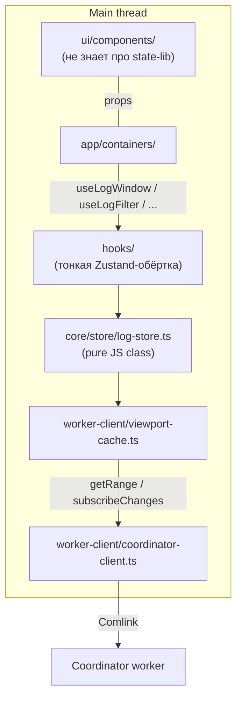

# 0007. State management: Zustand поверх чистого core-store класса

- Status: accepted
- Date: 2026-05-02

## Context and Problem Statement

Главному потоку нужно состояние:

- Активный фильтр (`LogFilter`).
- Выбранная запись (`selectedId`).
- Список источников и их статусы (получаемые подписками от coordinator'а).
- **Viewport-кэш** для виртуализированного списка — окно индексов → `LogEntry`, фоновый prefetch соседних диапазонов.

Фоновая нагрузка специфична:

- Канонический хранитель entries — **не main thread**, а indexer worker (см. [ADR-0003](0003-worker-centric-topology.md), [ADR-0005](0005-sqlite-fts5-opfs-index.md)). Главный поток держит лишь viewport-окно.
- Streaming-источники приводят к частым apply-able событиям «новые записи добавлены» → нужна effective subscribe-модель без re-render всего дерева.
- На частоту keystroke'ов в FilterBar нельзя пересчитывать всё.

Контракт хуков ([ADR-0002](0002-headless-architecture.md)) — это и есть «договор» с UI. Реализация под капотом не должна протекать в `ui/components/`.

## Considered Options

- **Zustand + чистый core-store класс (предлагаемая)** — `src/core/store/log-store.ts` — обычный JS-класс с `getSnapshot/subscribe`; в `src/hooks/` — zustand-обёртка для React-привязки. UI ничего о zustand не знает.
- **Pure React (`useReducer` + `useSyncExternalStore` + Context)** — никаких новых зависимостей; React 19 + `useSyncExternalStoreWithSelector` корректно работают с external store.
- **Jotai (атомы)** — гранулярные подписки. Хорош для read-heavy зависимостей, но append-heavy мутации большого массива и derived `filteredEntriesAtom` пересчёт ведут к тем же проблемам — без выигрыша архитектурно.
- **Redux Toolkit** — оверкилл для нашей шкалы (нет complex actions/sagas). Бандл тяжелее.
- **MobX** — полный контроль через observables, но сильно протекает в типизацию и в UI; противоречит headless-цели.

## Decision Outcome

Chosen option: **«Zustand поверх чистого core-store класса»**.

Ключевая инверсия:

- `src/core/store/log-store.ts` — **обычный TypeScript-класс**, никаких React-импортов. Он держит локальное состояние (filter, selectedId, sources cache) и делегирует данные viewport-кэшу + RPC-вызовам в coordinator. Это — единственный источник правды на главном потоке.
- `src/hooks/` — **тонкие React-обёртки**, использующие zustand (или `useSyncExternalStore`) для подписки. UI и ui-адаптеры импортируют только из `src/hooks/` через barrel.
- UI **ничего не знает** ни о zustand, ни о store-классе. Zustand можно заменить на `useSyncExternalStore` (вариант B) одной правкой в `src/hooks/`.

### Почему Zustand, а не pure React

1. **Append-heavy уведомления** при streaming-источниках: `set` с одной правкой состояния дешевле reducer'а или композиции атомов.
2. **Селекторы из коробки**: `useStore(s => s.filter)` подписывается ровно на нужный кусок — селекторное равенство решает проблему «контекст ре-рендерит всё».
3. **Минимальный бандл (~1 KB gzipped)** — пренебрежимо для PWA, выигрыш по DX и перфу.
4. **Тестируемость**: store можно держать как фабрику (`createLogStore()`) и подменять в тестах без React. Singleton-режим мы избегаем.
5. **Не запирает архитектуру**: invariant сохранён — core-store класс независим от React, zustand-обёртка живёт в `hooks/` и заменяется при желании.

### Контракт между слоями

```
src/core/store/log-store.ts             — pure JS class, getSnapshot/subscribe
src/worker-client/viewport-cache.ts     — main-thread кэш окна (Map<index, LogEntry>)
src/hooks/use-log-window.ts             — обёртка (zustand или useSyncExternalStore)
src/hooks/use-log-filter.ts             — то же
src/hooks/use-selected-entry.ts         — то же
src/hooks/use-source-controller.ts      — wraps coordinator.* вызовы
```

Контракт UI — return-типы хуков, см. [ADR-0002](0002-headless-architecture.md).

### Перформанс-инварианты

Независимо от выбора state-библиотеки:

- Канонический список entries — в indexer worker'е, не на main.
- Viewport-кэш — `Map<absoluteIndex, LogEntry>` с eviction вне `[from-overscan, to+overscan]`. По умолчанию overscan = 200 строк.
- `version: number` инкрементируется при invalidation (новые entries попали в фильтр / фильтр сменился). Виртуализатор перерендеривается по version.
- Debounce text-query 100–150 мс перед отправкой `setFilter` в coordinator.

### Consequences

- Good: append-heavy и filter-heavy сценарии получают селекторные подписки бесплатно.
- Good: core-store остаётся чистым TS — пишется и тестируется без React, что ускоряет итерации и сохраняет дверь в pure-React (опция B) открытой.
- Good: ~1 KB бандла — незаметно.
- Bad: появляется одна внешняя зависимость, нужно следить за её совместимостью при мажорных upgrade'ах. Поверхность API маленькая — риск умеренный.
- Bad: zustand-singleton может протекать в тесты при невнимательной настройке. Митигация: фабрика `createLogStore()` + Provider в тестах.
- Bad: контракт между core-store и zustand-обёрткой нужно поддерживать руками (типы дублируются на тонкой границе). Митигация: общие типы из `src/core/types/`.
- Neutral: если архитектура когда-нибудь упрётся в фундаментальное ограничение Zustand'а — переключение на pure React (`useSyncExternalStore`) ограничивается правкой `src/hooks/`. Структура папок и контракт не меняются.

### Open follow-ups

- Конкретный пакет/middlewares (`subscribeWithSelector`, `shallow`) — определим при реализации шага 13 плана.
- Для тестов: фабрика `createLogStore()` + минимальная обёртка `<LogStoreProvider>` (если zustand singleton-режим окажется неудобным).

## Diagram



## Links

- [docs/plans/headless-worker-architecture.md](../plans/headless-worker-architecture.md) — план внедрения, §6 (state-management) и §6 «Перформанс-инварианты».
- [ADR-0002](0002-headless-architecture.md) — headless-архитектура и hook-контракт.
- [ADR-0003](0003-worker-centric-topology.md) — где живёт канонический список entries (не на main).
- [Zustand](https://github.com/pmndrs/zustand) — библиотека.
