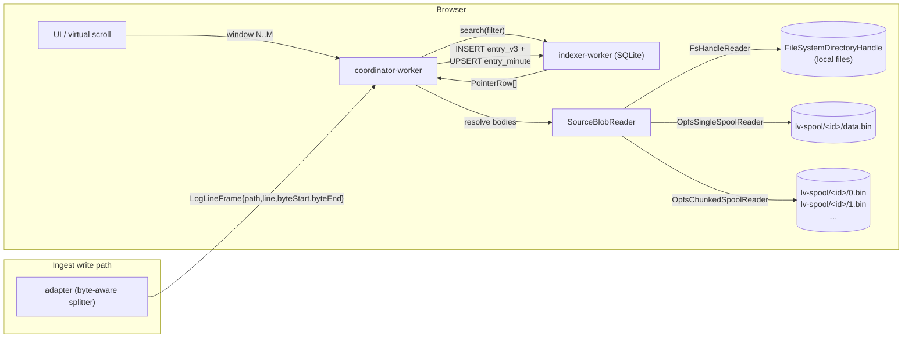

# 0016. Offset-pointer + minute-bucket index, lazy body read

- Status: proposed
- Date: 2026-05-06

## Context and Problem Statement

Текущий индекс ([ADR-0005](0005-sqlite-fts5-opfs-index.md)) — это **перенос содержимого**: парсер для каждой строки сохраняет в `entry` колонки `message` и `raw`, а FTS5-триггеры ([schema-v2-fts.sql](../../src/workers/indexer/db/schema-v2-fts.sql)) дополнительно копируют те же поля во `entry_fts`. На `large.jsonl` 6.5 МБ это ≈10–12 МБ в OPFS-SQLite — индекс **больше** исходных данных.

Для **directory**-источников ситуация особенно бессмысленна: исходные `.log`-файлы уже лежат в файловой системе пользователя, доступны через `FileSystemDirectoryHandle`, и копировать их содержимое внутрь OPFS-SQLite не нужно — мы можем хранить только *указатель* на нужные байты в исходном файле и читать их лениво при отображении.

Аналогичная логика применима к **non-directory** источникам (text/pasted/snapshot/url/stream), но с оговоркой: у них исходного байтового файла нет — данные приходят разово (text/pasted/snapshot/url) или потоком (stream). Им нужно **место для байтов**, и единственное безопасное место в браузере — OPFS.

Параллельно нужно решить судьбу **FTS5**. После отказа от хранения `raw`/`message` в SQLite инвертированный индекс негде строить — либо отказываемся от FTS-поиска, либо строим его отдельно (OPFS-spool с собственным форматом, отдельный movement).

Цель: индекс стал **по логической записи "какой файл / какие байты / какой timestamp/level / какие поля"** + помощник-aggregate "по минутам" для timeline / first-paint. Тело — **лениво** из исходного файла или OPFS-spool.

## Considered Options

**Структура индекса:**
- A. **Per-entry pointer-only** — одна row на каждую запись с `(file_path, byte_start, byte_end, ts, level, fields_json)`. Точные SQL-фильтры. Без aggregates.
- B. **Per-file × per-minute aggregates only** — одна row на (файл, минута) с byte-range bucket'а. Минимум места, но точечные фильтры по trace_id/level не работают на индексном уровне.
- C. **Гибрид: pointer + minute bucket** — обе таблицы. Точные фильтры через pointer-таблицу, timeline/group-by через aggregates.

**Full-text search (на чём индексируем):**
- α. **Без FTS5** — поиск substring/regex применяется на post-resolve-уровне после SQL-фильтра по полям/времени.
- β. **FTS5 на parsed `message`** — `raw` уходит, `message` остаётся как материализованная колонка ради FTS.
- γ. **Свой inverted index в OPFS** — отдельный артефакт, не SQLite.

**Хранилище байтов для non-directory источников (stream особенно):**
- I. **Один OPFS-файл append-only** — `lv-spool/<sourceId>.bin`, writer пишет, reader читает.
- II. **Chunk-per-packet** — для каждого pushed-packet'а `lv-spool/<sourceId>/<chunkSeq>.bin`. Writer и reader работают на разных файлах.

## Decision Outcome

Chosen: **C + α + I/II микс**, потому что:

- **Гибрид (C)** даёт точные SQL-фильтры (для UI с фильтр-баром и group-by), и одновременно даёт быстрый timeline через bucket'ы. Дополнительные ~16 байт на запись для bucket'а — приемлемо.
- **Без FTS5 (α)** убирает дублирование (которое ADR-0005 явно создавал) и снимает крупный stake в OPFS. Поиск свободного текста становится post-filter'ом по уже сокращённому набору. Когда — и если — этот scope станет узким местом, вернёмся за γ отдельным ADR.
- **Микс хранилища (I + II)**: для **directory/file** — байты в исходном FS-handle, OPFS не трогаем. Для **text/pasted/snapshot/url** — single-spool (I), приходит разово. Для **stream** — chunked-spool (II), потому что append в один файл создаёт contention writer↔reader, а chunk-per-packet снимает блокировку и упрощает LRU-eviction старых пакетов. **Унифицированный layout**: каждый source — отдельный каталог `lv-spool/<sourceId>/`, внутри либо `data.bin` (single), либо `<seq>.bin` (chunked). Удаление source — одна операция `removeEntry(sourceId, { recursive: true })`, и в каталоге есть место для будущих per-source-артефактов (resume cursor, manifest).

### Schema (упрощённо)

```sql
-- Pointer-only entries — body живёт в FS-handle / OPFS-spool
CREATE TABLE entry_v3 (
  id TEXT PRIMARY KEY,
  source_id TEXT NOT NULL,
  seq INTEGER NOT NULL,
  ts INTEGER, level TEXT NOT NULL,
  file_path TEXT NOT NULL,        -- '' / 'sub/a.log' / '<chunkSeq>'
  byte_start INTEGER NOT NULL,
  byte_end INTEGER NOT NULL,      -- exclusive
  fields_json TEXT
);

-- Minute aggregates per (source, file, minute_bucket)
CREATE TABLE entry_minute (
  source_id TEXT, file_path TEXT, minute_bucket INTEGER,
  byte_start INTEGER, byte_end INTEGER,
  entry_count INTEGER, level_dist_json TEXT,
  PRIMARY KEY (source_id, file_path, minute_bucket)
);

-- entry_fts удалена. Триггеры удалены.
```

`file_path` semantics определяется типом источника:
- directory/file → relative path внутри source-handle (`sub/a.log`).
- text/pasted/snapshot/url → пустая строка `''` (единственный spool-файл `lv-spool/<sourceId>.bin`).
- stream → chunk-seq как строка (`'0'`, `'1'`, …), указывает на `lv-spool/<sourceId>/<chunkSeq>.bin`.

Read path: `search(filter)` возвращает `PointerRow[]`, отдельный `lazy-resolver` слой группирует pointers по `(sourceId, file_path)`, идёт в `SourceBlobReader` (3 имплементации: `FsHandleReader` / `OpfsSingleSpoolReader` / `OpfsChunkedSpoolReader`), читает blob.slice() и прогоняет через парсер для восстановления `message`. UI получает уже привычный `LogEntry` shape.

### Consequences

- Good: размер OPFS-БД сокращается в 3-4× (на `large.jsonl` ≈10 МБ → ≈3 МБ). Для directory-источников БД вообще не растёт пропорционально объёму данных — только pointers.
- Good: ingest становится быстрее — нет FTS-индексации (≈30-50 % CPU при insert'е).
- Good: больше не дублируем содержимое исходных файлов в БД. Для пользователей это интуитивнее и предсказуемее (по объёму на диске).
- Good: chunked-spool (stream) допускает параллелизм writer↔reader и LRU-eviction старых пакетов одной операцией `removeEntry(<chunkFile>)`.
- Bad: каждое чтение visible window требует FS-IO (`getFile()` + `slice().text()`) и повторного парсинга. Митигация: handle cache в worker'е, batched read по группе pointer'ов из одного файла, парсинг 100 строк ≈ ms.
- Bad: full-text "найди упоминание deadlock везде" без других фильтров деградирует до bucket-сканирования (читаем bucket'ы по minute-aggregate). На 10× файлов это секундные latency. UI должен предупреждать (или считать прогресс).
- Bad: для stream-источников chunk-per-packet создаёт N мелких файлов в OPFS. Митигация: coalesce в адаптере (≥64 КБ или ≥500 мс между chunk'ами).
- Bad: contract на read path сложнее — нужен `SourceBlobReader` слой с тремя реализациями и handle-cache. Тестируется отдельно.
- Neutral: search-bar substring/regex теперь работает на post-resolve уровне. Семантика та же, путь другой.
- Neutral: ADR-0005 (SQLite + OPFS) **не superseded** — выбор движка остаётся. Меняется только внутреннее использование: уходит FTS5 и материализация body.

## Diagram



## Links

- [docs/architecture/log-pipeline-sequence.md](../architecture/log-pipeline-sequence.md) — runtime sequence-диаграммы (ingest, read, filter change), как это решение работает в живом пайплайне.
- [docs/plans/replicated-cooking-muffin.md](../plans/replicated-cooking-muffin.md) — план реализации (9 фаз).
- [ADR-0005](0005-sqlite-fts5-opfs-index.md) — выбор SQLite+OPFS, остаётся в силе. FTS5-часть и материализация `raw`/`message` заменяется этим ADR.
- [ADR-0006](0006-persistence-strategy.md) — что переживает reload (handle persistence). Правила не меняются: directory-handle нужно re-grant, OPFS-spool остаётся.
- [ADR-0014](0014-worker-lifecycle.md) — coordinator-worker, в котором живёт SourceBlobReader и handle cache.
- [ADR-0015](0015-directory-tree-and-file-frames.md) — `LogLineFrame` + `fields.file_path`. ADR-0016 расширяет frame полями `byteStart`/`byteEnd`.
