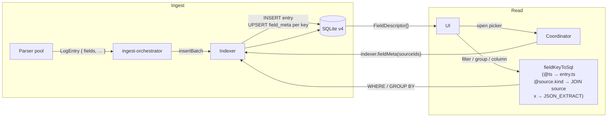

# 0017. Dynamic field schema + `@`-namespace for built-in attributes

- Status: proposed
- Date: 2026-05-07

## Context and Problem Statement

Сейчас «полевая модель» в приложении расщеплена надвое:

- **Жёстко закодированные built-in поля** в коде и CSS:
  - Колонки таблицы — фиксированный CSS-grid `52px 16px 120px 58px 120px 150px 1fr 52px` ([lv.css:1107](../../src/ui/styles/lv.css#L1107)) и шапка в [LvViewer.tsx:408](../../src/ui/components/stream/LvViewer.tsx#L408).
  - Group-by enum: `trace_id | req_id | user_id | service | level | kind | file` ([lv-types.ts:108](../../src/ui/contracts/lv-types.ts#L108)).
  - Filter-bar: отдельные кнопки `levels[]`, `services[]`, `filePaths[]`, `timeRange`.
- **Динамические dynamic-поля** уже частично работают: парсеры кладут произвольные ключи в `entry.fields` (JSON), `LogFilter.fieldFilters` ([log-filter.ts](../../src/core/types/log-filter.ts)) умеет их фильтровать через `JSON_EXTRACT(fields_json, '$.key')`. Но UI этим **не пользуется** для колонок/group-by; пользователь сам впечатывает имя ключа в свободное поле.

Из-за этого:

- Любое новое поле, которое выдаёт парсер (`http.status`, `kubernetes.pod`, `request_duration_ms`), невидимо в picker'ах. Чтобы его увидеть/группировать, нужно знать имя.
- Источники с разной формой логов (pino vs nginx vs syslog) показывают одинаковую жёсткую таблицу, и интересные поля приходится искать в `raw`.
- Свойства уровня источника (имя, kind, file_path, source_id) тоже идут как «специальные» — каждое со своим SQL-сахаром (`filter.sources`, `filter.services`, `filter.filePaths`).

Цель решения — единая модель «полей»: и dynamic-ключи парсера, и built-in атрибуты строки/источника живут в одном namespace, единообразно резолвятся в SQL, и UI генерирует picker'ы (column / group-by / filter) **из реальных данных** через schema discovery.

Решение опирается на [ADR-0016](0016-offset-pointer-index-lazy-body.md) — `entry.fields_json` уже содержит парсенные поля; нужно просто построить поверх него index of seen keys + sane SQL routing.

## Considered Options

Три ортогональных вопроса.

**Storage схемы (где хранить «какие поля встречались»):**

- A. Precomputed at ingest — отдельная таблица `field_meta(source_id, key, …)`, обновляется в той же транзакции, что и `entry`.
- B. On-demand — `SELECT json_each.key, COUNT(*) FROM entry, json_each(fields_json) GROUP BY 1` каждый раз когда picker открывается.
- C. Hybrid — кэш в worker memory + invalidation по change events.

**UX колонок:**

- α. User picks: дефолт = текущие 8 колонок, есть кнопка `+ Add column`.
- β. Auto-suggest top-N most-common полей.
- γ. Hybrid: фиксированные `LN / TIMESTAMP / LEVEL / MESSAGE` + auto-suggest посередине + ручной toggle.

**Namespace built-in vs dynamic:**

- I. `@`-prefix для built-in: `@ts`, `@level`, `@file`, `@source.name`, `@source.kind`.
- II. Без префикса, визуальные группы в picker'е («Source / Built-in» сверху, «Fields» снизу).
- III. Два отдельных picker'а — «Source attribute» и «Field».

## Decision Outcome

Chosen: **A + γ + I**.

- **A (precomputed `field_meta`)** — picker открывается мгновенно на 1k и на 1M строк одинаково; `JSON_EACH` over fields_json на больших объёмах превращается в seconds. Дополнительная стоимость — несколько UPSERT'ов в той же транзакции, что INSERT entries (она уже batched).
- **γ (гибрид колонок)** — стартовый вид без сюрпризов; пользователь добавляет интересные поля по необходимости из auto-suggested списка. CSS-grid строится из `useUiPrefs.columns` — массива `LvColumn[]`, persist'ит выбор между сессиями.
- **I (`@`-prefix)** — namespace без коллизий: пользовательское поле `level` в `fields_json` не путает SQL-translator, `@level` всегда — колонка `entry.level`. SQL-router (`fieldKeyToSql`) централизованно различает префикс. Существующие shorthand-фильтры (`filter.levels`, `filter.services`, `filter.filePaths`) остаются на API-поверхности, в SQL-слое всё унифицируется через тот же translator.

### Field key reference

```
@ts            number   entry.ts                     timestamp ms
@level         enum     entry.level                  trace|debug|info|warn|error|fatal|unknown
@message       text     (lazy-resolved, not in SQL)
@seq           number   entry.seq
@file          string   entry.file_path
@byte_start    number   entry.byte_start             (rare; shown only with debug toggle)
@byte_end      number   entry.byte_end
@source.id     string   entry.source_id
@source.name   string   source.name (JOIN)
@source.kind   enum     source.kind  (JOIN)
<other>        any      JSON_EXTRACT(fields_json, '$.<key>')
```

`@source.*` требуют `JOIN source ON source.id = entry.source_id`. SQL-translator добавляет JOIN автоматически если в filter есть хотя бы один `@source.*`.

### `field_meta` (schema v4 — sketch)

```sql
CREATE TABLE field_meta (
  source_id    TEXT NOT NULL REFERENCES source(id) ON DELETE CASCADE,
  key          TEXT NOT NULL,                    -- 'trace_id' / 'remote_addr' / …
  type         TEXT NOT NULL,                    -- 'string'|'number'|'boolean'|'enum'|'mixed'
  occurrences  INTEGER NOT NULL DEFAULT 0,
  total_seen   INTEGER NOT NULL DEFAULT 0,
  last_seen_at INTEGER,
  top_values_json TEXT,                          -- top-K {value, count}
  PRIMARY KEY (source_id, key)
);
CREATE INDEX idx_field_meta_source ON field_meta(source_id);
```

Для built-in (`@`) ничего не пишем — у них всегда фиксированный type, и они присутствуют в каждой строке. UI показывает их секцией без обращения к `field_meta`.

### Consequences

- Good: `+ Add column`, `Group by …`, `Filter on …` для любого поля без ручного впечатывания. Парсер выдал — UI показал.
- Good: Schema discovery O(rows in `field_meta`) ≈ десятки записей на источник, против O(всех строк) на JSON_EACH.
- Good: SQL-translator централизует routing — добавить новое built-in поле = одна запись в `fieldKeyToSql`. SQL-сахар на shorthand-полях (`filter.levels` etc) сворачивается в один путь.
- Good: Колонки persist'ятся per-user (`useUiPrefs.columns`) — открыл следующий source с тем же набором логов, видит ту же конфигурацию.
- Bad: Schema migration v4 — destructive ingest для backfill `field_meta` (старые `entry`-rows не имеют counter'ов). На v3-системе после миграции при первом запросе придётся либо принять «meta empty» и заполнить on-demand, либо триггернуть re-ingest. См. план.
- Bad: Insertbatch транзакция растёт — extra UPSERT'ы (один на уникальный key в batch). На batch'е 1000 lines × 5 unique keys ≈ 5 UPSERT'ов; profiling нужен, но порядок — низкий.
- Bad: Type inference хрупкая. `status` может быть number в одном лог и string в другом → type='mixed' с UI-предупреждением. Sort/filter операторы с `>`/`<` на mixed type — undefined.
- Bad: `top_values_json` ограничен top-K (~20). High-cardinality поля (trace_id) видны как «много уникальных», точечный filter всё равно работает через свободный ввод.
- Neutral: ADR-0011 (server-side group/histogram) остаётся в силе — group-by теперь принимает arbitrary key, проходит через тот же `fieldKeyToSql`.

## Diagram



## Links

- [docs/plans/replicated-cooking-muffin.md](../plans/replicated-cooking-muffin.md) — phase-by-phase implementation plan для этого ADR.
- [ADR-0010](0010-lv-on-viewstore-core-types.md) — почему UI читает core-типы напрямую без adapter-слоя; этот ADR расширяет ту же линию на полевую модель.
- [ADR-0011](0011-server-side-aggregations-and-regex.md) — server-side group/histogram. После 0017 group-by принимает arbitrary `FieldKey`.
- [ADR-0016](0016-offset-pointer-index-lazy-body.md) — pointer-index, поверх которого живёт `entry.fields_json`. Body lazy-resolves отдельно.
