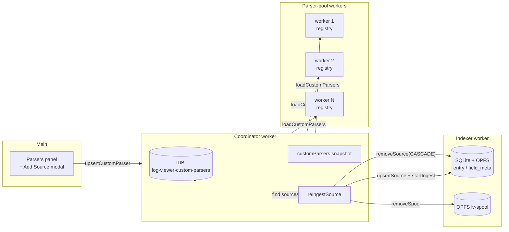

# 0018. Parser plugin architecture, custom parsers, and re-parse cycle

- Status: proposed
- Date: 2026-05-11

## Context and Problem Statement

ADR-0003 / ADR-0014 описывают парсерный пул как worker'ы, но не фиксируют, **как именно** регистрируются парсеры, как добавляются новые без правки исходников и что происходит со старыми записями, когда парсер меняется. После фиксации `LogParser` и нескольких `defineXxx`-фабрик пул держит в памяти ~5 встроенных парсеров (`json-lines`, `nginx-combined`, `syslog-3164`, `app-text`, `plain-text`). Это покрывает «знакомые» форматы, но не позволяет пользователю:

1. Добавить свой формат (внутрифирменные приложения, кастомные ETL-логи, GH-actions-like dumps) без сборки приложения.
2. Заменить детектор по умолчанию у конкретного источника (когда `canParse` ошибочно выбирает `plain-text` на pseudo-JSON).
3. Получить пере-парсинг **уже проиндексированных** строк после правки парсера — иначе одна edit-кнопка превращается в «удалить источник → добавить заново».

Дополнительный constraint: ADR-0004 фиксирует Comlink + сервис-воркер пул. Любая регистрация должна работать **на всех воркерах** пула (включая будущих, поднятых после первого batch'а), иначе rebалансировка ingest'а тихо проваливается на «незнакомом» worker'е.

## Considered Options

- **A. Только встроенные парсеры + edit исходников + ребилд.** Просто, дёшево, исключает любых non-developer пользователей. Поведение «не поддерживается» приходится демонстрировать каждым новым форматом.
- **B. Plugin-API в виде `LogParser`-фабрик + пер-source override (`parserId`), но без пользовательских парсеров.** Закрывает (2) и (3) частично. Не закрывает (1).
- **C. (выбрано) Полная plugin-архитектура: `LogParser` интерфейс + декларативные factories (`defineRegexParser`, `defineGrokParser`, `defineMultilineParser`) + пользовательские definitions, хранящиеся в IDB, плюс автоматический re-ingest при изменении парсера или его привязки к источнику.** Закрывает все три проблемы. Требует stable API для plugin-registration и устойчивого broadcast pattern в parser-pool.

## Decision Outcome

Chosen option: **"C — full plugin architecture"**, потому что один и тот же контракт (`LogParser`) обслуживает и встроенные парсеры, и пользовательские — отсутствует дополнительный data path для «custom». Цена решения — стоимость one-shot pre-flight compile и пер-source стирания entry/field_meta/OPFS-spool при изменении парсера. Эти операции локализованы в координаторе, не текут в UI.

### Ключевые подсистемы

- **`LogParser` контракт** ([src/core/types/log-parser.ts](../../src/core/types/log-parser.ts)) — `id`, `canParse(line)`, `parseLine(line, ctx)`, плюс необязательные `continuationRegex` (для multiline) и `defaultColumns` (для seed-таблицы).
- **Декларативные фабрики** ([src/core/parsers/lib/](../../src/core/parsers/lib/)) — `defineRegexParser`, `defineMultilineParser`, `compileGrok`. Один правильно отлаженный helper → встроенные парсеры (`nginx`, `syslog`, `app-text`) пишутся в 30-50 строк декларативного кода.
- **Custom parser definitions** ([src/core/parsers/custom-parser-def.ts](../../src/core/parsers/custom-parser-def.ts)) — `CustomParserDef { kind: 'regex' | 'grok' | 'js-function', pattern, … }`. Persist в IDB-store `log-viewer-custom-parsers`. Компилируется в `LogParser` через `compileCustomParser`.
- **Pre-bundled library** ([docs/parsers/*.json](../../docs/parsers/)) — кураторские definitions, импортируются в приложение через `import.meta.glob('/docs/parsers/*.json')`. Кнопка `Import` копирует в IDB пользователя.
- **Broadcast pattern в parser-pool** ([src/workers/coordinator/pool/parser-pool.ts](../../src/workers/coordinator/pool/parser-pool.ts)) — координатор держит latest snapshot `customParsers[]` и зовёт `loadCustomParsers(defs)` на каждом активном воркере. При spawn нового worker'а — replay тех же defs. Без этого «новый» worker не знал бы о пользовательском парсере.
- **Per-source parser override** — `LogSource.parserId?: string` сериализуется в `meta_json` через `serializeSourceMeta` и восстанавливается на reload (см. `placeholderFromIndexed`). Дропdown в Add-Source модалке + сохраняемая привязка.
- **Re-parse cycle** — `coordinator.upsertCustomParser` / `removeCustomParser` / `setSourceParser` вызывают `reIngestSource(source)`:
  1. abort live aborter,
  2. `indexer.removeSource(id)` — CASCADE дропает `entry`/`field_meta`/`minute_bucket`,
  3. `removeSpool(id)` — OPFS-spool очищается,
  4. `indexer.upsertSource(newSource)` с новой `meta_json`,
  5. `startIngest(newSource)` — pipeline крутится заново,
  6. `emitChange()` — UI получает фрешсные counters.

### JS-function: opt-in и threat model

JS-function kind компилируется через `new Function('line', 'ctx', body)` **в worker'е parser-pool'а**. Sandbox нет — нет ни `window`, ни DOM, но `fetch` есть, и любой код, который пользователь напишет, выполнится. Это **личный инструмент** (PWA в браузере), а не SaaS, поэтому риск принимается, но:

- В UI option `js-function` появляется в Kind-dropdown **только** при включённом `localStorage['lv:jsParsersEnabled'] = '1'` (чекбокс в Parsers-панели).
- Per-line `throw` ловится try/catch'ем — одна плохая строка не убивает batch.
- Syntax-error при compile → парсер регистрируется в `null`-состоянии (canParse=false), UI показывает ошибку.

### Consequences

- **Good**:
  - Один и тот же код-path обслуживает все парсеры (встроенные + пользовательские + шаблоны).
  - Пользователь добавляет format без сборки.
  - Edit парсера → видимое изменение в течение секунд (re-parse автоматический).
- **Bad**:
  - Re-ingest многомегабайтных источников дорогой; sequential по affected sources, чтобы не raid'ить parser-pool / SQLite.
  - JS-function — реальный risk surface, защита — только UI-флаг. Если кто-то монтирует чужой `localStorage`-state, парсер исполнится.
  - Broadcast pattern добавляет одну точку синхронизации: координатор обязан помнить latest `customParsers[]` и replay'ить — без этого «холодные» worker'ы будут парсить без custom'ов.
- **Neutral**:
  - IDB-store отдельный от `log-viewer-handles` — чище инвалидация и миграции.
  - Templates лежат в `docs/parsers/` — версионируются как обычный код, ревьюятся в diff'ах.

## Diagram

## Links

- [ADR-0003](0003-worker-centric-topology.md) — worker pool topology
- [ADR-0004](0004-comlink-rpc-with-custom-pool.md) — RPC layer this builds on
- [ADR-0014](0014-worker-lifecycle.md) — worker lifecycle guarantees
- [ADR-0016](0016-offset-pointer-index-lazy-body.md) — lazy-body model that re-parse interacts with
- [ADR-0017](0017-dynamic-field-schema.md) — dynamic field schema fed by every parser
- [ADR-0019](0019-multiline-buffer-in-orchestrator.md) — orchestrator-side multi-line accumulation
- [docs/plans/replicated-cooking-muffin.md](../plans/replicated-cooking-muffin.md) — full multi-format roadmap
