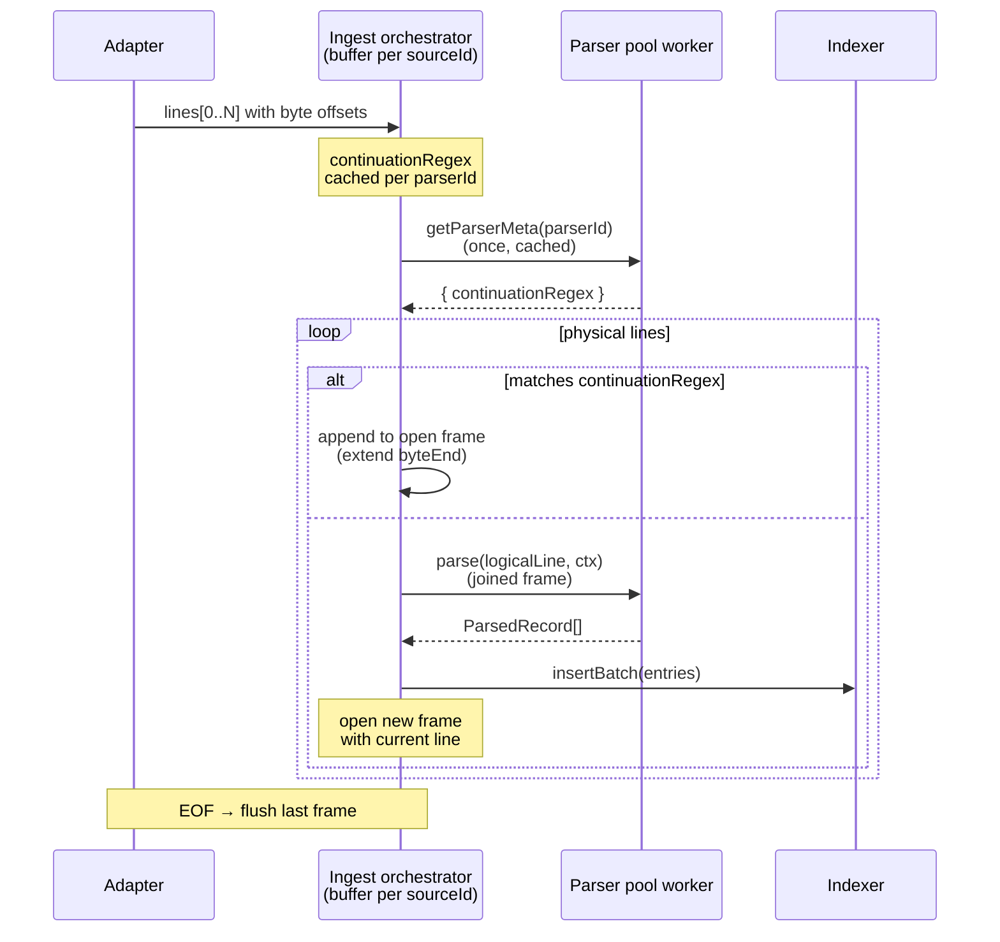

# 0019. Multi-line ingest buffer in orchestrator (option A)

- Status: proposed
- Date: 2026-05-11

## Context and Problem Statement

Большая часть форматов — однострочные: одна физическая `\n`-завершённая строка = одна `LogEntry`. Но три семейства логов фундаментально многострочны:

- **Stacktrace'ы** (JVM `\tat …`, Python `File "…"`, `Caused by:`).
- **Pretty-printed JSON / multi-line YAML** в логах разработки.
- **Apache-/nginx-стиле логи с длинными «продолжением» строками** (редко, но встречается).

Парсер-пул [src/workers/coordinator/pool/parser-pool.ts](../../src/workers/coordinator/pool/parser-pool.ts) — stateless: orchestrator кидает `parserPool.withWorker((p) => p.parse(lines, ctx))`, любой worker может взять batch. Multi-line аккумуляция плохо ложится: buffer должен жить **между batch'ами одного source'а**, а worker'ы чередуются.

Дополнительный constraint: после ADR-0016 индексер хранит только pointers (`byteStart`, `byteEnd`); тело лениво читается lazy-resolver'ом из OPFS / file handle. Любая модель «одна логическая запись = диапазон байт» должна работать в обе стороны:
- ingest: накопить N физических строк → собрать в одну запись с широким `[byteStart, byteEnd)`,
- read: lazy-resolver читает этот диапазон (со `\n` внутри) и снова парсит — multiline-парсер должен корректно обработать вход.

## Considered Options

- **A. (выбрано) Buffer в orchestrator'е**: `ingest-orchestrator` знает `continuationRegex` парсера (через RPC `parser-pool.getParserMeta(parserId)`), сам перепаковывает входной поток физических строк в логические перед отправкой в пул. Parser-pool остаётся stateless.
  - Плюс: пул не меняется. Lazy-resolver не меняется — он уже умеет читать произвольный байт-range и передавать его парсеру; multiline-парсер делает `split('\n') + parseBlock`.
  - Минус: orchestrator таскает per-source `openFrame`/`cont[]` буфер. `getParserMeta` нужно кешировать (cheap, parser registry уже в памяти worker'а).
- **B. Sticky source → worker assignment.** Каждый source pinned consistent-hash'ем (`sourceId % poolSize`). Worker держит per-source buffer.
  - Плюс: parser-pool остаётся «честно» сам отвечает за multiline.
  - Минус: ломает load-balancing — медленный source блокирует pin'нутый worker. Worker-restart (на crash или resize) теряет buffer.
- **C. Buffer внутри парсер-пула, в едином «multiline state manager».** Pool сам индексирует buffer по `(sourceId, parserId)` и synchronises между worker'ами.
  - Плюс: orchestrator чист от состояния.
  - Минус: усложняет pool API; синхронизация между Web Worker'ами через `MessageChannel` либо `SharedArrayBuffer` (не везде доступен в PWA-контексте).

## Decision Outcome

Chosen option: **"A — buffer в orchestrator'е"**, потому что:

1. Сохраняет parser-pool stateless — упрощает rebalancing и worker-restart (ADR-0014).
2. Lazy-resolver и indexer не меняются: orchestrator выдаёт «logical line» с уже корректным `byteStart`..`byteEnd`, всё остальное pipeline-а ничего не знает о multiline.
3. `getParserMeta` — дешёвая операция: registry уже в worker, lookup O(1), результат кэшируется orchestrator'ом per `(parserId)`. RPC-cost окупается за один batch.
4. Будущие multiline-форматы пишутся через `defineMultilineParser` декларативно — `hooks.isContinuation(line)` живёт рядом с парсером, без правок orchestrator'а или pool'а.

### Pipeline

1. Orchestrator получает batch физических строк `[line0, line1, …]` от adapter'а с их offset'ами в OPFS/file handle.
2. Перед отправкой в пул:
   - Если для текущего `(sourceId, parserId)` нет открытого frame'а: первая строка становится `openFrame`, идёт в `cont[]` accumulator.
   - Каждая следующая строка проходит через `continuationRegex.test(line)`:
     - **match** → добавляется в `cont[]`, `byteEnd` буфера сдвигается.
     - **no match** → orchestrator flush'ит текущий buffer как одну логическую запись (`raw = cont.join('\n')`, `byteStart = openFrame.byteStart`, `byteEnd = previous-line.byteEnd`), открывает новый frame с текущей строкой.
   - На EOF / abort — flush открытого frame'а.
3. Logical lines уходят в `parserPool.parse(lines, ctx)`. Парсер не знает, что input уже multiline — он `split('\n') + parseBlock` обрабатывает корректно, single-line парсер видит обычную строку.
4. Lazy-resolver при чтении диапазона `[byteStart, byteEnd)` получает slice со `\n` внутри. Multi-line парсер re-parses корректно; single-line парсер на расширенный диапазон не должен попадать (single-line parsers генерируют записи с byteEnd ≤ end-of-physical-line — invariant).

### Consequences

- **Good**: parser-pool остаётся «один batch → один RPC → один worker», без cross-worker state; lazy-resolver контракт не меняется; `defineMultilineParser` — единственное место с multiline-логикой.
- **Bad**: orchestrator теперь stateful — per-(source,parser) buffer обязан корректно flush'иться на abort/EOF/error. Утечка buffer'а на reload — потерянная последняя запись (mitigated EOF-flush'ем).
- **Bad**: расширение byteEnd за пределы физической строки делает невозможным «частичный» read одной строки из середины multi-line frame'а — lazy-resolver должен читать целый frame. На больших stacktrace'ах это нормально (~2-10 KB), но для патологических входов (50 MB JSON-блоб) — нет smart partial read.
- **Neutral**: `parser-pool.getParserMeta(parserId)` — новый cheap RPC. Cache на стороне orchestrator'а — `Map<parserId, ParserMeta>`, инвалидация на `loadCustomParsers` (см. ADR-0018).

## Diagram

## Links

- [ADR-0003](0003-worker-centric-topology.md) — parser-pool topology
- [ADR-0014](0014-worker-lifecycle.md) — worker lifecycle / restart guarantees
- [ADR-0015](0015-directory-tree-and-file-frames.md) — per-file frame contract
- [ADR-0016](0016-offset-pointer-index-lazy-body.md) — lazy body read this builds on
- [ADR-0018](0018-parser-plugin-architecture.md) — parser plugin contract
- [docs/plans/replicated-cooking-muffin.md](../plans/replicated-cooking-muffin.md) §Phase 2.D — open question that this ADR resolves
