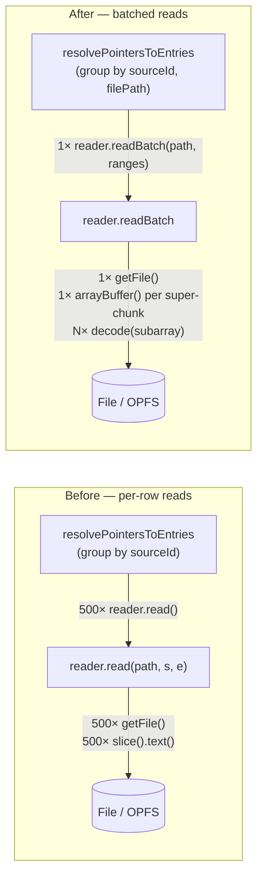

# 0020. Batched contiguous blob reads в `SourceBlobReader`

- Status: proposed
- Date: 2026-05-20

## Context and Problem Statement

[ADR-0016](0016-offset-pointer-index-lazy-body.md) ввёл lazy-resolve: индексер хранит только указатели `(file_path, byte_start, byte_end)`, а тело строки читается из исходного файла при отображении. В Consequences того ADR в качестве митигации указан «batched read по группе pointer'ов из одного файла», но в коде это реализовано не было: [lazy-resolver.ts](../../src/workers/coordinator/read/lazy-resolver.ts) вызывал `reader.read(...)` для **каждой** записи отдельным `Promise.all(map(...))`.

Симптом, который это создаёт: при прокрутке UI-окна (~500 записей: `OVERSCAN=200` + visible) делается ~500 операций

- `getFile()`/`getFileHandle` (для OPFS — ещё `getDirectoryHandle('lv-spool')` + `getDirectoryHandle(sourceId)` на каждую запись);
- `Blob.slice(start, end).text()` — отдельный декод UTF-8 на каждый range;
- для directory-источника — `resolveFileHandleByPath` по дереву директорий на каждый range, даже когда все строки в одном файле.

Стоимость одного `refresh` окна доминирует в latency скролла. Параллельная проблема (число `refresh`-ов) решается отдельным ADR/PR (debounce/coalescing, см. план [docs/plans/binary-baking-clover.md](../plans/binary-baking-clover.md)).

## Considered Options

- **A. Оставить как есть.** Прозрачно, но скролл уже ощутимо лагает на `large.jsonl` (50k строк); только усугубится при появлении более тяжёлых источников.
- **B. Кэшировать `FileSystemFileHandle.getFile()` поверх существующего интерфейса.** Снимает N walks по OPFS-дереву, но всё ещё N декодов и N `Blob.slice().text()` round-trip'ов. Половинчатое решение.
- **C. Расширить контракт `SourceBlobReader` методом `readBatch(filePath, ranges)`**, который читает один сплошной супер-чанк `[min(byteStart), max(byteEnd))` и нарезает его по индивидуальным диапазонам через `TextDecoder.decode(subarray)`. Группировка в lazy-resolver становится `(sourceId, filePath)` — для directory-источников строки окна могут лежать в разных файлах, и смешивать их в один super-chunk нельзя.

## Decision Outcome

Chosen: **C**.

- Один `Blob.slice(min, max).arrayBuffer()` + N `TextDecoder.decode(view.subarray(s, e))` стоят на порядки дешевле, чем N `Blob.slice().text()` каждый со своим IO и своим декодером.
- Контракт явный и тестируемый: метод-`readBatch` живёт на интерфейсе, базовый алгоритм нарезки — pure-функция `readRangesFromBlob`, у каждой конкретной имплементации только обязанность достать `Blob`/`File`.
- Семантика UTF-8 закреплена: байтовые диапазоны → `TextDecoder` поверх `Uint8Array.subarray`, не `String.slice` (которое режет по UTF-16 code unit'ам и портит multibyte-символы на границах).

### Контракт

```ts
export interface ByteRange {
  readonly byteStart: number;
  readonly byteEnd: number;
}

export interface SourceBlobReader {
  read(filePath: string, byteStart: number, byteEnd: number): Promise<string>;
  /**
   * Read N byte-ranges from a single file in as few IO operations as
   * possible. Result is index-parallel to `ranges`. Caller groups ranges
   * by `(sourceId, filePath)`.
   */
  readBatch(
    filePath: string,
    ranges: ReadonlyArray<ByteRange>,
  ): Promise<ReadonlyArray<string>>;
}
```

`read(...)` остаётся, но переиспользует `readBatch([{...}])[0]`.

### Стратегия в `readRangesFromBlob`

1. Сортируем `ranges` по `byteStart`, сохраняя оригинальный индекс — результат отдаём в порядке входа.
2. Жадно пакуем подряд идущие ranges в один **супер-чанк**, пока его span `(max - min)` ≤ `MAX_SUPERCHUNK_BYTES` (4 МБ). Каждый супер-чанк = один `blob.slice(min, max).arrayBuffer()` + N `TextDecoder.decode(view.subarray(...))`.
3. Если отдельный range сам по себе больше cap'а — читаем его одиночным `slice().arrayBuffer()`, не пытаемся включить в общий супер-чанк.

В рабочем сценарии (~500 строк × ~200 байт = ~100 КБ окно) cap не срабатывает почти никогда — это защита от патологических случаев (multi-MB строки, snapshot-члены гигабайтного объёма).

### Группировка в `lazy-resolver`

Сейчас группа — `sourceId`. Меняется на `(sourceId, filePath)`:

- Парсер-RPC по-прежнему один на `sourceId` (батч-парс сохраняется).
- Reader-RPC — один на `(sourceId, filePath)`. Для directory-источника, где окно может включать несколько файлов, каждый файл читается отдельно — это правильно, потому что их `byteStart/byteEnd` живут в собственных адресных пространствах.

## Diagram



## Consequences

- Good: latency lazy-resolve для типичного 500-строкового окна падает на порядок — один IO/декод вместо N. Заметно убыстряет скролл.
- Good: для directory-источника навигация по дереву директорий теперь O(files-in-window), а не O(rows-in-window).
- Good: UTF-8-корректность вынесена в одно место (`readRangesFromBlob`) и покрыта тестом с кириллицей+emoji — не появятся регрессии в отдельных reader'ах.
- Neutral: интерфейс `SourceBlobReader` шире на один метод; одиночный `read` остаётся для тех мест, где батч не имеет смысла.
- Bad: при патологическом окне с одиночными многомегабайтными строками вырастает peak-RAM (один супер-чанк в памяти). Cap `MAX_SUPERCHUNK_BYTES = 4 MB` ограничивает это сверху.
- Bad: тест-матрица расширилась — добавлены тесты на batch, UTF-8, превышение cap'а; нужно поддерживать.

## Links

- [ADR-0014](0014-worker-lifecycle.md) — coordinator worker, где живёт `lazy-resolver` и reader'ы.
- [ADR-0016](0016-offset-pointer-index-lazy-body.md) — lazy body read; этот ADR уточняет именно `read path` оттуда (batched mitigation).
- [docs/plans/binary-baking-clover.md](../plans/binary-baking-clover.md) — план реализации и контекст другого следующего шага (coalescing `setVisibleRange`).
- [src/core/storage/source-blob-reader.ts](../../src/core/storage/source-blob-reader.ts), [src/workers/coordinator/read/lazy-resolver.ts](../../src/workers/coordinator/read/lazy-resolver.ts) — точки реализации.
