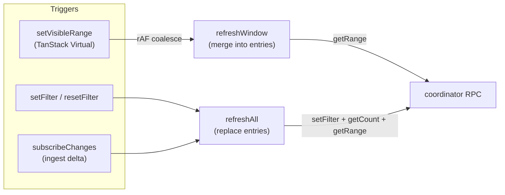

# 0021. Window-only refresh + entry cache в `log-client`

- Status: proposed
- Date: 2026-05-20

## Context and Problem Statement

В исходной реализации [log-client.ts](../../src/worker-client/log-client.ts) единственная функция `refresh()` обслуживала любой триггер обновления — смена фильтра, ingest-delta из `subscribeChanges` и **скролл** через `setVisibleRange`. Это сделало путь скролла дороже, чем нужно:

1. На каждый скролл-кадр шёл `setFilter(filter)` в координатор, хотя фильтр не менялся.
2. Каждый раз дёргался `getCount()`, хотя счётчики при скролле не двигаются.
3. `set({ entries: new Map() })` **полностью заменял** кэш окна — рядом стоявшие строки, которые только что были на экране, выкидывались. При мелком скролле туда-сюда UI рендерил skeleton поверх уже виденных рядов.
4. `set({ isLoading: true })` зажигал глобальный loading-оверлей на каждом скролл-кадре.
5. Не было coalescing'а: TanStack Virtual меняет `first/last` несколько раз за инерционный скролл, и `useEffect → setVisibleRange → refresh` отстреливал каждый раз.

Параллельно [ADR-0020](0020-batched-contiguous-blob-reads.md) уменьшил **стоимость** одного fetch'а. Этот ADR уменьшает **число** fetch'ов и устраняет лишнюю работу внутри них.

## Considered Options

- **A. Оставить как есть, ускорив только нижний слой.** ADR-0020 сам по себе уже даёт ощутимый прирост, но при инерционном скролле всё равно стреляет N refresh'ей с лишними `setFilter`/`getCount`, и каждый продолжает гасить кэш.
- **B. Debounce `setVisibleRange` по времени.** Просто в реализации, но создаёт visible lag: пока debounce-таймер ждёт, новые ряды не подтягиваются.
- **C. rAF-coalescing + split на `refreshAll` / `refreshWindow` + merge entries.** Не вносит задержку (ровно один refresh за кадр), скролл-путь не делает лишнего, и UI не теряет уже загруженные строки.

## Decision Outcome

Chosen: **C**.

### Изменения

1. **Split** `refresh` на два пути в [log-client.ts](../../src/worker-client/log-client.ts):
   - `refreshAll()` — `setFilter` + `getCount` + `getRange`, **заменяет** `entries`, ставит/снимает глобальный `isLoading`. Вызывается из `setFilter`, `resetFilter` и `subscribeChanges` (ingest-delta).
   - `refreshWindow()` — только `getRange`, **мержит** новый range в существующий `entries` Map, не трогает `isLoading`. Вызывается **исключительно** из `setVisibleRange`.

2. **rAF-coalescing**. `setVisibleRange` не запускает refresh напрямую — она ставит флаг и шедулит refresh через `requestAnimationFrame`. Несколько `setVisibleRange` в одном кадре сливаются в один RPC. Fallback на `queueMicrotask` в средах без rAF (тесты).

3.bis. **Append-only ingest не сбрасывает кэш.** `subscribeChanges`-коллбэк в log-client раньше всегда звал `refreshAll`. Это убивало UX при активной индексации больших файлов: `ingest-orchestrator` стреляет `onChange` после каждого `insertBatch`, координатор делает `count` + рассылку, главный поток чистит `entries` и заново тянет окно — несколько раз в секунду. Теперь `subscribeChanges`-коллбэк сравнивает `filteredCount`: если он только **вырос** — `entries` не трогаем (индексы уже загруженных строк стабильны при append-only). Если **упал** (re-ingest, удаление источника) — полный `refreshAll`. Live-tail и автоскролл продолжают работать через нормальный `setVisibleRange`-путь: на новые индексы скрываются, `refreshWindow` дотягивает.

3.ter. **Throttle на координаторе.** Параллельно сам координатор теперь коалесцирует `emitChange`: leading edge (первое событие в тихом окне) уходит мгновенно, последующие в окне 200 мс склеиваются в одну trailing-нотификацию. Это снимает count-RPC и Comlink-round-trip 10–20×/сек, типичные для активной индексации больших файлов. См. `emitChange` / `dispatchChangeNotice` в [coordinator.ts](../../src/workers/coordinator/coordinator.ts).

3. **Entry cache с эвикцией**. После merge'а ключи `entries`, которые ушли за `[windowFrom - EVICT_MARGIN, windowTo + EVICT_MARGIN)`, удаляются. `EVICT_MARGIN = 3 × OVERSCAN` — заметно шире, чем сам fetch-диапазон (`OVERSCAN = 200`), чтобы мелкие скролл-баунсы не сжигали кэш.

4. **Никаких глобальных индикаторов на скролле**. Незагруженные ряды рисуются skeleton'ами через `getRow(i) === undefined` — этот контракт уже был. Глобальный `isLoading` остаётся за `refreshAll` (смена фильтра, первая загрузка, ingest-delta).

### Контракт `entries`

- Map обязан содержать только записи, **актуальные для текущего `filter` и `version`**. `refreshAll` его заменяет; `refreshWindow` только мержит. При любых событиях, меняющих ground truth (фильтр, источники, ingest), используется `refreshAll`.
- Ключ — абсолютный индекс после фильтра. Этот индекс стабилен между ingest-delta'ми только в append-only сценарии. `subscribeChanges` всё равно вызывает `refreshAll`, чтобы не рассинхронизироваться.

## Diagram

## Consequences

- Good: на инерционном скролле — 1 refresh за кадр вместо N. Каждый refresh не делает `setFilter`/`getCount` зря.
- Good: мелкий скролл не гасит уже отрисованные строки — глаз больше не видит skeleton-вспышку.
- Good: глобальный loading-оверлей теперь честно сигнализирует «грузим новый фильтр / новые данные», а не «листай дальше».
- Bad: новая инвариант — `entries` обязана сбрасываться при любом сдвиге `filter`/`version`. Сейчас держится через явные `refreshAll` в `setFilter`/`resetFilter`/`subscribeChanges`/`clearAll`. Любой будущий путь, меняющий ground truth, должен идти через `refreshAll`, иначе UI покажет стейл.
- Bad: EVICT_MARGIN держит до ~`6 × OVERSCAN` строк (1200) в кэше при активном скролле в обе стороны. Каждая `LogEntry` — несколько килобайт, итого порядка нескольких MB. Приемлемо для современных браузерных вкладок.
- Neutral: rAF-fallback на `queueMicrotask` достаточен для Vitest и для headless-сред. Под Worker'ом (где log-client не живёт) тоже работает.

## Links

- [ADR-0014](0014-worker-lifecycle.md) — где живёт coordinator (тот, в который ходит `log-client`).
- [ADR-0016](0016-offset-pointer-index-lazy-body.md) — lazy body read; этот ADR опирается на то, что `getRange` уже дешёвый.
- [ADR-0020](0020-batched-contiguous-blob-reads.md) — уменьшил **стоимость** одного fetch'а; этот ADR уменьшает **число** fetch'ов и побочную работу внутри них.
- [src/worker-client/log-client.ts](../../src/worker-client/log-client.ts) — точка реализации.
- [docs/plans/binary-baking-clover.md](../plans/binary-baking-clover.md) — план, где описан вариант A.
