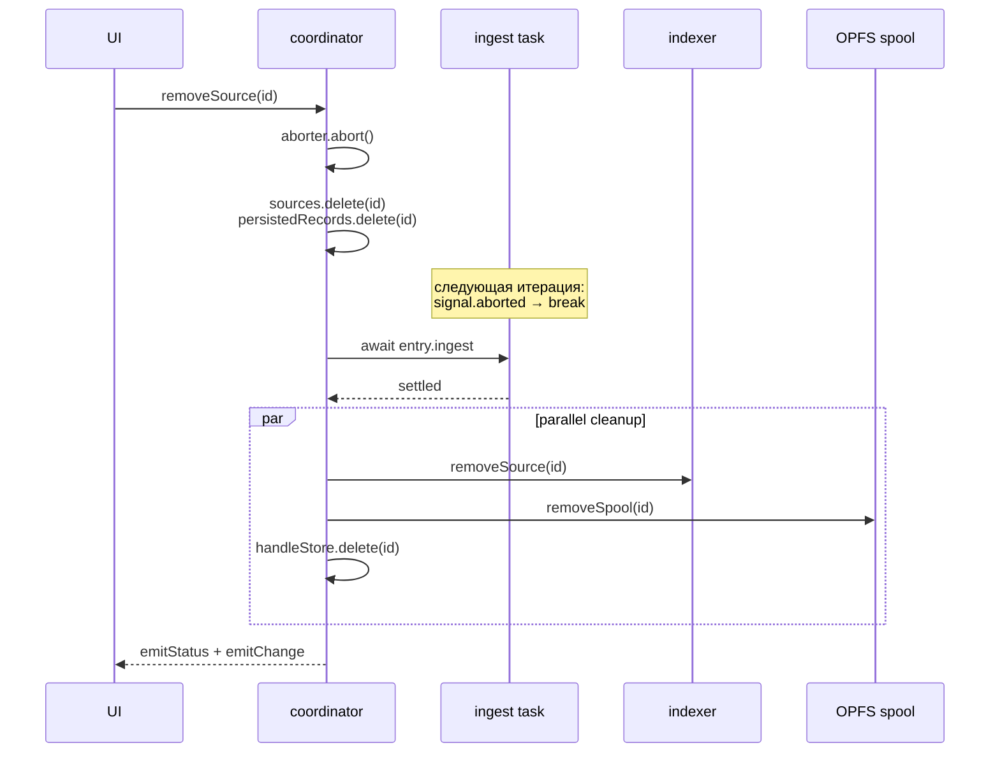

# 0022. Полная очистка ресурсов при `removeSource` (включая live-ingest)

- Status: proposed
- Date: 2026-05-20

## Context and Problem Statement

Метод `removeSource` в [coordinator.ts](../../src/workers/coordinator/coordinator.ts) до этого ADR делал три вещи: дёргал signal на ingest-aborter, удалял запись из in-memory `sources`/`persistedRecords` и параллельно вызывал `indexer.removeSource(id)` + `handleStore.delete(id)`. На практике этого было недостаточно:

1. **OPFS-spool оставался.** Для источников `text` / `url` / `snapshot` / `stream` тело каждой строки лежит в `lv-spool/<sourceId>/` (см. [ADR-0016](0016-offset-pointer-index-lazy-body.md)). `reIngestSource` уже знал, что после удаления нужно дернуть `removeSpool(id)`, но `removeSource` — нет. Поэтому при удалении такого источника в OPFS оставался мусор пропорционально объёму данных. На повторных удалениях это легко выедало квоту.
2. **Гонка с in-flight ingest-батчем.** `aborter.abort()` — синхронный, лишь взводит signal. Ingest-петля в [ingest-orchestrator.ts](../../src/workers/coordinator/ingest/ingest-orchestrator.ts) проверяет signal только в начале итерации; уже начатый `await indexer.insertBatch(entries)` доводился до конца. Если этот `insertBatch` завершался **после** `indexer.removeSource(id)`, в таблице `entry` оставалась горстка строк с `source_id` несуществующего источника. UI их не показывал (источника нет в `sources`), но БД росла.
3. **Stale-уведомления.** Последний `onChange()` от ingest'а летел уже после удаления, координатор выполнял пересчёт count для актуального фильтра, главный поток дёргал `refresh` против БД, где строки этого источника либо уже удалены, либо вот-вот будут.

## Considered Options

- **A. Только `removeSpool`.** Снимает (1), но (2) и (3) остаются.
- **B. Также трекать ingest-задачу и `await` её перед удалением.** Снимает (1), (2), (3) сразу. Требует одного дополнительного поля `ingest?: Promise<void>` на `SourceEntry`.
- **C. Идти дальше и переписать ingest-петлю на cancellation-aware insertBatch.** Большой объём изменений в indexer + adapter контрактах ради того же эффекта, что даёт B.

## Decision Outcome

Chosen: **B**.

### Контракт `SourceEntry`

```ts
interface SourceEntry {
  source: LogSource;
  status: SourceStatus;
  aborter: AbortController | null;
  /**
   * Resolves when the background `ingestSource(...)` task fully exits.
   * `removeSource` awaits this before deleting indexer rows so an
   * in-flight `insertBatch` cannot race past the delete.
   */
  ingest?: Promise<void>;
  parserId?: string;
  parserDefaultColumns?: ReadonlyArray<string>;
}
```

В `startIngest` промис `ingestSource(...)` оборачивается в `.catch(...)` (AbortError молча проглатывается, остальные ошибки идут в `console.warn` — статус источника всё равно эмитится через `onStatus({ kind: 'error', ... })`), записывается в `entry.ingest`.

### Алгоритм `removeSource`



Ключевые инварианты:

- К моменту `indexer.removeSource(id)` ни одного выполняющегося `insertBatch` для этого source-id уже нет — потому что мы дождались `entry.ingest`.
- `onStatus` и `onChange` коллбэки в ingest-задаче гайдят по `sources.has(source.id)` (для `onChange`) и по `sources.get(source.id)` (для `onStatus`). Так как `sources.delete(id)` вызывается **до** `await ingestPromise`, последние эмиты в самом конце ingest'а молча отбрасываются. Stale-уведомление до главного потока не доезжает.
- OPFS-spool чистится параллельно с indexer.removeSource и handleStore.delete — `removeSpool` идемпотентна и no-op для kinds без spool'а (directory/file).

## Consequences

- Good: больше нет утечки OPFS-байт при удалении text/url/snapshot/stream источников. Размер OPFS теперь честно отражает live-набор.
- Good: orphaned entries в `entry` не появляются даже при удалении источника в момент активной индексации.
- Good: UI не дёргается на stale-`onChange` после удаления.
- Neutral: `removeSource` теперь синхронно ждёт завершение ingest-петли. На практике это занимает миллисекунды (max — длительность одного `insertBatch` + один проход по signal-check'у). На больших батчах теоретически до сотен миллисекунд; UI всё это время видит источник со статусом «удаляется» (статус не сбрасывается до завершения).
- Bad: контракт `SourceEntry` стал жирнее. Любой будущий путь, который добавляет новый источник вне `startIngest`, должен также проставлять `ingest`-поле или сознательно его опускать (тогда `removeSource` просто не ждёт — для статуса `'queued'` это корректно: ingest ещё не стартовал).
- Bad: если ingest-задача когда-нибудь зависнет внутри await'а без проверки signal (например, бесконечно ждёт ответа сетевого адаптера), `removeSource` тоже зависнет. Митигация — все адаптеры должны передавать signal в нижележащие fetch/WS/SSE; на сегодня это так.

## Links

- [ADR-0014](0014-worker-lifecycle.md) — coordinator worker, где живёт `removeSource` и `startIngest`.
- [ADR-0016](0016-offset-pointer-index-lazy-body.md) — где описан `lv-spool` контракт, чьи байты теперь честно чистятся.
- [src/workers/coordinator/coordinator.ts](../../src/workers/coordinator/coordinator.ts) — `removeSource`, `startIngest`, `SourceEntry`.
- [src/workers/coordinator/ingest/ingest-orchestrator.ts](../../src/workers/coordinator/ingest/ingest-orchestrator.ts) — ingest-петля, чей `signal.aborted`-check мы теперь дожидаемся.
- [src/core/storage/opfs-spool.ts](../../src/core/storage/opfs-spool.ts) — `removeSpool` (никаких изменений, только новая точка вызова).
