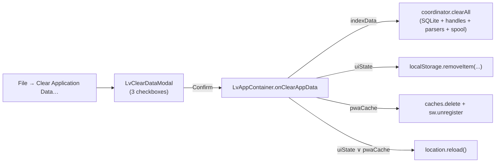

# 0023. File → Clear application data — три скоупа очистки

- Status: proposed
- Date: 2026-05-20

## Context and Problem Statement

У приложения накопилось четыре независимых хранилища, которые могут «помнить» состояние между сессиями:

1. **Worker-side данные**: SQLite OPFS-индекс, OPFS `lv-spool/` с телами записей, IDB `handle-store` (FS-handle'ы directory-источников), IDB `custom-parser-store`.
2. **UI state в LocalStorage** (zustand `persist`): `lv:bookmarks`, `lv:saved-searches`, `lv:recent-files`, `lv:ui-prefs`, `lv:jsParsersEnabled`.
3. **PWA-кэш**: Workbox-precache в `Cache Storage` + регистрация service worker'а.
4. Сам worker (terminated при HMR-перезагрузке, не пользовательский сценарий).

До этого ADR `clearAll` в координаторе чистил только (1) частично — без OPFS spool'а и без custom-parser-store, по тем же причинам, что были у `removeSource` до [ADR-0022](0022-source-removal-cleanup.md). Кнопки «всё стереть» в UI не было, а смешивать UI-state с index-data в одном «снести всё» неудобно: пользователь часто хочет почистить только кэш индекса, сохранив закладки и недавние файлы. Прокидывать выбор пользователю — единственный способ это сделать без потери данных.

## Considered Options

- **A. Одна кнопка «Reset everything».** Прозрачно, но регулярно затирает закладки/preferences. Срабатывает раз в полгода, накапливая раздражение.
- **B. Три checkbox'а в диалоге.** Пользователь выбирает скоуп; UI/Container выполняет действия по разрешению.
- **C. Отдельные кнопки в разных местах.** Меньше открытий диалога, но размывает UX — где «снести индекс»? где «снести закладки»?

## Decision Outcome

Chosen: **B**.

### Размещение

- Пункт в **File menu** — `Clear Application Data…` ([LvMenuBar.tsx](../../src/ui/components/topbar/LvMenuBar.tsx)). Команда `clear-data` ловится в `LvApp.runCommand` ветке и открывает модалку.
- Модалка: [LvClearDataModal.tsx](../../src/ui/components/modals/LvClearDataModal.tsx). Три чекбокса (`indexData`/`uiState`/`pwaCache`), кнопка Cancel / Clear selected. Confirm — обязательный (необратимо).
- Парент рендерит модалку условно (`{open && <LvClearDataModal …/>}`) — гарантирует свежий state при каждом открытии без эффектов сброса.

### Скоупы и порядок выполнения

Container ([LvAppContainer.tsx](../../src/app/containers/LvAppContainer.tsx)) `onClearAppData` исполняет независимо в порядке:

1. `indexData` → `sourceCtrl.clearAll()`. Координатор:
   - abort'ит все live ingest'ы и **дожидается** их завершения (тот же контракт, что в ADR-0022).
   - Параллельно вызывает `indexer.clearAll()`, `handleStore.clearAll()`, `customParserStore.clearAll()`, `removeAllSpool()` — последний — новый helper в [opfs-spool.ts](../../src/core/storage/opfs-spool.ts), `removeEntry('lv-spool', { recursive: true })`.
2. `uiState` → `clearUiState()` из [clear-app-data.ts](../../src/app/clear-app-data.ts). Удаляет фиксированный список LocalStorage-ключей. Список — единая точка правды; любой новый persisted-store должен дописать туда свой ключ, иначе утечёт через очистку.
3. `pwaCache` → `clearPwaCache()`: `caches.keys()` + `caches.delete(...)` + `serviceWorker.getRegistrations().unregister()`.

### Reload

Service-worker unregister реально срабатывает только на следующей навигации. UI-state живёт в памяти zustand-store'ов, и LocalStorage-wipe сам по себе не сбрасывает уже загруженные значения. Поэтому Container делает `location.reload()` если выбран `pwaCache` **или** `uiState`. Для чистого `indexData`-сценария reload не нужен — координатор уже эмитнул пустой статус, UI обновится через подписку.

### Снижение latency (instant feel)

После первой итерации обнаружилось, что click → "Clearing…" → закрытие модалки выглядит долгим: даже маленький `indexData`-проход ждёт abort'а live-ingest'ов (секунды на большом файле), а индексер.clearAll/removeAllSpool накладываются сверху. Чтобы кнопка ощущалась мгновенной, делаем три параллельных правки:

1. **Модалка закрывается синхронно** на Confirm. `onConfirm` уходит fire-and-forget, через `.catch(console.warn)` — никакого `busy`-состояния, никакого ожидания.
2. **Координатор эмитит пустой статус сразу** после `sources.clear()`/`persistedRecords.clear()`, до `await Promise.all(ingestPromises)` и до `indexer.clearAll`. Сайдбар очищается за миллисекунды, тяжёлая работа продолжается в фоне.
3. **Скоупы параллельно**. Container делает `Promise.all([clearAll(), clearPwaCache()])` (LocalStorage wipe — синхронный, фигурирует первым), вместо последовательного await каждого.

Trade-off: пользователь больше не видит ошибку чистки в самой модалке — она ушла в `console.warn`. На практике эти ошибки невосстановимые («OPFS quota», «caches.delete failed») и для пользователя бесполезны; видимое поведение — состояние UI всё равно сходится через подписки и/или reload.

## Diagram

## Consequences

- Good: пользователь выбирает scope; закладки/recent не теряются при «снеси индекс».
- Good: `clearAll` теперь честно чистит весь worker-side state (включая OPFS spool и custom parsers) — закрылся тот же gap, что `removeSource` закрыл в ADR-0022.
- Good: централизованный список UI-state ключей — добавление нового persisted-store ведёт к одной строчке правки.
- Neutral: на `indexData` только пользователь видит, как пропали источники; reload не нужен.
- Bad: `pwaCache`-вариант требует reload — пользователь теряет открытый стрим/выделение. Это ожидаемо, и сообщение в чекбоксе предупреждает.
- Bad: если в будущем добавится новый persisted store (например, в IDB), его нужно вручную включить либо в координаторный `clearAll` (worker-side), либо в `clearUiState` (main-thread). Тестов на «всё очистилось» сейчас нет.

## Links

- [ADR-0014](0014-worker-lifecycle.md) — где живёт координатор и его `clearAll`.
- [ADR-0016](0016-offset-pointer-index-lazy-body.md) — OPFS-spool, теперь чистится в bulk-пути.
- [ADR-0018](0018-parser-plugin-architecture.md) — custom-parser-store, добавлен в `clearAll`.
- [ADR-0022](0022-source-removal-cleanup.md) — тот же контракт abort+await-ingest, что переиспользует `clearAll`.
- [src/app/clear-app-data.ts](../../src/app/clear-app-data.ts) — main-thread helpers.
- [src/ui/components/modals/LvClearDataModal.tsx](../../src/ui/components/modals/LvClearDataModal.tsx) — UI.
