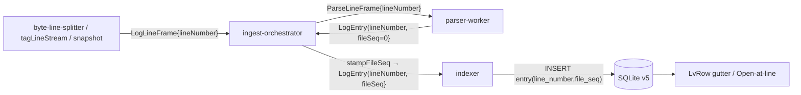

# 0024. Physical line number и per-file entry ordinal в LogEntry

- Status: proposed
- Date: 2026-05-22

## Context and Problem Statement

В таблице логов первая (gutter) колонка показывала `entry.seq` — глобальный счётчик записей в источнике через все файлы. Это сбивает с толку:

- Пользователь привычно ожидает увидеть **номер строки в исходном файле** (как в редакторе/`less`), чтобы быстро открыть файл «на этой строке».
- `entry.seq` монотонно растёт через все файлы directory-источника, поэтому первая запись в `b.log` имеет seq, например, 12 345 — никак не связано с её положением в `b.log`.
- «Open at line» в [LvViewer.tsx](../../src/ui/components/stream/LvViewer.tsx) передавал тот же `entry.seq` в меню «Open in editor», что было заведомо неправильно для multi-file источников.

Пользователь попросил оба значения: физический номер строки в файле и порядковый номер entry в файле; по умолчанию показывать первое.

## Considered Options

- **Option A** — добавить два новых поля в `LogEntry` (`lineNumber`, `fileSeq`) и колонки в БД, заполнять во время ingest.
- **Option B** — вычислять оба значения на лету в UI/coordinator по filePath + позиции entry в выборке. Не сходится: без полной выборки на клиенте нельзя посчитать ranged ordinal, а ingest-pipeline для lineNumber всё равно нужен.
- **Option C** — хранить только `lineNumber`, отказаться от `fileSeq` как «производного». В большинстве однострочных логов они совпадают, но при multi-line continuation (stack-traces) расходятся, и пользователь явно попросил оба значения.

## Decision Outcome

Chosen option: **«Option A»**.

- **`lineNumber`** — 1-based физическая строка в исходном файле, рассчитывается на самой ранней стадии pipeline (byte-line-splitter / tagLineStream / snapshot-adapter / stream-adapter) и переносится через `LogLineFrame` → `ParseLineFrame` → `LogEntry` без сюрпризов. Для multi-line блоков, склеенных по `continuationRegex` в [ingest-orchestrator.ts](../../src/workers/coordinator/ingest/ingest-orchestrator.ts), комбинированный frame наследует lineNumber **первой** физической строки блока.
- **`fileSeq`** — 1-based порядковый номер логической записи внутри файла. Парсер про существующие в файле записи не знает, поэтому проставляет 0; нумерацию по факту разрешает orchestrator через Map<filePath, counter> прямо перед `insertBatch`.
- **Stream-источники** считают `lineNumber` глобально через все OPFS-чанк-файлы — пользователь воспринимает их как один непрерывный поток, и сброс на каждом chunk был бы запутывающим. `fileSeq` для stream совпадёт с глобальным fileSeq так же — у них один path (`''`).
- **Persistence** — non-destructive миграция БД v5: `ALTER TABLE entry ADD COLUMN line_number, file_seq` с default `0`. Старые source'ы продолжают жить, в gutter для них показывается fallback на `seq` (то же поведение что и было до этой правки); реингест добавит корректные значения.
- **UI** — переключатель `Gutter shows: Line / Entry / Both` в `LvTableSettings`, по умолчанию `Line`. В режиме `Both` рендерится `<line>·<entry>` одной ячейкой, чтобы не расширять gutter.
- **«Open at line»** — переходит на `entry.lineNumber` с fallback на `entry.seq` для pre-v5 строк.

### Consequences

- Good:
  - Gutter теперь отражает то, что пользователь ожидает: номер строки в его файле.
  - «Open at line» становится семантически корректным — внешние редакторы получают настоящий line number, а не глобальный ingest seq.
  - Будущие фичи (например, deep-link на конкретную строку, sticky group headers) могут опереться на стабильное значение.
- Bad:
  - Растёт строка `entry` в SQLite на два `INTEGER` + lineNumber пробрасывается через все frame'ы — overhead 16-24 байта на запись плюс копии в pipeline. На больших фикстурах (50k+ строк) измеримо, но не критично — приоритет UX выше.
  - Источники, импортированные до миграции, показывают `seq` (через fallback) пока не будут реингествлены — это видно только в редких случаях (например, открыли large.jsonl, потом обновили приложение).
- Neutral:
  - `ParsedRecord` исключает теперь и `lineNumber`/`fileSeq` — это упрощает контракт парсера, но требует одной правки сторонних парсеров, если они появятся.

## Diagram

## Links

- [LvRow.tsx](../../src/ui/components/stream/LvRow.tsx) — рендер gutter с учётом `LvGutterMode`.
- [LvTableSettings.tsx](../../src/ui/components/filter/LvTableSettings.tsx) — переключатель `Gutter shows`.
- [schema-v5-line-numbers.sql](../../src/workers/indexer/db/schema-v5-line-numbers.sql) — миграция.
- Связано с [ADR-0016](0016-offset-pointer-index-lazy-body.md) (offset-pointer entries, на которые мы наслаиваем новые поля) и [ADR-0019](0019-multiline-buffer-in-orchestrator.md) (continuation-склейка, для которой определяется правило «lineNumber первой строки блока»).
