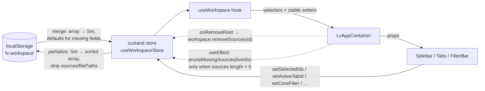

# 0025. Persist UI workspace across reloads

- Status: proposed
- Date: 2026-05-22

## Context and Problem Statement

Источники переживают reload (SQLite + IndexedDB handles), и UI-tweaks/bookmarks/saved-searches/recent-files уже сидят за `persist`-middleware (`lv:ui-prefs` и др.). Но «рабочее место» пользователя — открытые табы, активный таб, чекбоксы в сайдбаре, поисковый фильтр, group-by, live-tail — жило только в `useState` внутри [LvAppContainer.tsx](../../src/app/containers/LvAppContainer.tsx) и стиралось на каждом F5. Юзер терял query, набор выбранных файлов и открытый таб после любого reload.

Дополнительная сложность: `subscribeStatus` координатора выдаёт первый snapshot **синхронно и часто пустой**, а затем второй после `hydratePersisted` — значит, любой prune workspace'а, привязанный к первому emit'у, успешно затирает только что отгидрированное состояние.

## Considered Options

- A — Cherry-pick дропнутых коммитов `2d94cfb` + `442b000`, восстановить полный Workspace c Export/Import, ADR-0024 (canonical state) и per-source customization (~600 строк).
- B — Свежий `useWorkspace` store через `zustand persist`, тот же паттерн что у `useBookmarks` / `useSavedSearches` / `useUiPrefs`, ограниченный объёмом «tabs + selection + filter + group-by + live-tail». Export/Import и per-source customization — отдельными планами.
- C — Do nothing: оставить `useState`, продолжать терять состояние на reload.

## Decision Outcome

Chosen option: **B (fresh persisted store)**, потому что объём в B покрывает ~95% жалоб на потерю работы за единственный новый модуль и одну миграцию контейнера, без тяжёлого contracts/Export-слоя. Cherry-pick из A тянет с собой ADR-0024 «canonical portable state», LvImportWorkspaceModal и `fileOverrides` — это самостоятельные решения, фиксируются отдельно когда понадобятся.

### Consequences

- Good: рабочее место пользователя переживает reload без потерь; код соответствует существующему паттерну `lv:*`-store'ов, который уже хорошо понимают читатели.
- Good: `mergeWorkspaceData` устойчив к corrupted JSON — partial / wrong-typed поля заполняются дефолтами, не падает.
- Good: единая точка очистки — `removeSource(sourceId)` в store знает про `selectedIds`, `openTabs`, и `activeTabId`. Раньше эта логика была расплылась в `onRemoveRoot` контейнера.
- Bad: гейтить prune-on-hydrate через `sources.length > 0` — компромисс. Если пользователь *внешне* стёр все источники (через DevTools/IDB), но `lv:workspace` остался непустым, ghost-id'ы лежат в localStorage до первого мутирующего действия. Зрительно безопасно — `canPrune`-фильтр в `tabs` useMemo прячет их.
- Bad: `setActiveTabId` теперь — внешний store mutation; React 19 запрещает такие вызовы во время рендера, поэтому reset активного таба переехал из render-блока в `useEffect`. Один дополнительный re-render при удалении источника.
- Neutral: контракт `RangeCounts`/`ChangesNotice` не трогался — это чисто UI-side изменение.
- Neutral: `Set<string>` для selectedIds сериализуется в **сортированный** массив, чтобы snapshot localStorage был детерминированным для дебага и тестов.

## Diagram

## Links

- [docs/plans/glowing-rolling-honey.md](../plans/glowing-rolling-honey.md) — план реализации
- [src/hooks/use-workspace.ts](../../src/hooks/use-workspace.ts) — store + hook
- [src/hooks/__tests__/use-workspace.test.ts](../../src/hooks/__tests__/use-workspace.test.ts) — unit-тесты на partialize / merge / actions
- [ADR-0023](0023-clear-application-data.md) — `lv:workspace` добавлен в `UI_STATE_LOCAL_STORAGE_KEYS` файла `clear-app-data.ts`
