# 0026. Versioning, CHANGELOG, and release automation via Release Please + Conventional Commits

- Status: proposed
- Date: 2026-05-24

## Context and Problem Statement

Проект — open source PWA, опубликован на GitHub Pages, но до сих пор не имел версионирования: `package.json:version = "0.0.0"`, git tags пусты, `CHANGELOG.md` отсутствует, в UI висел хардкод `"1.0 · PWA"`. Деплой запускался автоматически на каждый push в `main`, без какой-либо маркировки релиза. Для пользователей это значит: невозможно понять, что изменилось между визитами, нет точки входа в историю изменений, а свежезагруженная PWA молча апдейтится в фоне без уведомления.

Нужно: ввести semver-версионирование, машиночитаемый CHANGELOG, дисциплину коммит-сообщений и точки в UI, где видна текущая версия и наличие обновления.

## Considered Options

- **Option A — Release Please + Conventional Commits.** Google-action автоматизирует release-PR с бампом `package.json:version` и записями в `CHANGELOG.md`, на merge создаётся git tag + GitHub Release. Требует перейти на Conventional Commits.
- **Option B — Changesets.** На каждый значимый PR создаётся файл `.changeset/*.md`, CLI собирает их в CHANGELOG. Не требует Conventional Commits, но добавляет ритуал к каждому PR. Уместен в монорепо с несколькими публикуемыми пакетами.
- **Option C — semantic-release.** Каждый push в `main` сразу публикует релиз. Хорош для библиотек на npm, для PWA-приложения избыточен.
- **Option D — Ручной flow (Keep a Changelog + ручные tags).** Сам бампишь `package.json`, сам ведёшь CHANGELOG, сам тегаешь. Максимум контроля, минимум зависимостей, но в open source — слабая дисциплина без CI.
- **Option E — Do nothing.** Не вводить версионирование.

## Decision Outcome

Chosen option: **"Option A — Release Please + Conventional Commits"**, потому что для single-package GitHub Pages-проекта он даёт лучшее соотношение автоматизация/настройка: дисциплина коммитов остаётся единственным ритуалом, а версия, CHANGELOG, tags и GitHub Releases получаются автоматически. Changesets требует лишнего ритуала на каждый PR, semantic-release избыточен для PWA, ручной flow даёт слабую дисциплину в open source. Manifest-mode (`release-please-config.json` + `.release-please-manifest.json` с `{".": "0.1.0"}`) — единственный источник правды о текущей версии, так как git tags пусты. На pre-1.0 включены флаги `bump-minor-pre-major: true` и `bump-patch-for-minor-pre-major: true`, чтобы кадензa оставалась мягкой до стабилизации API.

Сопутствующие решения:

- Стартовая версия — **0.1.0** (а не 1.0.0), pre-1.0 честнее отражает зрелость проекта.
- Версия пробрасывается в bundle через Vite `define` как `__APP_VERSION__` / `__APP_BUILD_HASH__` — единый источник для статус-бара, About-секции и `transformIndexHtml`-инъекции в футер лендинга.
- PWA update-баннер через `useRegisterSW` из `virtual:pwa-register/react` (потребовалось добавить `workbox-window` как devDependency).
- `GITHUB_TOKEN` не триггерит другие workflow → в [.github/workflows/deploy.yml](../../.github/workflows/deploy.yml) добавлен триггер `release: types: [published]`, чтобы деплой стартовал после merge release-please PR без PAT.

### Consequences

- Good: предсказуемые релизы, авто-генерация CHANGELOG, git tags + GitHub Releases без ручного труда, версия видна пользователю в 4 точках UI, PWA-апдейт явный.
- Good: дисциплина Conventional Commits улучшает diff PR-описаний и автоматизирует scope-определение в будущем (release notes, semver-bump).
- Bad: новые коммиты в `main` обязаны соответствовать Conventional Commits — это барьер для контрибьюторов. Митигируется правилами в [CONTRIBUTING.md](../../CONTRIBUTING.md) и [CLAUDE.md](../../CLAUDE.md).
- Bad: добавлена devDependency `workbox-window` (~5 kB gzipped в bundle) как цена за `useRegisterSW`.
- Neutral: `package.json:version` и `CHANGELOG.md` теперь read-only для людей (кроме seed-записи `[0.1.0]`) — править их руками запрещено.
- Neutral: peer-dep `vite-plugin-pwa@1.2.0` на Vite ^3..^7 при нашем Vite 8 остаётся открытым риском, но не ухудшается этим решением.

## Diagram

```mermaid
flowchart LR
  Dev[Developer commit feat/fix/perf in CC] --> Push[push to main]
  Push --> RP[release-please workflow]
  RP --> RPPR[release PR: bump version + CHANGELOG]
  RPPR -->|merge| Tag[git tag vX.Y.Z]
  Tag --> Release[GitHub Release published]
  Release --> Deploy[deploy.yml on release published]
  Deploy --> Pages[GitHub Pages /log-viewer/]
  Pages --> SW[Service Worker autoUpdate]
  SW --> Banner[useRegisterSW onNeedRefresh -> LvUpdateBanner]
```

## Links

- План: [docs/plans/open-async-stardust.md](../plans/open-async-stardust.md)
- [release-please](https://github.com/googleapis/release-please) — Google action.
- [Conventional Commits 1.0](https://www.conventionalcommits.org/en/v1.0.0/)
- [Keep a Changelog 1.1.0](https://keepachangelog.com/en/1.1.0/)
- [semver 2.0](https://semver.org/spec/v2.0.0.html)
