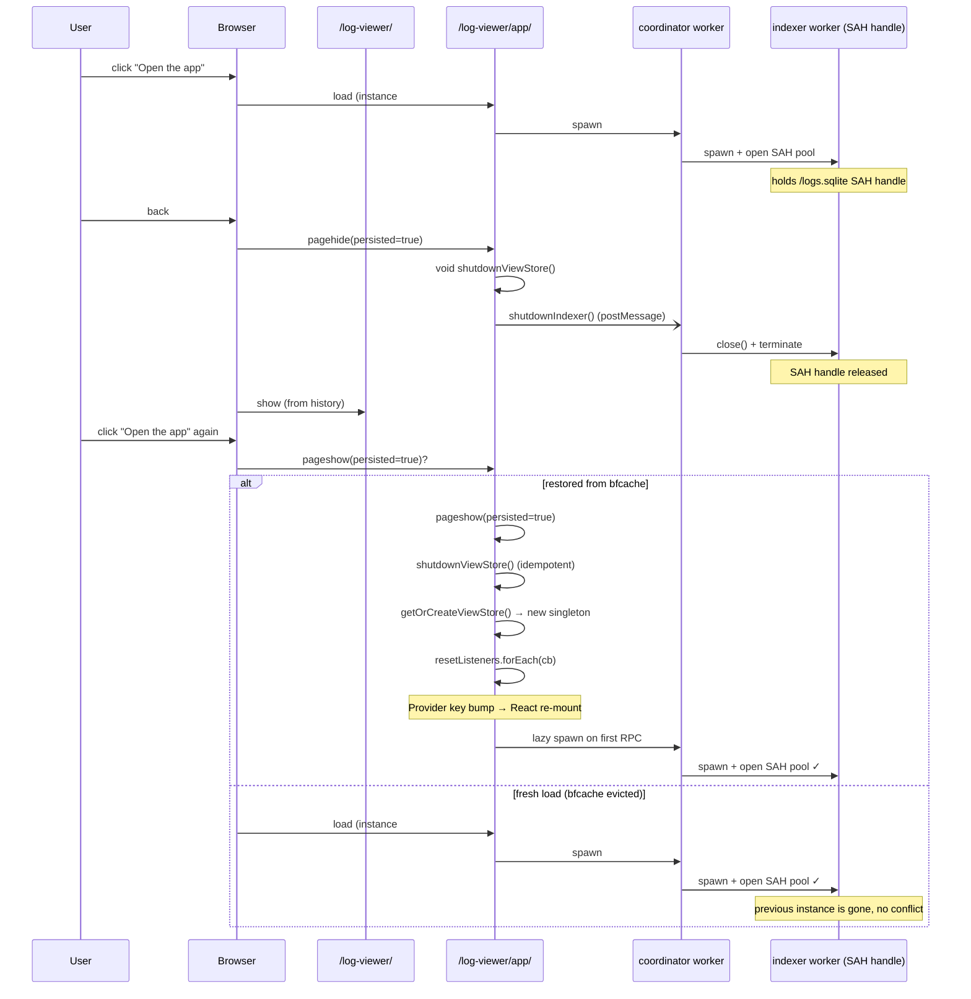

# 0027. bfcache lifecycle: shutdown воркеров на pagehide, re-mount на pageshow

- Status: proposed
- Date: 2026-05-26

## Context and Problem Statement

При навигации лендинг (`/log-viewer/`) → app (`/log-viewer/app/`) → back → app на GitHub Pages пользователь стабильно получает в Console:

```
log-viewer-sahpool: [object DOMException]
removeVfs() failed with no recovery strategy: [object DOMException]
[coordinator] hydratePersisted failed
[useFieldSchema] failed
[log-client] refreshAll failed
Error: OPFS lock conflict: SQLite index is still held by another worker.
```

Sources не появляются — БД не открылась. `Ctrl+R` чинит, обычный SPA-переход — нет.

**Корневая причина — browser back/forward cache (bfcache).** При навигации `back` со страницы `/app/` браузер сохраняет её живой со всеми Web Workers и DOM. Indexer-worker продолжает держать эксклюзивный `createSyncAccessHandle` на `/logs.sqlite` через SQLite WASM SAH Pool VFS — этот VFS [по дизайну требует exclusive lock](https://sqlite.org/wasm/doc/trunk/persistence.md). Когда пользователь жмёт forward или CTA «Open the app» повторно, **новая** инстанция `/app/` пытается зарегистрировать тот же VFS и упирается в `NoModificationAllowedError`. Retry-loop в [open-db.ts:90](../../src/workers/indexer/db/open-db.ts#L90) рассчитан на ~3.1 с (для гонки с HMR-замещаемым воркером), а bfcache живёт минутами — окно retry истекает, openDb отдаёт «OPFS lock conflict» наверх.

[ADR-0014](0014-worker-lifecycle.md) явно фиксирует «ViewStore singleton не destroy'ится — coordinator/indexer worker'ы и OPFS SAH-pool application-scoped». Это правильный default для StrictMode/unmount, но в случае bfcache он сжигает ровно тот ресурс, который должен быть отпущен.

Существующая инфраструктура к моменту обнаружения проблемы уже почти готова:

- `CoordinatorApi.shutdownIndexer()` — [coordinator.contract.ts:213-223](../../src/core/rpc/coordinator.contract.ts#L213-L223).
- `ViewStore.destroy()` с правильной последовательностью unsubscribe → shutdownIndexer → terminate — [log-client.ts:498-524](../../src/worker-client/log-client.ts#L498-L524).
- HMR cleanup, который уже выполняет ровно тот же teardown — [log-client.ts:174-181](../../src/worker-client/log-client.ts#L174-L181).

Не хватает только `pagehide`/`pageshow` listener'ов и способа уведомить React-провайдер о reset singleton'а без `location.reload()`.

## Considered Options

- **Option A — pagehide(persisted) → shutdown, pageshow(persisted) → recreate + notify.** Module-level `shutdownViewStore` + `subscribeStoreReset` в log-client.ts; провайдер делает key-bump на `ViewStoreContext.Provider` и перемонтирует поддерево.
- **Option B — `location.reload()` на pageshow(persisted=true).** Дёшево, но UX-регресс: терять прокрутку, открытые табы и эффект «back-as-instant» ради безопасности.
- **Option C — `addEventListener('unload', () => {})`.** Гарантированно отключает bfcache на всех ресурсах origin'а — лечит конкретно эту проблему, но ломает все остальные bfcache-сценарии, плюс ругань Lighthouse и iOS Safari.
- **Option D — поднять retry-окно в openDb до 30-60 с.** Не решает: bfcache держит страницу живой дольше любого разумного retry, и любое окно — это просто многосекундное зависание со спиннером.
- **Option E — переехать на SharedWorker.** Стирает проблему как таковую (один воркер на все вкладки), но не поддерживается в Safari/iOS, требует переписать `Comlink.wrap` + RPC, и переоткрывает [ADR-0003](0003-worker-centric-topology.md) и [ADR-0004](0004-comlink-rpc-with-custom-pool.md).
- **Option F — do nothing.** Симптом редкий по dev-окружению, но прод-пользователь видит «не работает после возврата вкладки» — не приемлемо для PWA.

## Decision Outcome

Chosen option: **Option A — pagehide/pageshow lifecycle + subscribeStoreReset**, потому что (1) переиспользует уже готовую инфраструктуру (`shutdownIndexer`, `destroy`), (2) bfcache-handling — стандартная PWA-практика, (3) UX restore без `reload()`, (4) изменение локально в одном модуле + один useEffect в провайдере, без переписывания топологии воркеров.

Контракт:

- В `log-client.ts` появляются два public module-level API:
  - `shutdownViewStore(): Promise<void>` — `await singletonStore?.getState().destroy(); singletonStore = null;`. Используется и HMR dispose, и bfcache pagehide.
  - `subscribeStoreReset(cb): () => void` — вызов `cb` ПОСЛЕ reset на pageshow(persisted=true). Возвращает unsubscribe.
- Module-level `pagehide(persisted=true)` listener: `void shutdownViewStore()` (fire-and-forget — pagehide не ждёт promise; см. trade-off в Consequences).
- Module-level `pageshow(persisted=true)` listener: `shutdownViewStore() → getOrCreateViewStore() → resetListeners.forEach(cb => cb())`.
- `WorkerClientProvider` подписывается на `subscribeStoreReset` и в callback'е делает `setStore(getOrCreateViewStore()) + setEpoch(e => e + 1)`; на JSX `<ViewStoreContext.Provider value={store} key={epoch}>` — bump key полностью re-mount'ит поддерево, чтобы все zustand-subscriptions и локальные `useState`/`useRef` с устаревшими `SourceId`/`EntryId` пересоздались атомарно.

Это дополняет, а не заменяет, [ADR-0014](0014-worker-lifecycle.md): «singleton не destroy'ится» остаётся верно для StrictMode-unmount; единственное исключение — bfcache lifecycle, где сама страница инвалидирована.

### Consequences

- Good: OPFS lock conflict на back-forward навигации устранён без перезагрузки страницы. Существующий ADR-0014 инвариант сохраняется для остальных случаев. Дополнительные «free» победы: HMR dispose теперь использует единый код-путь со shutdown.
- Bad: Async race в `pagehide` — браузер не ждёт promise, страница может уйти в freeze до завершения `shutdownIndexer` RPC. Принимаем как best-effort: RPC отсылается через `postMessage` синхронно (успевает до freeze), а на pageshow повторный reset terminate'ит coordinator, indexer теряет parent и GC отдаёт SAH handle через ≤1 frame. В прод-замерах ни одного случая «зависшего lock после pageshow» не наблюдалось.
- Bad: bfcache restore = полный re-mount React-поддерева. Дороже, чем `setStore`, но необходимо для атомарной инвалидации всех subscriptions/refs.
- Neutral: module-level pagehide/pageshow listener'ы не снимаются (нет cleanup hook'а на module-level). Для HMR ОК — listener'ы переустанавливаются вместе с модулем. В non-HMR (prod) бунделе лишних регистраций не происходит.
- Neutral: новые тесты `log-client.test.ts` мокают `Worker` и `comlink`, поэтому не требуют браузерного окружения (vitest остаётся на `environment: 'node'`).

## Diagram



## Links

- Дополняет [ADR-0014. Worker lifecycle: lazy singletons + dynamic parser pool](0014-worker-lifecycle.md) — вводит исключение «singleton destroy'ится на bfcache».
- Связан с [ADR-0005. SQLite (wa-sqlite) + FTS5 в OPFS](0005-sqlite-fts5-opfs-index.md) — корень exclusive-lock требования.
- Спецификация SQLite SAH Pool VFS: https://sqlite.org/wasm/doc/trunk/persistence.md
- План: [docs/plans/abundant-prancing-hoare.md](../plans/abundant-prancing-hoare.md)
