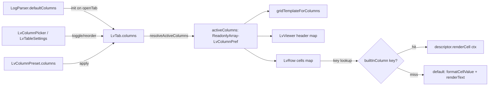

# 0028. Unified column model для таблицы логов

- Status: accepted
- Date: 2026-05-27

## Context and Problem Statement

До Phase 4 (см. [docs/plans/columns-multi-format-impl.md](../plans/columns-multi-format-impl.md)) в таблице логов жили **две несимметричные модели колонок**:

1. **«Chrome data»** — четыре захардкоженных `` с классами `lv-row-ts/lvl/svc/file` и фиксированными ширинами `178/58/120/150 px`, прямо в `gridTemplateForColumns`. Видимость управлялась четырьмя boolean'ами в `LvTweaks` (`showTimestamp/Level/Service/File`).
2. **«Data columns»** — массив `LvColumnPref[]` с произвольным `widthPx`, ячейки рисовались через `cellValueOf` и обобщённый renderer.

Это вытекало в:

- Хедер был `×4` + `.map(...)` вместо одного цикла — невозможно унифицированно переставлять или скрывать колонки.
- Picker не показывал built-in атрибуты как обычные поля, хотя они уже есть в `BUILT_IN_FIELD_DESCRIPTORS` ([src/core/filter/field-descriptor.ts](../../src/core/filter/field-descriptor.ts)) и в `getEntryFieldValue` ([src/core/filter/field-key.ts](../../src/core/filter/field-key.ts)) умеют резолвиться (`@ts`, `@level`, `@source.name`, `@file`).
- При попытке сделать «по умолчанию = только LN + message» появилась четвёрка boolean toggles в `LvTweaks` — патч поверх асимметрии, который усугублял проблему вместо её решения.

Концептуально built-in атрибуты — **те же data-колонки**, просто с custom-рендером (форматирование timestamp, level-tag, basename файла, fallback service из fileMeta).

## Considered Options

- **Option A — Оставить как есть**, добавить boolean-флаги `showTimestamp/Level/Service/File` для управления видимостью chrome-стрипа. Минимум изменений, но фиксирует асимметрию навсегда; picker и chrome-полоса продолжают развиваться по разным правилам.
- **Option B — Unified column model**. Один реестр `LvColumnDescriptor` со всеми колонками; built-in атрибуты получают `renderCell` для своих визуальных особенностей; layout таб = плоский массив `{key, widthPx}`; chrome ограничивается тем, что **никогда** не выбирает пользователь (gutter, caret, message-1fr, actions).
- **Option C — Datadog-style universal Message column**. Радикальное упрощение до одной message-колонки с inline-chips, всё остальное только в expand-detail. Отклонено в discovery (см. [docs/plans/whimsical-booping-feigenbaum.md](../plans/whimsical-booping-feigenbaum.md)) как переписывание привычной таблицы.

## Decision Outcome

Chosen option: **"Option B — Unified column model"**, потому что (а) убирает дубликат логики между chrome- и data-ячейками, (б) делает picker единственным источником истины для видимости любой колонки, (в) позволяет per-tab profile (Phase 1) и presets (Phase 3) симметрично работать со встроенными атрибутами и user-полями.

### Реализация

- **Реестр** — [src/ui/contracts/lv-column-registry.tsx](../../src/ui/contracts/lv-column-registry.tsx). `LvColumnDescriptor { key, label, defaultWidthPx, headerClass?, cellClass?, renderCell? }` + built-in для `@ts/@level/@source.name/@file`. `renderCell(ctx)` получает `entry`, `fileMeta`, `showDate`, `renderText` (search-highlight shorthand), `defaultText`, `defaultValue`.
- **Chrome** — только gutter (LN, 52px), caret (16px), message (1fr, всегда single-line — никаких переносов), actions (52px). Эти элементы не data-колонки, они UI-каркас.
- **gridTemplateForColumns** — `[52px, 16px, ...columns, 1fr, 52px]`. Один цикл, никаких специальных кейсов.
- **LvViewer header / LvRow cells / skeleton row** — единый `columns.map(...)` с lookup `builtInColumn(key)`; descriptor с `renderCell` использует его, иначе default рендер (formatCellValue + renderText).
- **Picker** ([LvColumnPicker](../../src/ui/components/filter/LvColumnPicker.tsx), [LvTableSettings](../../src/ui/components/filter/LvTableSettings.tsx)) — built-in `@`-ключи лежат рядом с dynamic и virtual; при чекбоксе берётся `descriptor.defaultWidthPx` (178/58/120/150), для всего остального — 140.
- **Удалено** — `tweaks.showTimestamp/showLevel/showService/showFile` и `tweaks.wrap`. Их семантика теперь выражается через `columns` (видимость = присутствие ключа) и `lv-row-msg` (всегда `white-space: nowrap`).
- **Migration v2 → v3** ([migrateUiPrefs](../../src/hooks/use-ui-prefs.ts)) удаляет устаревшие поля из persisted `lv:ui-prefs`, идемпотентно.

### Consequences

- **Good:** один путь добавления/удаления колонки, симметрия для preset/per-tab/virtual fields, header/row становятся `.map(...)` без if-каскадов. По умолчанию таблица минимальна (LN + message) — формат-aware колонки появляются по запросу через picker или `parser.defaultColumns`.
- **Bad:** breaking change для существующих пользователей — старая четвёрка фиксированных колонок исчезает из таблицы при обновлении (миграция чистит флаги, но не сидит явные `@ts/@level/...` в `columns`). Они могут вернуть их через picker. CSS-классы `lv-row-ts/lvl/svc/file` остались живыми (через `descriptor.cellClass`), но `.lv-row-msg.wrap` стал dead code и подлежит cleanup'у.
- **Neutral:** ширина built-in колонок теперь хранится в `columns[].widthPx` (а не захардкожена в gridTemplate) — пользователь может ресайзить как и любую другую колонку (когда появится resize-handle).

## Diagram

## Links

- План реализации: [docs/plans/columns-multi-format-impl.md](../plans/columns-multi-format-impl.md) (Phase 4)
- Discovery-документ: [docs/plans/whimsical-booping-feigenbaum.md](../plans/whimsical-booping-feigenbaum.md)
- Смежные ADR: [0017-dynamic-field-schema](0017-dynamic-field-schema.md), [0018-parser-plugin-architecture](0018-parser-plugin-architecture.md), [0025-persist-ui-workspace](0025-persist-ui-workspace.md)
