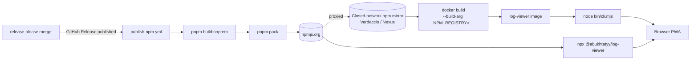

# 0029. On-prem дистрибутив: npm-пакет с bundled CLI + Dockerfile

- Status: proposed
- Date: 2026-06-07

## Context and Problem Statement

До сих пор log-viewer выкладывался только на GitHub Pages: статика по пути `/log-viewer/`, multi-page билд (лендинг + app), workflow [.github/workflows/deploy.yml](../../.github/workflows/deploy.yml). Для пользователей внутри закрытого корпоративного контура (нет интернета, есть npm-proxy типа Nexus/Verdaccio) такой деплой бесполезен:

- статика не выложена ни в один распространяемый формат, кроме GH Pages;
- pull-based решения (`docker pull` из публичных реестров) часто заблокированы;
- `base: '/log-viewer/'` хардкодит путь, под который собрана PWA — поднять на другом префиксе нельзя.

Приложение полностью клиентское: нет backend, fetch на API отсутствует, всё хранится в OPFS через [@sqlite.org/sqlite-wasm](../../package.json). Это значит, что «развернуть on-prem» = «отдать статику с правильными MIME, HEAD/GET, SPA-fallback». Никакого rendering, сессий, БД на сервере не нужно.

Требуется опубликовать артефакт, который:

- ставится через npm/pnpm из приватного зеркала или прямо как tarball;
- сам поднимает HTTP-сервер (чтобы не зависеть от nginx и не плодить вторую упаковку для веб-сервера);
- упаковывается в Docker одной командой через готовый `Dockerfile` в репо;
- не ломает существующий GH Pages деплой.

## Considered Options

- **Option A — npm-пакет `@abukhtatyy/log-viewer` с встроенным Node CLI + Dockerfile в репо.** Сборка `BUILD_TARGET=onprem` кладёт только app в `dist/app/`, `bin/cli.mjs` отдаёт его через `node:http`. `Dockerfile` ставит пакет из настраиваемого `--build-arg NPM_REGISTRY=…`. Один артефакт работает локально (`npx`), в контейнере, и за reverse proxy.
- **Option B — nginx-образ в GHCR.** Multi-stage Docker build → `nginx:alpine` со статикой. Минимум Node в runtime, но: два разных способа запуска (Docker vs локально), need MIME-config'и для wasm/webmanifest и SPA-rewrite в nginx.conf — пользователь будет настраивать сам.
- **Option C — Tarball на GitHub Releases (статика).** Дешевле всех, но пользователь сам поднимает любой web-сервер и сам правит MIME/SPA fallback. Самый частый foot-gun: `.wasm` отдаётся как `application/octet-stream` → sqlite-wasm streaming compile падает молча.
- **Option D — Готовый Docker image в GHCR.** Самый удобный для конечного пользователя, но требует GHCR-зеркала в закрытом контуре, которого у клиентов обычно нет; npm-зеркала встречаются чаще.
- **Option E — Do nothing.** Оставить только GH Pages.

## Decision Outcome

Chosen option: **"Option A — npm-пакет с bundled CLI + Dockerfile в репо"**.

Решение балансирует распространённость npm-зеркал в закрытых контурах с отсутствием серверной логики у самого приложения. CLI инкапсулирует все правила раздачи (`.wasm → application/wasm`, immutable cache для `assets/*`, SPA-fallback на `index.html`, `/healthz`-эндпоинт для Docker) — это код, который писать всё равно надо, и его можно покрыть тестами. `Dockerfile` — тонкая обёртка над `npm install`, в которой пользователь только меняет `NPM_REGISTRY` под своё зеркало. Полностью offline-сценарий покрывается классическим `docker save`/`docker load` готового образа на стороне сборщика — не требует магии в Dockerfile.

Сопутствующие решения:

- **Имя пакета `@abukhtatyy/log-viewer`** (личный scope, поскольку unscoped `log-viewer` занят на npmjs). Имя бинаря — `log-viewer` (`npx @abukhtatyy/log-viewer`).
- **Один `vite.config.ts` с env-флагом `BUILD_TARGET=onprem`.** Альтернатива (два конфига) ведёт к дрейфу версий плагинов; env-флаг хорошо ложится на CI matrix.
- **`base: '/'` для on-prem, mount только в root.** `'./'` ломает SW (VitePWA генерирует абсолютные URL в precache manifest и worker URLs). Развёртывание под произвольный префикс отложено до явного запроса.
- **HTTP-сервер на встроенном `node:http`, без зависимостей.** Для закрытого контура каждая транзитивная зависимость — это supply-chain поверхность; `sirv`/`@fastify/static` подтягивают `mrmime`/`totalist`/etc. — лишнее.
- **COOP/COEP не ставим.** sqlite-wasm в текущей сборке использует `OpfsAsyncProxy` через MessageChannel (видно по `sqlite3-opfs-async-proxy-*.js` в dist), `SharedArrayBuffer` не нужен. Если в будущем переключимся на `OpfsSAHPool` — CLI придётся научить этим заголовкам, фиксируем как known follow-up.
- **Service Worker оставлен по умолчанию**, с CLI-флагом `--no-sw` для downgrade-сценариев (deploy за TLS-terminating proxy недоступен).
- **Публикация в npmjs.org с `--provenance`** через отдельный workflow [.github/workflows/publish-npm.yml](../../.github/workflows/publish-npm.yml), триггер `release: published`. release-please продолжает быть единственным источником правды о версии.
- **GitHub Pages деплой не трогаем** — `pnpm build` без env-флага идёт в default-режим `'pages'`.

### Consequences

- Good: один артефакт обслуживает все три сценария: локальный `npx`, Docker, offline через `docker save`. Закрытый контур ставит из своего npm-зеркала без особой инфраструктуры.
- Good: правила раздачи (MIME, кеш, fallback, healthz, path-traversal guard) собраны в одном CLI-файле — версионируются вместе с приложением, не разъезжаются с nginx-конфигом.
- Good: `BUILD_TARGET` — единственная точка переключения между публичной и on-prem сборкой; добавлять новые таргеты (например, embed-mode для iframe) можно тем же механизмом.
- Bad: добавлен `bin/cli.mjs` (~200 строк) как новый поддерживаемый код. Альтернатива (nginx) перекладывала бы это в чужой конфиг, который пользователь всё равно бы переписывал.
- Bad: пакет перестаёт быть `private: true`. Это требует осознанной публикации — release-please будет триггерить `npm publish` на каждом релизе. Снять `private` навсегда — необратимое решение.
- Bad: PWA в on-prem требует TLS (или `localhost`). По голому HTTP-IP SW не зарегистрируется, OPFS не инициализируется. Документируется в README как обязательное требование к deploy.
- Neutral: Версия `@abukhtatyy/log-viewer` синхронизирована с git-тегом релиза (release-please bump-ит `package.json:version`). Любые расхождения между npm и GH Releases — баг, а не фича.
- Neutral: `vite-plugin-pwa@1.2.0` peer-mismatch с Vite 8 — известный риск, новый билд его не усугубляет.

## Diagram

## Links

- План: [docs/plans/npm-recursive-rainbow.md](../plans/npm-recursive-rainbow.md)
- Связанные ADR:
  - [0026. Versioning, CHANGELOG, and release automation via Release Please + Conventional Commits](0026-release-please-and-conventional-commits.md)
  - [0005. SQLite (wa-sqlite) + FTS5 в OPFS как индекс/БД для логов](0005-sqlite-fts5-opfs-index.md) — даёт контекст про OPFS требования.
- [npm provenance](https://docs.npmjs.com/generating-provenance-statements)
- [vite-plugin-pwa](https://vite-pwa-org.netlify.app/)
