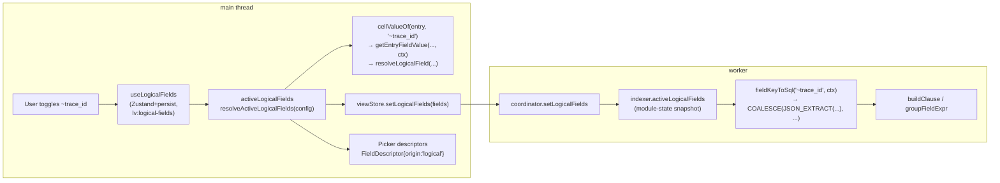

# 0030. Logical fields (`~`-namespace) — cross-format semantic attributes

- Status: proposed
- Date: 2026-06-12

## Context and Problem Statement

В реальных логах одно и то же логическое понятие записывается по-разному в зависимости от формата и конвенции сервиса. Канонический пример — `trace_id`:

- `pino.jsonl` → `{"trace_id": "abc"}`
- `bunyan.jsonl` → `{"traceId": "abc"}`
- `nginx-access.log` → парсер выдаёт поле `http_x_trace_id`
- `app.log` → plain-text `... traceId=abc` (regex по message)

До этого ADR проект уже имел [ADR-0017](0017-dynamic-field-schema.md) — динамическую field-schema с `@`-namespace для built-in атрибутов и сырыми ключами из `fields`. Пользователь мог фильтровать/группировать по конкретному ключу формата, но **не существовало способа** одним кликом сказать «trace_id — это вот эта штука во всех моих файлах» и дальше использовать её как обычное поле в filter / group / column poперёк форматов.

Кроме того, в коде существовал параллельный механизм — **virtual fields** (`vf:`-namespace): per-tab regex-extracted колонки с UI создания в Table settings. Это решало только часть задачи (read-path display per single tab) и не масштабировалось на cross-format поиск/группировку.

Индустрия решает это давно: **Datadog Attribute Remapper + Standard Attributes** (`sources: ["traceId", "trace_id", ...] → target: "trace_id"`), Elastic ECS, Splunk FIELDALIAS, Loki `label_format`. Datadog подход — наиболее близкий к нашим требованиям: chain попыток + каталог Standard Attributes.

## Considered Options

- **Option A — Per-format / per-source mapping** (Splunk FIELDALIAS-style). Декларация «для формата pino поле `trace_id`, для bunyan — `traceId`». Не масштабируется при смешанных конвенциях внутри одного формата (pino и bunyan технически один `json-lines` парсер).

- **Option B — Chain extractors** (Datadog Attribute Remapper-style). Одна цепочка `field`/`regex` extractor'ов прикладывается ко всем записям; первый non-null выигрывает. Built-in каталог из популярных шаблонов + user-defined. **Выбран.**

- **Option C — Expression DSL** (Vector VRL-style). Полноценный язык выражений: `entry.fields.trace_id ?? entry.fields.traceId ?? match(...)`. Максимум гибкости, но собственный парсер/грамматика/документация/sandbox — недели работы для 5% выигрыша поверх B.

- **Option D — Inline label_format в запросах** (Loki LogQL). Не подходит UX — мы не язык запросов, а UI-first инструмент.

## Decision Outcome

Chosen option: **"B — Chain extractors"**, потому что подход Datadog проверен индустрией, симметричен нашему `fieldFilters`-pipeline'у, не требует собственного DSL и не ломается при mixed-convention внутри одного формата.

Дополнительно зафиксировано:

- **Namespace `~`** (тильда) — отдельно от `@`-built-ins ([ADR-0017](0017-dynamic-field-schema.md)) и сырых ключей `fields`. Имена: `~trace_id`, `~user_id`, `~http.status`. Точка в id означает namespace внутри логических полей, не nested path.
- **Global workspace-wide scope.** Активные определения работают во всех табах. Persistence — `localStorage` ключ `lv:logical-fields` через Zustand+persist.
- **Built-in каталог** из 12 templates (адаптация Datadog Standard Attributes): `trace_id`, `span_id`, `request_id`, `user_id`, `session_id`, `service`, `host`, `http.method`, `http.status`, `http.path`, `error.kind`, `error.message`. Все по умолчанию disabled — пользователь активирует явно из rail-панели "Logical fields".
- **Resolution split:**
  - Read-path (UI rendering): JS-резолвер `resolveLogicalField` по цепочке field-lookup и regex-match.
  - Worker-path (SQL filter/group): `field`-extractors → COALESCE из `JSON_EXTRACT(entry.fields_json, '$.<path>')`. `regex`-extractors silently пропускаются в SQL, потому что `entry.message` и `entry.raw` не материализованы в SQLite после [ADR-0016](0016-offset-pointer-index-lazy-body.md). Это явно документировано hint'ом в UI.
- **RPC контракт** расширен методом `setLogicalFields(fields)` (indexer → coordinator → log-client). Main-thread синхронизирует активный список в worker при изменениях через useEffect; индексер держит latest snapshot в module-state и подмешивает в каждый `buildClause` через `LogicalFieldsCtx`.
- **UDF `regexp_extract_group(pattern, text, group, flags)`** установлен на SQLite-инстансе как заготовка для будущего `regex-on-json` extractor type, который сможет применять regex к уже извлечённым JSON-значениям.
- **virtualFields удалены полностью** (типы, props, UI, тесты, преsets-поле). Logical fields покрывают их use case в более общей и cross-format форме. Backward compat не поддерживаем — virtualFields никогда не релизились наружу.

### Consequences

- **Good:** один клик в Settings — поле работает поперёк всех загруженных форматов в filter/group/column. Built-in каталог даёт zero-config старт для типичных observability-сценариев. Расширяемость: future `regex-on-json` и `expr`-extractor добавляются как новые типы в той же цепочке, не ломая существующих определений.
- **Bad:** regex-extractors **не работают** в server-side filter/group (только в column display). Это compromise за ADR-0016 lazy body — устраним отдельным ADR, если выяснится, что critical (потребуется или материализация подмножества fields, или post-filter на main-thread по visible window).
- **Bad:** chain делает несколько `JSON_EXTRACT`-вызовов на каждой записи, что чуть дороже одного. Если станет узким местом — materialize logical field в indexer как computed column. Не сейчас.
- **Neutral:** virtualFields исчезают как концепция. Все, кто использовал их через preset/tab — переедут на logical fields руками (релизных пользователей не было).

## Diagram

## Links

- План реализации: `docs/plans/flickering-waddling-torvalds.md`
- Datadog Attribute Remapper: https://docs.datadoghq.com/logs/log_configuration/processors/remapper/
- Datadog Standard Attributes: https://docs.datadoghq.com/standard-attributes/
- Related: [ADR-0017](0017-dynamic-field-schema.md) (расширяется `~`-namespace'ом), [ADR-0028](0028-unified-column-model.md) (column registry получил `origin:'logical'`), [ADR-0011](0011-server-side-aggregations-and-regex.md) (REGEXP UDF — теперь и `regexp_extract_group`), [ADR-0016](0016-offset-pointer-index-lazy-body.md) (объясняет почему regex-extractors не работают в SQL).
