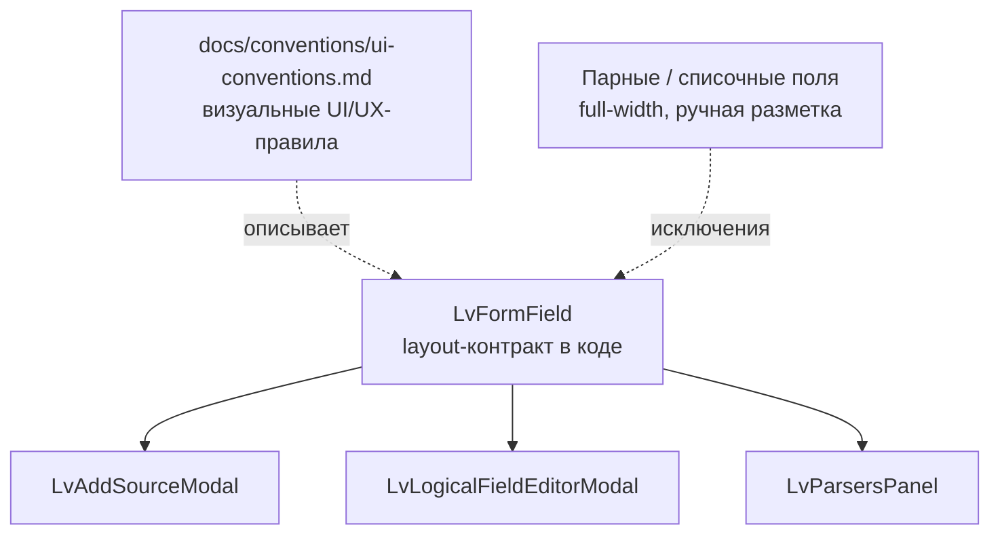

# 0031. Единый компонент LvFormField как layout-контракт для полей форм

- Status: proposed
- Date: 2026-06-14

## Context and Problem Statement

Формы верстались тремя независимыми способами без переиспользуемого компонента поля:
`.lv-form-*` (лейбл слева) в `LvAddSourceModal`, `.lv-tset-vf-*` (лейбл сверху) в
`LvLogicalFieldEditorModal` и смешанный набор с CSS-override в `LvParsersPanel`. Две
модальные формы выглядели по-разному (в одной лейбл слева, в другой сверху), а каждая
новая форма копировала разметку заново — рассогласование накапливалось.

Параллельно встал вопрос, где фиксировать договорённости по интерфейсу: ADR-практика
в проекте есть, но отдельного места под UI/UX-правила не было.

## Considered Options

- Option A — Ввести единый компонент `LvFormField` как обязательный способ верстать
  подписанное поле; код-контракт зафиксировать в ADR, а визуальные/поведенческие
  UI/UX-договорённости вынести в живой свод `docs/conventions/ui-conventions.md`.
- Option B — Оформлять каждое UI-решение (раскладку, отступы, тексты) отдельным ADR;
  переиспользуемого компонента не вводить.
- Option C — do nothing: оставить три системы вёрстки и копипаст разметки.

## Decision Outcome

Chosen option: **"Option A"**, because единый компонент убирает дублирование и делает
раскладку форм предсказуемой, а разделение каналов фиксации отражает природу решений:
то, что про **код** (компонент-контракт, его классы и исключения) — ADR-материал; то,
что про **внешний вид и поведение** интерфейса (раскладка «лейбл слева в модалках /
сверху в узких панелях», отступы, тексты подписей) — живой свод, который удобнее
дополнять, чем серию ADR.

Контракт:

- Подписанные поля форм верстаются только через
  [`LvFormField`](../../src/ui/components/common/LvFormField.tsx) (классы
  `.lv-form-row` / `.lv-form-row--col` / `.lv-form-row--top`).
- Исключения, занимающие всю ширину и идущие мимо компонента: парные поля (два
  контрола в строке) и списочные секции.
- Визуальные правила и выбор ориентации описаны в
  [`docs/conventions/ui-conventions.md`](../conventions/ui-conventions.md) → Forms.

### Consequences

- Good: одна точка правды для вёрстки поля; новые формы консистентны по умолчанию; две
  модалки приведены к единому виду; чёткая граница «код → ADR, UI/UX → свод».
- Bad: существующие формы пришлось мигрировать; компонент покрывает не все составные
  случаи (парные/списочные поля остаются ручной разметкой как задокументированные
  исключения).
- Neutral: введён новый канал документации `docs/conventions/ui-conventions.md` рядом с `adr/`;
  старые классы `.lv-tset-vf-*` остаются для своего исходного места (table-settings).

## Diagram

## Links

- Реализация: [src/ui/components/common/LvFormField.tsx](../../src/ui/components/common/LvFormField.tsx)
- Свод UI/UX-конвенций: [docs/conventions/ui-conventions.md](../conventions/ui-conventions.md)
- Связанный ADR: [0030. Logical fields (`~`-namespace)](0030-logical-fields-tilde-namespace.md)
