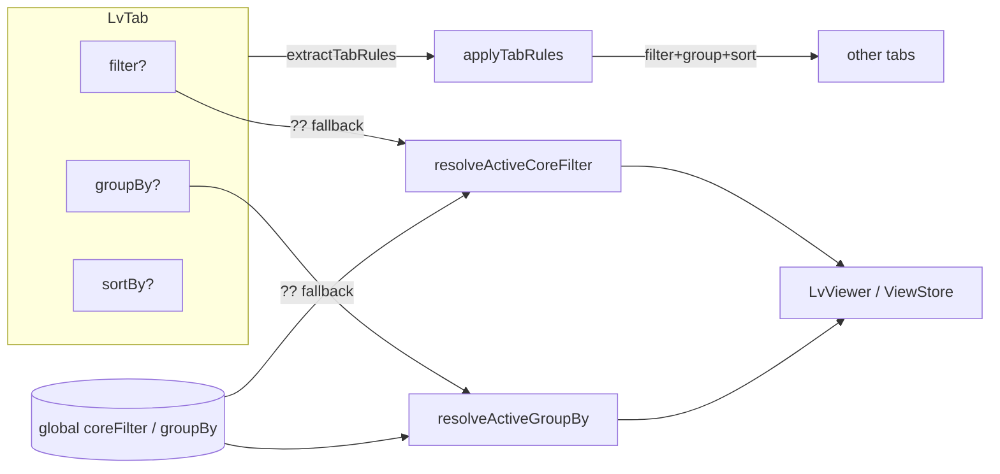

# 0033. Per-tab view rules (filter / sort / group-by) with apply-to-other-tabs

- Status: proposed
- Date: 2026-06-14

## Context and Problem Statement

Каждый открытый файл-лог живёт в своём табе (`LvTab`), но фильтр (`coreFilter`)
и группировка (`groupBy`) хранились глобально в `useWorkspaceStore` и применялись
ко всем табам сразу. Это мешает реальной работе: нельзя на одном табе сгруппировать
по `service`, а на соседнем отфильтровать по `level` — любая правка расплывается на всё.

При этом в проекте уже сложился паттерн пер-табовых настроек: `LvTab.columns?`
(резолв через `resolveActiveColumns`, ADR-0028 / план columns-multi-format) и
`LvTab.sortBy?` (пер-табовая сортировка). `__all__` — агрегатный таб — выступает
носителем глобальных дефолтов. Нужно довести фильтр и группировку до того же
паттерна и дать возможность переносить правила одного таба на другие.

## Considered Options

- Option A — Пер-табовые `filter`/`groupBy` по паттерну `columns`/`sortBy`
  («tab override ?? global default», `__all__` = global) + операция «применить
  к другим табам» (bundle = filter+sort+group, без columns).
- Option B — Привязать правила к источнику (per-source prefs), а не к табу.
- Option C — do nothing, оставить глобально.

## Decision Outcome

Chosen option: **"Option A"**, потому что он переиспользует уже принятую и понятную
модель пер-табовых настроек, не вводит новый стор и нулевой ценой обратно совместим
(старые табы без полей резолвятся в глобальные дефолты). Per-source (Option B) —
ортогональное будущее расширение, не отменяет пер-табовость.

Ключевые контрактные решения:

- **Модель.** `LvTab.filter?: LogFilter` и `LvTab.groupBy?: ReadonlyArray<LvGroupBy>`
  — опциональные override'ы. Отсутствие → fallback на глобальные `coreFilter`/`groupBy`.
- **`__all__` = носитель глобальных дефолтов.** Читает и пишет глобальное состояние;
  исключён из целей и источника операции «применить к другим».
- **`tab.filter` хранится без scope.** `sources`/`filePaths` всегда выводятся из id
  таба (`tabSelection`), поэтому в override они занулены — на запись (`applyTabRules`)
  и defensively на persist (`partializeWorkspace`).
- **Bundle «применить к другим» = filter + group-by + sortBy.** `columns` намеренно
  НЕ копируются — они формат-специфичны (pino ≠ nginx) и сидятся из
  `parserDefaultColumns`. Цели: все табы или выбранное подмножество.
- **Новый таб** открывается «чистым» — override'ы `undefined`, т.е. глобальные дефолты
  (без наследования от активного таба).
- **Резолв — чистые функции** в `src/ui/utils/active-columns.ts`
  (`resolveActiveCoreFilter`, `resolveActiveGroupBy`, `extractTabRules`, `applyTabRules`),
  тестируются в node, симметрично `resolveActiveColumns`.
- **Persistence** не требует миграции: поля аддитивны к `LvTab`, `STORAGE_VERSION` = 1.

### Consequences

- Good: фильтр/сортировка/группировка независимы по табам; перенос правил массово или
  выборочно; обратная совместимость без миграции; единая модель с `columns`/`sortBy`.
- Bad: ещё одна ось состояния на табе — больше веток `__all__` vs file-tab в контейнере;
  UI «Tabs»-меню добавляет поверхность.
- Neutral: drill-down и save-search теперь оперируют эффективными (пер-табовыми)
  правилами активного таба.

## Diagram

## Links

- ADR-0025 (persist UI workspace), ADR-0028 (unified column model)
- docs/plans/eager-nibbling-hickey.md
