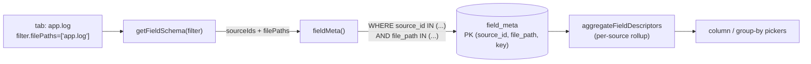

# 0035. Per-file dimension in the field_meta cache

- Status: proposed
- Date: 2026-06-17

## Context and Problem Statement

The `field_meta` cache (ADR-0017) stores every dynamic field key a parser
emits, so the column / group-by / filter pickers can enumerate available
fields without scanning the `entry` table. Until now it was keyed by
`(source_id, key)` — one row per source, no per-file dimension.

A directory source bundles many files under a single `source_id`. When the
user opens a single-file tab inside such a source (e.g. `app.log` in a
folder that also holds `mixed.log`, `nginx-access.log`, `stack-traces.log`),
the pickers showed the **union of every sibling file's keys** under "Fields
from open logs" — even though `app.log` (plain-text, parser `app-text`)
produces no dynamic fields at all. The per-tab scope `filter.filePaths` was
already computed in the container and plumbed to `getFieldSchema`, but
`getFieldSchema` → `fieldMeta` ignored it: the cache had no way to answer
"which keys belong to this file".

## Considered Options

- **Option A — add `file_path` to `field_meta` (migration v6)** — widen the
  primary key to `(source_id, file_path, key)`, write per-file on ingest,
  scope reads by `filter.filePaths`. Rebuild the cache once from the
  persisted `entry` table on upgrade (no source re-parse).
- **Option B — compute keys on demand from `entry`** — when a file is
  active, scan `entry.fields_json` scoped by `file_path` at picker-open
  time. No schema change, but reintroduces exactly the full-table scan the
  `field_meta` cache exists to avoid.
- **Option C — do nothing** — accept that file tabs inside a directory
  source show sibling files' fields.

## Decision Outcome

Chosen option: **"Option A"**, because it keeps the cache fast on the read
path (a single indexed lookup) while making it correct at file
granularity; the `entry` table already carries `source_id` / `file_path` /
`fields_json` with an `idx_entry_source_file` index, so the v6 cache can be
rebuilt from it on upgrade without re-parsing any source files.

### Consequences

- Good: column / group-by pickers list only the fields of the active file;
  plain-text files correctly show no "Fields from open logs" section.
- Good: multi-select / `__all__` tabs still union across selected files
  (empty `filePaths` → whole source, unchanged behaviour).
- Neutral: `field_meta` grows from one row per `(source, key)` to one per
  `(source, file, key)`; compatibility badges stay source-level (per-file
  rows roll up by `source_id` in `aggregateFieldDescriptors`).
- Bad: one-time rebuild scans the persisted `entry` table on first start
  under v6 (bounded, batched, no file re-parse); `aggregateFieldMeta` now
  returns a nested `Map<source, Map<file, Map<key, accum>>>`, touching its
  callers and tests.

## Diagram

## Links

- [ADR-0017](0017-dynamic-field-schema.md) — original field_meta cache and picker model (dynamic columns / group-by).
- [ADR-0033](0033-per-tab-view-rules.md) — per-tab filter scope that supplies `filter.filePaths`.
- Schema: [schema-v6-field-meta-file.sql](../../src/workers/indexer/db/schema-v6-field-meta-file.sql), migration in [migrations.ts](../../src/workers/indexer/db/migrations.ts).
