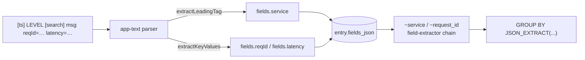

# 0036. Parsers emit canonical fields for cross-format logical fields

- Status: proposed
- Date: 2026-06-17

## Context and Problem Statement

Logical fields (ADR-0030, `~`-namespace) are the cross-format abstraction:
a `~service` / `~request_id` should resolve regardless of log format. In
SQL (group-by, filter aggregation) a logical field compiles only its
`field` / `regex-on-json` extractors — both read `entry.fields_json`. The
`regex`-on-`message`/`raw` extractor is skipped in SQL because the body
lives outside SQLite (ADR-0016).

For plain-text `*.log` (parser `app-text`, format `[ts] LEVEL [service]
message k=v`) the parser only put `stack` / `exception_*` into
`fields_json` and left `[service]` and the `k=v` pairs inside the
free-form `message`. So grouping by `~service` / `~request_id` produced a
single NULL group: the `field` extractors found nothing and the
`regex(message)` fallback can't run server-side. JSON formats (pino) and
regex parsers that already structure their output (nginx-combined) worked;
text formats did not.

The fix needs to also make it easy to add support for new formats.

## Considered Options

- **Option A — parsers emit canonical fields** — each format parser
  structures its own line into `entry.fields` under canonical names
  (`service`, `reqId`, …). Logical fields then resolve via the existing
  `field`-extractor chain in SQL, no SQL/catalog change. Adding a format =
  writing a parser. Shared text helpers keep it DRY.
- **Option B — materialise logical values at ingest** — run the full
  extractor chain (incl. `regex` on raw/message) at ingest and store the
  results in a queryable table. Works for any format and extractor type,
  but needs a new table + migration and a re-ingest on every logical-field
  config change.
- **Option C — do nothing** — logical-field grouping stays JSON/regex-parser
  only; text formats keep showing a single NULL group.

## Decision Outcome

Chosen option: **"Option A"**, because it keeps the layering clean
(parsers own format knowledge; logical fields are a thin cross-format
alias over canonical field names), needs no SQL, schema, or catalog
changes, and makes "add a new format" mean "add a parser" — reusing shared
text helpers. The logical-field catalog already chains on these canonical
names (`service`, `reqId`), so existing built-ins light up for text
formats with zero catalog edits.

### Consequences

- Good: grouping / filtering / column pickers work on text formats the
  same as on JSON; `~service` / `~request_id` resolve for `*.log`.
- Good: new text formats reuse `extractLeadingTag` / `extractKeyValues`
  ([kv.ts](../../src/core/parsers/lib/kv.ts)) and emit canonical names — no
  changes outside `core/parsers/`.
- Neutral: the extracted keys also surface in `field_meta` (per-file since
  ADR-0035) and the "Fields from open logs" picker section.
- Bad: a parser-output change only affects future ingests — already-indexed
  sources must be re-ingested (re-add the source) to gain the new fields;
  there is no parser-version gate that auto-triggers re-ingest (possible
  follow-up). `regex`-only logical fields still don't group server-side.

## Diagram

## Links

- [ADR-0030](0030-logical-fields-tilde-namespace.md) — logical fields and the extractor chain.
- [ADR-0016](0016-offset-pointer-index-lazy-body.md) — body moved out of SQLite (why `regex`-on-message can't run server-side).
- [ADR-0035](0035-field-meta-per-file-scope.md) — per-file field_meta the new keys flow into.
- Helper: [kv.ts](../../src/core/parsers/lib/kv.ts); parser: [app-text-parser.ts](../../src/core/parsers/app-text-parser.ts).
