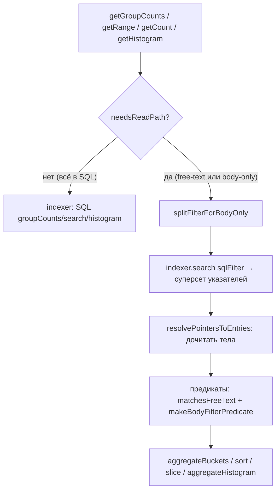

# 0037. Read-path для body-only logical-полей

- Status: proposed
- Date: 2026-06-17

## Context and Problem Statement

Logical-поля ([ADR-0030](0030-logical-fields.md), `~`-namespace) — это
пользовательские производные поля с упорядоченной цепочкой экстракторов.
Три типа экстракторов:

- `field` / `regex-on-json` — компилируются в SQL над `fields_json`.
- `regex` — матчится по телу строки (`message`/`raw`), которое после
  [ADR-0016](0016-offset-pointer-index-lazy-body.md) **не хранится в SQLite**
  (ленивый byte-pointer, читается на read-path).

Поле, у которого **все** экстракторы — `regex`-по-телу, компилируется в SQL
литерал `NULL` (`logicalFieldToSql` в
[sql.ts](../../src/core/logical-fields/sql.ts)). Назовём такое поле
**body-only**. До этого решения такое поле:

- корректно отображалось как **колонка** (резолвится в памяти,
  `resolveLogicalField` на уже прочитанной записи), но
- **группировка** → `GROUP BY NULL` → один пустой бакет;
- **фильтр** `~field = value` → `NULL = value` → ничего не матчит;
- **разворачивание бакета** (добавляет `~field=value` в `fieldFilters`) → пусто;
- **сортировка** по нему — no-op.

Воспроизводится на `.tmp/demo_logs/mixed/audit.txt`: действие (`password
changed`) лежит в message, извлечь его можно только `regex`-по-телу.

Ключевой прецедент: [ADR-0034](0034-read-path-fts-and-search-autocomplete.md)
уже ввёл «read-path» для свободного поиска — `ensureFreeTextMatches` в
координаторе: SQL отдаёт **суперсет** указателей, `resolvePointersToEntries`
дочитывает тела батчами, JS-предикат фильтрует, результат кэшируется по
`(filter, version)`. Это та же схема, что нужна body-only полям.

## Considered Options

- **Где резолвить:** в индексере (нет доступа к телам — нежизнеспособно) vs
  в **координаторе** (владеет читателем тел и in-memory резолвером).
- **Объём:** только группировка vs полный read-path (группировка + фильтр +
  сортировка + разворачивание) vs отключить операции в UI с подсказкой.
- **Хранение значений:** материализовать значения logical-полей при индексации
  в `fields_json`/колонку (быстрый SQL, но ломает разделение «сырые поля vs
  производные» из ADR-0030, требует переиндексации при правке экстракторов).
- **Кэш:** отдельный кэш для body-only vs **унификация** с free-text в один
  `ensureReadPathMatches` (избегает двойного прохода, когда в фильтре есть и
  свободный текст, и body-only поле).
- **Покрытие операций:** ограничить SQL-сканирование первыми N строками («по
  первым N») vs полная материализация набора.

## Decision Outcome

Chosen option: **полный read-path в координаторе, обобщающий механику
free-text из ADR-0034**, потому что тела всё равно нужны в памяти, а единый
кэш и единый предикат дают согласованное поведение списка, счётчика,
гистограммы, группировки и разворачивания без изменений RPC-контрактов.

Как это работает:

- `splitFilterForBodyOnly` снимает body-only `fieldFilters`/`sortBy` с фильтра,
  чтобы SQL вернул **суперсет**, а не `NULL = value`.
- `collectReadPathMatches` стримит суперсет, дочитывает тела, применяет
  free-text- и body-only-предикаты в памяти; `ensureReadPathMatches`
  кэширует это по `(filter, version)`.
- `getGroupCounts` агрегирует бакеты в памяти (`aggregateBuckets`), когда ось
  группировки body-only **или** в фильтре есть body-only предикат; иначе —
  прежний SQL-путь.
- `getRange`/`getCount`/`getEntriesScoped`/`getHistogram` идут через те же
  matches. `setLogicalFields` держит локальную копию полей в координаторе и
  сбрасывает кэш (правка экстрактора не меняет ни `filter`, ни `version`).
- **Полная материализация**, без скан-капа в v1 — как у текущего free-text
  пути (нужно для честного `getCount.filtered` и стабильного окна виртуального
  скролла).

### Consequences

- Good: группировка/фильтр/сортировка/разворачивание/гистограмма по
  body-only `~`-полям работают и согласованы со списком; контракты не тронуты;
  логика — чистые, юнит-покрытые core-хелперы (`body-only.ts`, `read-path.ts`).
- Bad: при активном body-only ограничении читаются тела всего SQL-суперсета
  (на больших файлах — заметно), один раз на `(filter, version)`. Граница та
  же, что у free-text. Follow-up: общий `READ_PATH_SCAN_CAP` + баннер «по
  первым N» для обоих путей.
- Neutral: координатор теперь держит зеркало активных logical-полей (как и
  индексер); при HMR-перезагрузке воркера копия сбрасывается до `[]` и
  восстанавливается следующим `setLogicalFields` с главного потока.

## Diagram

## Links

- [ADR-0016](0016-offset-pointer-index-lazy-body.md) — тело вне SQLite (byte-pointer)
- [ADR-0030](0030-logical-fields.md) — logical-поля и `~`-namespace
- [ADR-0034](0034-read-path-fts-and-search-autocomplete.md) — read-path для free-text (обобщён здесь)
