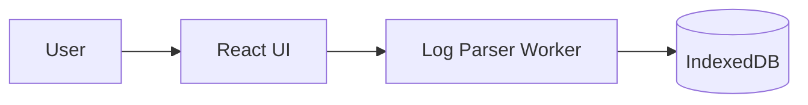

# Architecture Decision Records

Здесь живут **ADR** — короткие записи о принятых архитектурных решениях. Цель — чтобы через 3-6 месяцев было понятно, **почему** в проекте выбран именно такой подход, а не очевидная альтернатива. Это не журнал коммитов и не туду-лист.

## Когда создавать ADR

- Выбор библиотеки/фреймворка (state-менеджер, роутер, парсер логов, схема хранения).
- Выбор или смена архитектурного паттерна (Web Worker для парсинга, virtual scrolling, схема IndexedDB и т.п.).
- Отказ от очевидного решения с обоснованием.
- Контракт между модулями, на который будем ссылаться из кода и других ADR.

## Когда НЕ создавать

- Рутинные правки кода и стилевые рефакторинги без смены подхода.
- Багфиксы.
- Обновления зависимостей по semver без смены поведения.

## Как создать

В порядке предпочтения:

1. **Через Claude Code** — слэш-команда `/adr <короткое описание>`. Она найдёт следующий номер, заполнит шаблон из контекста разговора и допишет запись в индекс ниже.
2. **Вручную** — скопировать [0000-template.md](0000-template.md) → `NNNN-<kebab-slug>.md`, где `NNNN` — следующий номер с ведущими нулями. Не забыть добавить запись в [Index](#index).
3. **Из обсуждения в PR/issue** — после принятия решения в комментариях добавить ADR со ссылкой на обсуждение тем же коммитом.

## Конвенция нумерации

- 4 цифры с ведущими нулями: `0001`, `0002`, …
- Монотонно возрастают.
- **Никогда не переиспользуются**, даже если ADR отменён или признан ошибочным.

## Жизненный цикл

| Status | Когда |
| --- | --- |
| `proposed` | Черновик, обсуждается. |
| `accepted` | Принято, действует. |
| `deprecated` | Больше не актуально, но не заменено новым. |
| `superseded by [NNNN](NNNN-...)` | Заменено новым ADR. Старый файл **не удаляется** — в нём меняется только статус и добавляется ссылка на преемника. |

## Как ссылаться

Из кода (в комментариях у нетривиальных мест), из CLAUDE.md, из PR-описаний — обычной markdown-ссылкой:

```
см. [ADR-0007](docs/adr/0007-web-worker-for-parsing.md)
```

## Диаграммы — только Mermaid

Любая схема в ADR и в любой документации `docs/**` пишется как Mermaid-блок:

````markdown

````

Зачем именно Mermaid:

- Рендерится прямо на GitHub и в большинстве IDE-превью markdown'а.
- Версионируется как текст — диффы, blame, code review работают по-человечески.
- Не нужно отдельных тулов и экспортов.

Рекомендуемые типы:

- `flowchart` — архитектура компонентов, потоки данных.
- `sequenceDiagram` — взаимодействия между модулями/сервисами.
- `erDiagram` — схемы данных (IndexedDB stores, типы).
- `stateDiagram-v2` — жизненные циклы (например, состояния парсера).

Растровые картинки (скриншоты UI, фото) — в `docs/assets/`. **Схемы — только Mermaid.**

## Связь с Claude Code

- Команда `/adr` создаёт ADR из контекста текущего разговора.
- Stop-hook `.claude/hooks/adr-reminder.sh` напомнит, если в ответе модели похоже было принято архитектурное решение, но `docs/adr/` в этой сессии не обновлялся.
- Полная политика — в [CLAUDE.md](../../CLAUDE.md), раздел `Architecture Decision Records`.

## Index

- [0001. Record architecture decisions](0001-record-architecture-decisions.md) — accepted
