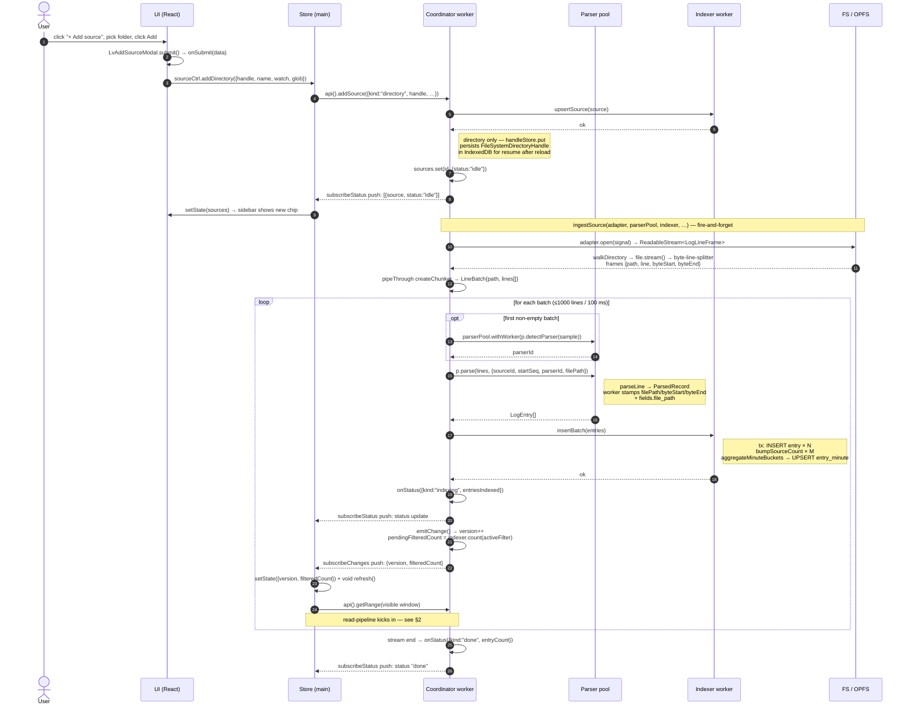
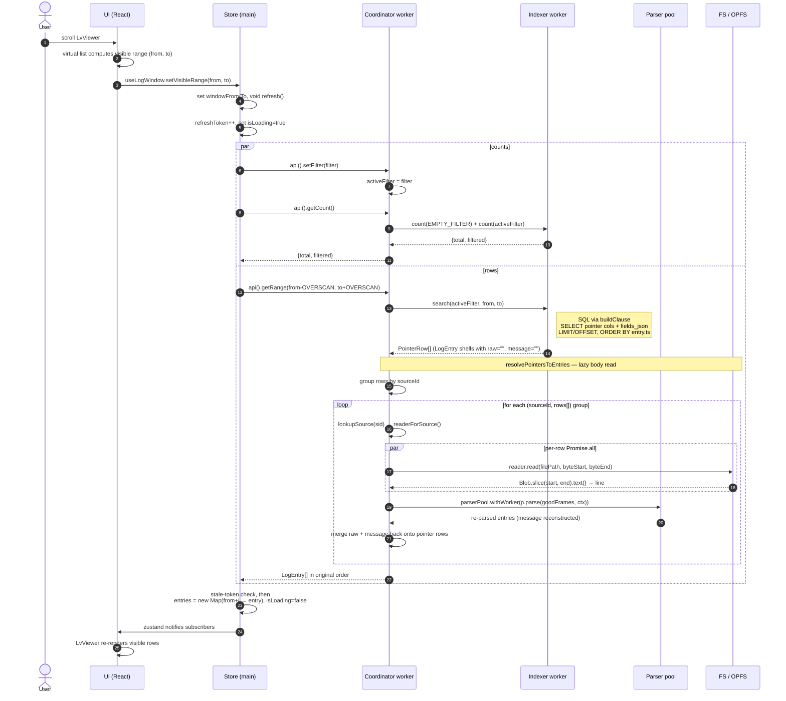
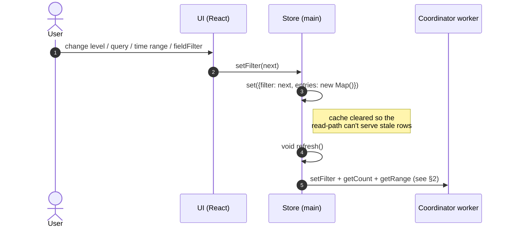

# Log pipeline — sequence diagrams

Sibling document to [ADR-0016 «Offset-pointer + minute-bucket index, lazy body read»](../adr/0016-offset-pointer-index-lazy-body.md). The ADR records _why_ the runtime is shaped this way; this document records _in what order_ messages cross worker boundaries while the user adds a source and scrolls through its logs.

Three scenarios:

1. **Ingest** — `+ Add source` → indexed pointers + sidebar update.
2. **Read** — virtual scroll → lazy-resolved `LogEntry`s in the viewer.
3. **Filter change** (mini) — UI control → cache reset → re-fetch.

Participants stay the same across diagrams so you can switch between them without re-grounding:

| alias     | role                                                                                                                                                                                                    |
| --------- | ------------------------------------------------------------------------------------------------------------------------------------------------------------------------------------------------------- |
| `User`    | Mouse / keyboard.                                                                                                                                                                                       |
| `UI`      | React tree — `LvAppContainer`, `LvSidebar`, `LvViewer`, hooks.                                                                                                                                          |
| `Store`   | Main-thread Zustand store from [`createLogClient`](../../src/worker-client/log-client.ts).                                                                                                              |
| `Coord`   | Coordinator worker — [`coordinator.ts`](../../src/workers/coordinator/coordinator.ts).                                                                                                                  |
| `Parsers` | Parser worker pool — `ParserPool.withWorker` pulls a worker running [`parser-api.ts`](../../src/workers/parser/parser-api.ts).                                                                          |
| `Indexer` | Indexer worker (SQLite + OPFS VFS) — [`indexer-api.ts`](../../src/workers/indexer/indexer-api.ts).                                                                                                      |
| `Storage` | The bytes — `FileSystemFileHandle` for directory/file sources, OPFS spool for text/url/stream/pasted. Wrapped behind [`SourceBlobReader`](../../src/workers/coordinator/storage/source-blob-reader.ts). |

All cross-thread arrows are Comlink RPCs unless noted.

---

## 1. Ingest — from "Add source" click to indexed pointers

### Step-by-step (ingest)

| step  | code                                                                                                                                                                                                                                                                                                                                                                       |
| ----- | -------------------------------------------------------------------------------------------------------------------------------------------------------------------------------------------------------------------------------------------------------------------------------------------------------------------------------------------------------------------------- |
| 3     | [`LvAppContainer.onSubmitAddSource`](../../src/app/containers/LvAppContainer.tsx) → `sourceCtrl.addDirectory(data)`.                                                                                                                                                                                                                                                       |
| 4     | [`log-client.ts addDirectory`](../../src/worker-client/log-client.ts) — under user-gesture; if no handle is preset, opens `showDirectoryPicker()` first.                                                                                                                                                                                                                   |
| 5–7   | [`coordinator.addSource`](../../src/workers/coordinator/coordinator.ts) — `await indexer.opening`, `newSourceId()`, `indexer.upsertSource`, then `handleStore.put` for directory sources.                                                                                                                                                                                  |
| 8     | [`coordinator.startIngest`](../../src/workers/coordinator/coordinator.ts) sets `sources.set(id, {status:"idle", aborter})`.                                                                                                                                                                                                                                                |
| 9     | `emitStatus()` synchronously calls every `statusListener` registered through [`subscribeStatus`](../../src/workers/coordinator/coordinator.ts) — the only push back to main. The main-thread callback in [`armSubscriptions`](../../src/worker-client/log-client.ts) does `store.setState({sources: records})`.                                                            |
| 11    | [`adapter.open(signal)`](../../src/core/sources/source-adapter.ts). For `directory`, [`directory-adapter`](../../src/core/sources/directory-adapter.ts) walks the handle and pipes each file's bytes through [`createByteLineSplitter`](../../src/core/sources/byte-line-splitter.ts).                                                                                     |
| 12    | [`createChunker({maxLines:1000, maxMs:100})`](../../src/workers/coordinator/ingest/chunker.ts) groups frames by `path` and emits `LineBatch`.                                                                                                                                                                                                                              |
| 14–16 | [`ingestSource` loop](../../src/workers/coordinator/ingest/ingest-orchestrator.ts) — first batch only: `detectParser(sample)`. Then `parse(lines, ctx)` where the parser worker stamps pointer fields onto each `LogEntry` (see [`parser-api.ts:enrich`](../../src/workers/parser/parser-api.ts)).                                                                         |
| 17    | [`indexer.insertBatch(entries)`](../../src/workers/indexer/indexer-api.ts) — single transaction: `INSERT_ENTRY_SQL` per entry, `bumpSourceCountStmt` per source, then `aggregateMinuteBuckets` + `upsertMinuteStmt` per bucket.                                                                                                                                            |
| 19–22 | `onChange` → [`emitChange`](../../src/workers/coordinator/coordinator.ts) (`version++`, recompute `filteredCount`, push to `changeListeners`). The main-thread callback runs `store.setState({version, filteredCount}); void refresh()` ([log-client.ts](../../src/worker-client/log-client.ts)) — that's why the viewer auto-updates as ingest progresses, no UI polling. |

---

## 2. Read — from scroll event to displayed lines

### Step-by-step (read)

| step  | code                                                                                                                                                                                                                                                                                                                                                                                                                                                                                                            |
| ----- | --------------------------------------------------------------------------------------------------------------------------------------------------------------------------------------------------------------------------------------------------------------------------------------------------------------------------------------------------------------------------------------------------------------------------------------------------------------------------------------------------------------- |
| 3     | [`useLogWindow.setVisibleRange`](../../src/hooks/use-log-window.ts).                                                                                                                                                                                                                                                                                                                                                                                                                                            |
| 4     | [`log-client.ts setVisibleRange`](../../src/worker-client/log-client.ts) — schedules `refresh()`.                                                                                                                                                                                                                                                                                                                                                                                                               |
| 5     | [`log-client.ts refresh`](../../src/worker-client/log-client.ts) — guards staleness with a monotonic `refreshToken`.                                                                                                                                                                                                                                                                                                                                                                                            |
| 7     | [`coordinator.setFilter` / `getCount`](../../src/workers/coordinator/coordinator.ts). `setFilter` deliberately does **not** emit a change event — otherwise the change-listener would call back into `refresh`, looping forever.                                                                                                                                                                                                                                                                                |
| 13    | [`coordinator.getRange`](../../src/workers/coordinator/coordinator.ts) — first hits the indexer for pointer rows, then runs them through the lazy resolver.                                                                                                                                                                                                                                                                                                                                                     |
| 14    | [`indexer.search`](../../src/workers/indexer/indexer-api.ts) returns `LogEntry` shells with `raw=""`/`message=""` and populated pointer fields (`filePath`, `byteStart`, `byteEnd`).                                                                                                                                                                                                                                                                                                                            |
| 17–22 | [`resolvePointersToEntries`](../../src/workers/coordinator/read/lazy-resolver.ts):<ol><li>group by `sourceId`,</li><li>resolve `LogSource` from the in-memory `sources` Map,</li><li>pick the right reader (`FsHandleReader` / `FileSourceReader` / `OpfsSingleSpoolReader` / `OpfsChunkedSpoolReader` — see [`source-blob-reader.ts`](../../src/workers/coordinator/storage/source-blob-reader.ts)),</li><li>`Promise.all` reads in the group,</li><li>one batched parser call to recover `message`.</li></ol> |
| 23    | The map-by-id step is what keeps result order stable when the parser drops empty/unrecognised lines.                                                                                                                                                                                                                                                                                                                                                                                                            |
| 24    | Stale-token check in `refresh` prevents a slow read from clobbering a newer scroll.                                                                                                                                                                                                                                                                                                                                                                                                                             |

---

## 3. Filter change (mini)

The full read pipeline kicks in from step 4 onwards — same diagram as §2.

### Step-by-step (filter)

| step | code                                                                                                                                       |
| ---- | ------------------------------------------------------------------------------------------------------------------------------------------ |
| 2    | [`log-client.ts setFilter`](../../src/worker-client/log-client.ts).                                                                        |
| 3    | The local `entries` Map is wiped intentionally — without that, the virtualizer would briefly show rows that satisfy the _previous_ filter. |
| 4–5  | Re-enter the read pipeline from §2 step 5.                                                                                                 |

---

## How this matches the code (verification)

The diagrams were traced against the implementation on `main` at the time of writing. Spot-check pointers if you suspect drift:

- **Worker boundary**: every arrow `Store → Coord` / `Coord → Indexer` / `Coord → Parsers` is a Comlink `proxy` call — confirmed in [`createLogClient.api()`](../../src/worker-client/log-client.ts) and `parserPool.withWorker(fn)`.
- **Push channels**: `subscribeStatus` and `subscribeChanges` are the _only_ push-from-worker channels. Both are wired in `armSubscriptions` ([log-client.ts](../../src/worker-client/log-client.ts)) — `Coord-->>Store` arrows in the diagrams correspond to those.
- **`setFilter` vs `emitChange`**: the comment in [`coordinator.setFilter`](../../src/workers/coordinator/coordinator.ts) explicitly notes that no change event is emitted there to avoid an infinite loop with `refresh()`. The diagrams reflect this: §3 shows main-thread-only `set({filter})`, then a single explicit `refresh()`.
- **Order inside `insertBatch`**: pointer-row INSERTs run _before_ `bumpSourceCount` and `upsertMinuteBuckets`, all in one transaction ([`indexer-api.ts insertBatch`](../../src/workers/indexer/indexer-api.ts)). A bucket without its underlying rows would violate the foreign-key invariant on `entry_minute.source_id`.
- **Pointer shell vs full entry**: `indexer.search` returns `LogEntry` instances with `raw=""`/`message=""` (`rowToEntry` in [`indexer-api.ts`](../../src/workers/indexer/indexer-api.ts)). Only the lazy resolver fills the body. UI types stayed unchanged through ADR-0016 — that's why diagram §2 shows `LogEntry[]` going back to the store, not a separate `PointerRow` shape.
- **Adapters not yet on OPFS spool** (text / url / stream / pasted): their byte ranges are _synthetic_ — the spool isn't written from the adapter side yet, so the read-path's `reader.read` returns blank text and the resolver leaves `raw=""/message=""`. Tracked as Phase 10 in `docs/plans/replicated-cooking-muffin.md`.
