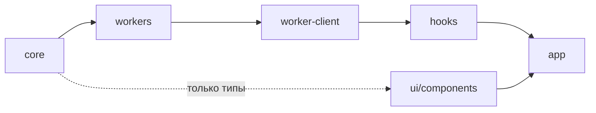

# Инженерные практики

Свод реально устоявшихся практик проекта log-viewer — чтобы кодовая база оставалась
единообразной и понятной, а контекст не терялся между сессиями (людей и AI-агентов).

## Как пользоваться

- **Descriptive, не aspirational**: здесь описано то, что уже принято в коде. Где практика
  ещё не сложилась или сознательно не вводилась — это помечено явно (см. «Осознанные
  пробелы» в [tooling.md](tooling.md)).
- Перед добавлением кода/формы/файла — сверься с соответствующим разделом.
- Каждая практика по возможности снабжена примером-образцом в коде.

## Граница ответственности (что где искать)

| Источник                                 | О чём                                                               |
| ---------------------------------------- | ------------------------------------------------------------------- |
| **Эти conventions**                      | Как писать код единообразно: стиль, типы, React, CSS, тесты, тулинг |
| [docs/adr/](../adr/)                     | _Почему_ выбран подход — архитектурные решения с обоснованием       |
| [CONTRIBUTING.md](../../CONTRIBUTING.md) | Процесс: коммиты, ветки, релизы (источник истины)                   |
| [task-management.md](task-management.md) | Оформление задач в GitHub Projects (формат Issue, поля доски)       |

Не дублируем — ссылаемся. Решение архитектурное → ADR; визуальное → ui-conventions.

## Карта слоёв (headless-архитектура)

Слои с однонаправленными зависимостями (ADR [0002](../adr/0002-headless-architecture.md));
эти границы **машинно** проверяются в [eslint.config.js](../../eslint.config.js):

| Слой          | Каталог              | Ответственность                                       |
| ------------- | -------------------- | ----------------------------------------------------- |
| core          | `src/core/`          | Доменная логика, типы, парсеры — чистый TS, без React |
| workers       | `src/workers/`       | coordinator / parser / indexer в Worker-контексте     |
| worker-client | `src/worker-client/` | main-thread прокси к воркерам                         |
| hooks         | `src/hooks/`         | React-glue: хуки поверх worker-client + core          |
| ui/components | `src/ui/components/` | Презентационные компоненты (props-driven)             |
| app           | `src/app/`           | Containers + providers — единственный шов             |

Подробнее: ADR 0002 (headless), 0003/0004 (worker/RPC),
[0007](../adr/0007-state-management-zustand.md) (Zustand), 0010 (core-типы в UI).

## Разделы

- [code-style.md](code-style.md) — именование, импорты, barrel, комментарии, ошибки/async
- [typescript.md](typescript.md) — interface/type, readonly, union, discriminated unions
- [react-state.md](react-state.md) — компоненты, hooks, Zustand, a11y
- [css.md](css.md) — lv-классы, токены, темы, модификаторы
- [ui-conventions.md](ui-conventions.md) — визуал/поведение UI: раскладка форм, компоненты
- [testing.md](testing.md) — Vitest, что покрываем
- [git-and-releases.md](git-and-releases.md) — коммиты, ветки, релизы
- [task-management.md](task-management.md) — оформление задач в GitHub Projects: формат Issue, поля доски, связь с планами
- [tooling.md](tooling.md) — ESLint, Prettier, хуки, CI, Dependabot
