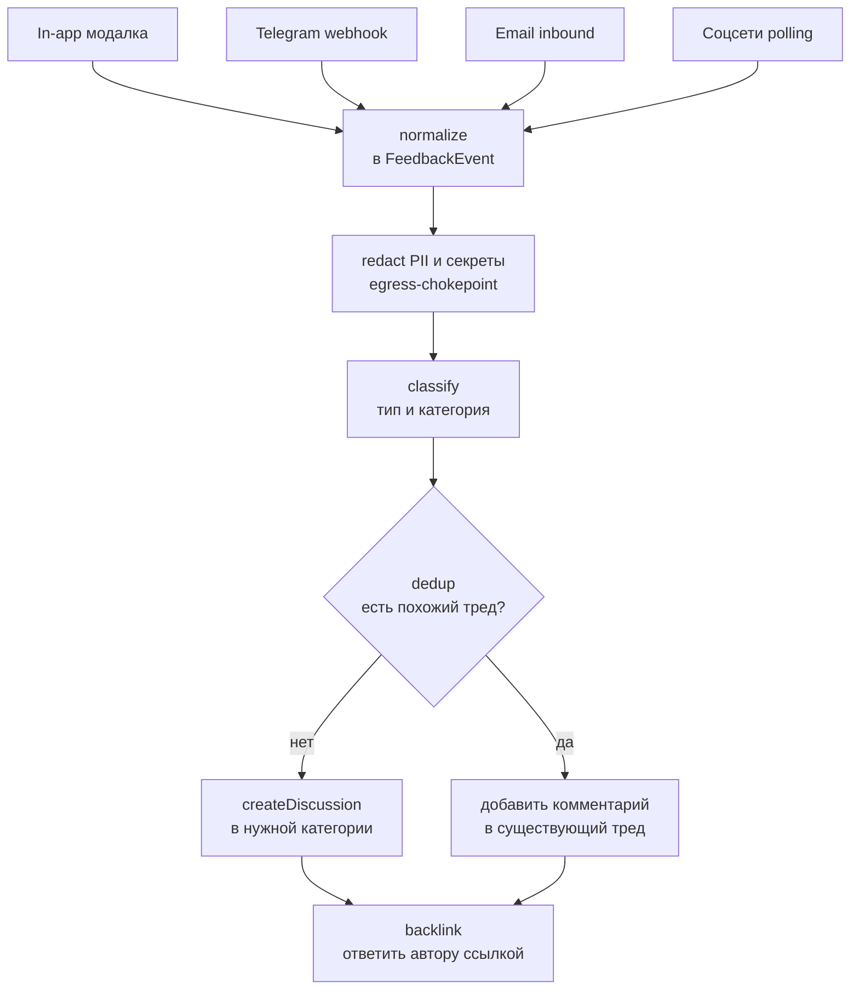

# Концепт: боты сбора обратной связи → GitHub Discussions

> Статус: **фантазия / исследование**. Это не план реализации с обязательствами, а проработка того, как
> устроить автоматический сбор обратной связи из разных каналов и её публикацию отдельными ветками
> обсуждений в GitHub Discussions. Решения «на вырост»; реальный ADR пишется, только когда дойдём до сборки.

## Context

Сейчас обратная связь в log-viewer **размазана по каналам и собирается вручную**:

- **GitHub Discussions** — канонический канал ([Bug Reports](https://github.com/AlexandrBukhtatyy/log-viewer/discussions/categories/bug-reports),
  [Ideas & Feature Requests](https://github.com/AlexandrBukhtatyy/log-viewer/discussions/categories/ideas-feature-requests)),
  есть готовые шаблоны в [.github/DISCUSSION_TEMPLATE/](.github/DISCUSSION_TEMPLATE/). Но пользователь должен
  сам прийти на GitHub, авторизоваться и оформить тред.
- **In-app модалка** (запланирована в [docs/plans/joyful-hatching-toucan.md](docs/plans/joyful-hatching-toucan.md)):
  пункт Help → «Report Issue…» открывает `LvFeedbackModal`, собирает диагностику (`collectDiagnostics()`) и
  ведёт на **pre-filled URL** Issue/Discussion — но дальше всё равно ручная отправка пользователем.
- **Telegram-группа**, почта, упоминания в соцсетях — это «тёмная материя» фидбэка: сообщения туда приходят,
  но в трекер не попадают, теряются в истории чата.

Боль: ценные баги и идеи оседают в каналах, где их никто не превращает в задачи. Discussions остаётся
полупустым, хотя реальный фидбэк есть — просто в Telegram и личке. **Цель концепта** — набор «ботов»
(адаптеров на входе + единый конвейер), которые принимают обратную связь из любого канала, нормализуют,
классифицируют, дедуплицируют и **заводят отдельную ветку обсуждения в GitHub Discussions** в правильной
категории, а затем отвечают автору ссылкой на созданный тред. Так Discussions становится единой точкой
правды для community-фидбэка, из которой созревшие треды по текущему процессу конвертируются в Issues и
кладутся на доску ([CLAUDE.md](CLAUDE.md) → «Управление задачами»).

### Жёсткое ограничение архитектуры

log-viewer — **фронтенд-only PWA без бэкенда** (вся логика в браузере и воркерах, хостинг — GitHub Pages).
Боты по своей природе требуют:

1. **места, где постоянно крутиться** (webhook-приёмник, polling по расписанию);
2. **секрета для записи в GitHub** (GitHub App / token), который **нельзя** держать в клиентском коде.

Поэтому боты живут **вне PWA** — в serverless/CI-слое. Это сознательный архитектурный водораздел: приложение
остаётся статикой, а ингест-конвейер — отдельный маленький сервис. Два реалистичных варианта рантайма
разобраны в разделе 3.

### Тип решения: гибрид

Конвейер строится как **коннектор + опциональный LLM-слой** поверх (ответ на уточнение):

- **Коннектор (всегда):** принять событие из канала → нормализовать → создать Discussion через GitHub GraphQL
  `createDiscussion`. Работает и без LLM (детерминированно, дёшево).
- **LLM-слой (опционально, фиче-флаг):** классификация типа (bug/feature/question/idea) и выбор категории,
  суммаризация длинных/сумбурных сообщений, **семантический дедуп** (поиск похожего существующего треда),
  определение языка. Включается там, где правила-эвристики не справляются; при недоступности/выключении —
  деградирует до коннектора с эвристиками.

---

## 1. Пользовательские сценарии

**Пользователь (источник фидбэка):**

- Пишет в Telegram-группу: «при загрузке 200МБ jsonl вкладка зависает» → через минуту бот отвечает в треде:
  «Спасибо! Завёл обсуждение → <ссылка на Discussion в Bug Reports>». Дубликаты схлопываются: если похожий тред
  уже есть, бот не плодит новый, а отвечает ссылкой на существующий и добавляет туда реакцию/комментарий.
- Жмёт в приложении Help → «Report Issue…», заполняет модалку (тип, описание, приложенная диагностика) →
  отправка уходит не на pre-filled URL вручную, а **прямо в ингест-эндпоинт**; Discussion создаётся ботом,
  пользователю показывается ссылка прямо в модалке.
- Пишет на почту проекта или упоминает проект в соцсети (Reddit/X) → бот-поллер подхватывает и заводит тред
  (для соцсетей — с пометкой источника и ссылкой на оригинал).

**Мейнтейнер:**

- Видит в Discussions структурированные треды из всех каналов в одном месте, с метками канала-источника,
  предполагаемого типа и (если включён LLM) кратким резюме — вместо того чтобы вручную мониторить пять каналов.
- Созревший тред по текущему процессу конвертирует в Issue и кладёт на доску.

**Принцип охвата:** сначала — самый управляемый канал (**in-app модалка**, где payload уже структурирован
и проходит через наш `collectDiagnostics()`), затем **Telegram** (webhook, мгновенный), и только потом
**email** и **соцсети** (poll/inbound-parse — дороже в инфраструктуре и шумнее).

---

## 2. Контракт события и конвейер

Сердце дизайна — **единый нормализованный `FeedbackEvent`**, к которому каждый адаптер приводит своё сырьё.
Дальше — общий конвейер, не знающий, из какого канала пришло событие.

```ts
// псевдо-контракт, единый для всех адаптеров
type FeedbackEvent = {
  channel: 'in-app' | 'telegram' | 'email' | 'social';
  externalId: string; // id сообщения в источнике (для идемпотентности и backlink)
  author: { handle?: string; displayName?: string }; // без e-mail/контактов в открытом виде
  text: string; // тело обращения
  lang?: string; // если определён
  diagnostics?: AppDiagnostics; // только для in-app: версия, build hash, UA, парсеры, ...
  attachments?: Array<{ name: string; url?: string }>;
  receivedAt: string; // ISO
};
```

Конвейер `ingest(event)` — последовательность шагов, каждый можно отключить флагом:



Шаги по порядку:

1. **normalize** — адаптер канала → `FeedbackEvent`. Единственное место, где живёт специфика канала.
2. **redact** — обращение и особенно `diagnostics` могут содержать PII/секреты (логи, токены, e-mail).
   Прежде чем что-то уйдёт в **публичный** Discussion, событие проходит редактор. Это та же подсистема, что
   спроектирована в [docs/plans/web-effervescent-biscuit.md](docs/plans/web-effervescent-biscuit.md) (раздел 4):
   токенизация вместо маскирования, denylist-детекторы (email, IP, JWT, bearer, карты, телефоны). **Здесь это
   не опция, а требование** — Discussions публичен. Переиспользуем `src/mcp/privacy/` (если/когда появится) или
   выносим детекторы в общий пакет.
3. **classify** — определить тип и категорию Discussions. Эвристики по ключевым словам/типу из модалки как
   дефолт; LLM-классификатор (фиче-флаг) — когда текст сумбурный. Маппинг: bug → Bug Reports, idea/feature →
   Ideas & Feature Requests.
4. **dedup** — поиск похожего открытого треда (поиск по Discussions API + опционально эмбеддинги/LLM). Если
   найден — не плодим новый, а комментируем существующий. Защита от спама-дублей.
5. **publish** — `createDiscussion` (GraphQL) с телом из шаблона, метками канала и типа; либо `addDiscussionComment`.
6. **backlink** — ответить автору в исходном канале ссылкой на тред (Telegram reply, ответ в модалке, и т.п.).

**Идемпотентность:** `externalId` запоминается (KV/файл состояния поллера), чтобы повторная доставка вебхука
или повторный проход поллера не создавали дубль.

---

## 3. Где это крутится (рантайм) и безопасность

Два реалистичных варианта; выбор фиксируется ADR при сборке.

| Вариант                                             | Как принимает                                                                                  | Плюсы                                                       | Минусы                                                                                       |
| --------------------------------------------------- | ---------------------------------------------------------------------------------------------- | ----------------------------------------------------------- | -------------------------------------------------------------------------------------------- |
| **GitHub Actions**                                  | `repository_dispatch` от лёгкого webhook-релея + `schedule` (cron) для поллинга соцсетей/почты | ноль внешней инфры, секреты в Actions secrets, рядом с репо | холодный старт, cron-гранулярность (не «мгновенно»), вебхуки всё равно нужно куда-то принять |
| **Serverless-функция** (Cloudflare Worker / Vercel) | прямой HTTPS-эндпоинт для in-app и Telegram webhook                                            | мгновенно, гибко, есть KV для idempotency/токен-стора       | отдельный сервис и деплой, ещё одно место с секретами                                        |

Реалистичный гибрид: **Cloudflare Worker** как тонкий приёмник (in-app POST + Telegram webhook, мгновенный
отклик, KV для idempotency) **+ GitHub Actions cron** для поллинга соцсетей/почты. Публикация в GitHub — через
**GitHub App** (а не персональный токен): узкие права (`discussions: write`), отзываемость, аудит.

Безопасность:

- **Секрет записи в GitHub никогда не в клиенте.** PWA шлёт фидбэк на эндпоинт приёмника; токен/ключ App
  живёт только в Worker/Actions secrets.
- **Антиспам и антиабьюз — обязательны** (см. раздел 5): публичная запись от бота — это вектор атаки.
- **Rate-limit на эндпоинте** in-app (PWA анонимна, эндпоинт открыт) — токен-бакет по IP + капча/PoW при
  подозрении.

---

## 4. Как организовать код, чтобы он легко сопровождался

Цель — **изолировать специфику каждого канала и не дублировать конвейер**. Один контракт `FeedbackEvent`,
один конвейер, тонкие адаптеры по краям (тот же принцип, что у `sources/`, `parsers/` в основном приложении).

```
feedback-bot/                  # отдельный пакет/сервис, НЕ внутри PWA-бандла
├── core/
│   ├── feedback-event.ts      # контракт FeedbackEvent + zod-схема
│   ├── pipeline.ts            # ingest(event): normalize→redact→classify→dedup→publish→backlink
│   ├── classify.ts            # эвристики + опциональный LLM-классификатор за флагом
│   ├── dedup.ts               # поиск похожих тредов (search API + опц. эмбеддинги)
│   └── idempotency.ts         # KV/файл состояния по externalId
├── adapters/
│   ├── in-app.ts              # POST из LvFeedbackModal → FeedbackEvent
│   ├── telegram.ts            # Telegram Bot API webhook → FeedbackEvent + reply backlink
│   ├── email.ts               # inbound-parse → FeedbackEvent
│   └── social.ts              # poll Reddit/X → FeedbackEvent (с ссылкой на оригинал)
├── github/
│   ├── discussions.ts         # createDiscussion / addDiscussionComment (GraphQL), категории, метки
│   └── app-auth.ts            # GitHub App auth (installation token)
├── privacy/                   # переиспользует детекторы редактора из web-effervescent-biscuit (раздел 4)
└── runtime/
    ├── worker.ts              # Cloudflare Worker — приёмник вебхуков
    └── poller.ts              # GitHub Actions cron — поллинг почты/соцсетей
```

Принципы сопровождаемости:

1. **Один конвейер, тонкие адаптеры.** Вся специфика канала — только в `adapters/*`; `core/pipeline.ts` про
   каналы не знает. Новый канал = новый адаптер + одна строка регистрации.
2. **Публикация в GitHub — за единым фасадом** `github/discussions.ts`. Категории/метки/маппинг типов в одном
   месте; смена структуры Discussions правит один файл.
3. **LLM — за флагом и за интерфейсом.** `classify`/`dedup` принимают стратегию (`heuristic` | `llm`).
   Без ключа/флага работает эвристика. Дефолт провайдера — свежие Claude (Opus 4.8), как в остальных концептах.
4. **Redact — обязательный chokepoint** перед `publish`. Физически невозможно опубликовать необработанный
   payload: единственный путь в GitHub идёт через шаг redact.
5. **Тестируемость без сети.** `pipeline`, `classify`, `dedup`, `redact` — чистые функции над `FeedbackEvent`;
   адаптеры и `github/` мокаются. Табличные тесты на фикстурах фидбэка с заведомыми PII.
6. **Идемпотентность по `externalId`** — повторная доставка не плодит дубли.
7. **ADR при сборке:** «Ингест обратной связи в Discussions» (выбор рантайма Worker vs Actions, GitHub App vs
   token, политика антиспама, граница LLM/эвристика).

### Что переиспользуем (а не пишем заново)

- **Редактор PII/секретов** — детекторы и токенизация из [docs/plans/web-effervescent-biscuit.md](docs/plans/web-effervescent-biscuit.md)
  (раздел 4). Это та же подсистема egress-редакции; выносим в общий пакет, если она появится в коде.
- **`collectDiagnostics()` и `LvFeedbackModal`** — из [docs/plans/joyful-hatching-toucan.md](docs/plans/joyful-hatching-toucan.md):
  in-app адаптер принимает уже собранный payload, не изобретая формат диагностики заново.
- **Шаблоны Discussions** — [.github/DISCUSSION_TEMPLATE/](.github/DISCUSSION_TEMPLATE/) (bug-reports.yml,
  ideas-feature-requests.yml): тело создаваемого треда строим по тем же полям, чтобы оно было консистентно
  ручным обращениям.
- **GitHub Actions** как рантайм — у проекта уже есть зрелый CI/CD ([.github/workflows/](.github/workflows/)).

---

## 5. Антиспам, модерация и приватность

Автосоздание **публичного** контента ботом — главный риск концепта. Защиты:

- **Очередь модерации, а не прямая публикация (рекомендуемый дефолт).** Подозрительные/низкокачественные
  события не идут сразу в Discussions, а ждут одобрения мейнтейнера (например, бот сначала постит в приватный
  канал/issue с label `triage`, и только по реакции 👍 публикует тред). У GitHub Discussions нет «черновиков»,
  поэтому буфер — на нашей стороне.
- **Спам-фильтр** до публикации: эвристики (ссылки/повторы/длина) + опционально LLM-оценка «это осмысленный
  фидбэк?». Порог настраивается.
- **Rate-limit** на открытом in-app эндпоинте (токен-бакет по IP, капча/PoW при всплеске).
- **Дедуп** (раздел 2, шаг 4) сам по себе режет дубли-флуд.
- **Приватность (требование, не опция):** Discussions публичен → весь egress через редактор. Диагностика из
  модалки особенно чувствительна (UA, возможные фрагменты логов). Честная оговорка та же, что в концепте Web
  MCP: denylist — это defense-in-depth, не 100%-гарантия; для in-app payload разумнее **allowlist** (публикуем
  только заведомо безопасные поля диагностики).

---

## Verification (когда/если дойдёт до сборки)

Это концепт, кода нет. Если двинемся в MVP, проверка выглядела бы так:

1. **Юнит-конвейер:** `ingest(event)` на фикстурах `FeedbackEvent` от каждого канала → правильный шаг
   publish/comment; redact вырезает заведомые PII; dedup схлопывает повтор. `pnpm test` (Vitest).
2. **In-app сквозняк:** в `pnpm dev` отправка из `LvFeedbackModal` → mock-эндпоинт получает payload, в теле
   нет нередактированной диагностики, в ответ приходит ссылка на тред.
3. **Telegram:** тестовый бот в тестовой группе → сообщение → создан тред в Bug Reports тестового репозитория;
   повторная доставка вебхука не плодит дубль (idempotency по `externalId`).
4. **Дедуп:** два похожих обращения → второй уходит комментарием в первый тред, а не новым тредом.
5. **Антиспам:** заведомо спамное сообщение уходит в очередь модерации, не публикуется напрямую.

## Трекинг

Этот концепт — **одна из веток зонтичного эпика «Сбор обратной связи»**. Эпик объединяет всю работу по
превращению разрозненного фидбэка в единый поток в Discussions/трекере:

- **In-app модалка** ([docs/plans/joyful-hatching-toucan.md](docs/plans/joyful-hatching-toucan.md)) — точка
  входа фидбэка из самого приложения (источник для адаптера `in-app`).
- **Боты-ингест → Discussions** (этот документ) — приём из всех каналов и публикация ветками обсуждений.

Эпик и эта задача заводятся в GitHub Project **Log Viewer** ([доска](https://github.com/users/AlexandrBukhtatyy/projects/1)).
Эпик «Сбор обратной связи» — статус **Planned** (Area = dx): in-app модалка уже проработана отдельным планом,
направление реально в ближайшей работе. Задача про ботов — карточка-Issue в статусе **Backlog**, **Area = dx**,
**Priority = low** (концепт-фантазия), **sub-issue эпика**. Концепт — этот документ; ADR пишется при переходе
к реальной сборке.

## Открытые вопросы (на будущее, не блокируют концепт)

- Рантайм: Cloudflare Worker + Actions cron vs полностью на Actions — что дешевле в сопровождении.
- GitHub App vs fine-grained token для записи в Discussions.
- Прямая публикация vs очередь модерации по умолчанию (баланс «живость» ↔ «защита от спама»).
- Набор каналов в MVP: ограничиться in-app + Telegram, отложив email/соцсети.
- Граница LLM: только дедуп/классификация или ещё и суммаризация; какой бюджет на вызовы.
- Стоит ли в Discussions помечать треды как «создано ботом», чтобы отличать от ручных.

---

## Что сделать при исполнении (после одобрения концепта)

1. **Сохранить этот документ** как концепт-план в [docs/plans/](docs/plans/) (имя файла оставить
   `github-project-snoopy-seahorse.md` или переименовать в осмысленный slug при коммите).
2. **Создать эпик-Issue** «Сбор обратной связи» (label `enhancement`) — краткое описание зонтика и ссылки на
   обе ветки работ (in-app модалка + боты-ингест). Добавить на доску **Log Viewer**, **Status = Planned**,
   **Area = dx**.
3. **Создать Issue** «Боты сбора обратной связи → GitHub Discussions» (label `enhancement`), в теле — краткое
   описание и строка `Plan: docs/plans/github-project-snoopy-seahorse.md`. Сделать её **sub-issue эпика**.
4. **Добавить Issue ботов на доску** Log Viewer (project `#1`, owner `AlexandrBukhtatyy`) и выставить через
   `gh`/GraphQL: **Status = Backlog**, **Area = dx**, **Priority = low**.
5. **Подвести in-app модалку** ([docs/plans/joyful-hatching-toucan.md](docs/plans/joyful-hatching-toucan.md))
   под эпик: если у неё уже есть Issue — сделать sub-issue эпика; если нет — отметить в эпике как будущую ветку.
6. **Инструменты:** sub-issues управляются `gh` (`gh issue edit --add-sub-issue` / соответствующие команды) с
   достаточно свежего CLI; фолбэк — GraphQL `addSubIssue`. На исполнении проверить `gh --version`.
7. По правилу автокоммита — закоммитить документ одним `docs(plans): …`. Push — только по явной команде.
