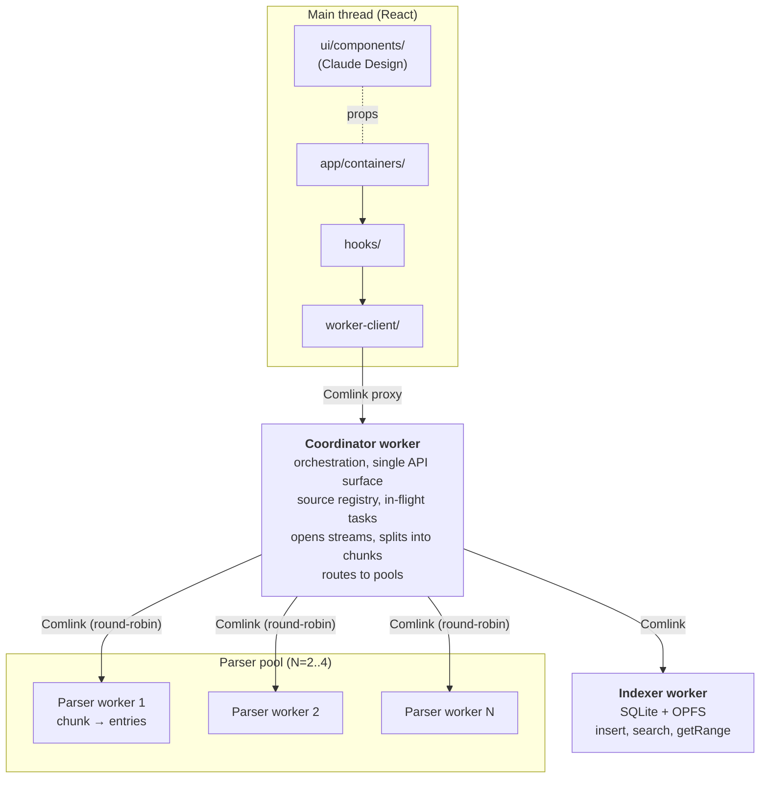

# Headless архитектура для log-viewer PWA (worker-centric)

## Context

Проект — свежий Vite 8 + React 19 + TypeScript scaffold с vite-plugin-pwa, реальной функциональности нет ([CLAUDE.md](CLAUDE.md), [src/App.tsx](src/App.tsx) — стартовая страница Vite). Цели:

1. **Изоляция логики от UI**, чтобы регенерация UI через Claude Design не требовала переделки поведения. Контракт между слоями — стабильные TS-интерфейсы хуков.
2. **Worker-centric обработка**: основной координатор-worker, к которому обращается приложение, плюс пул worker'ов под отдельные задачи (парсинг файла почанково, индексация, поиск). UI-поток должен оставаться отзывчивым на файлах в сотни МБ.
3. **Индексация в БД** для быстрого поиска по логам. Выбран **SQLite (wa-sqlite) + FTS5 в OPFS** — даёт range-queries (timestamp/level/source) и full-text поиск в одном движке.
4. **Источники логов** — file upload, paste, URL fetch, WebSocket/SSE стрим, **и каталог через File System Access API** (`showDirectoryPicker`, `FileSystemDirectoryHandle`). Часть источников переживают reload (handle сохраняется), часть — нет.
5. **RPC main↔workers** — рекомендую **Comlink + тонкий пул-обёртка + hand-rolled batched messages для hot path** (см. §7).

Подтверждённое стартовое состояние: только react/react-dom + vite-plugin-pwa, `src/` содержит Vite-скелет, `dev-dist/` уже в `.gitignore`.

---

## 1. Высокоуровневая топология



- **Coordinator worker** — единственная точка для main thread. Приложение видит только один Comlink-прокси.
- **Parser pool** — N (по `navigator.hardwareConcurrency`, capped 2–4) одинаковых worker'ов. Coordinator round-robin'ом отдаёт чанки строк.
- **Indexer worker** — владеет SQLite в OPFS. Single-writer (SQLite ограничение); read connections через тот же worker (последовательно, либо отдельный read-only worker позже).
- Stream-источники (WS/SSE) живут в coordinator: I/O-bound, не имеет смысла отдельный worker.

---

## 2. Структура каталогов

```
src/
  core/                         # ЧИСТЫЙ TS, импортируется и main, и worker'ами
    types/                      # LogEntry, LogLevel, LogFilter, LogSource, LogParser
    parsers/                    # json-lines, plain-text, regex + registry
    sources/
      source-adapter.ts         # интерфейс
      file-adapter.ts           # File / Blob
      directory-adapter.ts      # FileSystemDirectoryHandle (FS Access API)
      text-adapter.ts
      url-adapter.ts
      stream-adapter.ts         # WS / SSE
      line-splitter.ts          # TransformStream<string,string>
    filter/
      query.ts                  # LogFilter → SQL where-clause + FTS-выражение
      build-predicate.ts        # для in-memory сценариев / тестов
    rpc/
      coordinator.contract.ts   # типы RPC, экспонируемые coordinator'ом
      parser.contract.ts
      indexer.contract.ts
      messages.ts               # batched stream messages (hot path)
    util/
      ids.ts                    # branded IDs
      time.ts
      backoff.ts

  workers/
    coordinator/
      index.ts                  # entrypoint: Comlink.expose(coordinatorApi)
      coordinator.ts            # реализация API
      pool/
        parser-pool.ts          # round-robin поверх N Comlink-прокси
        backpressure.ts         # очередь чанков, capped
      ingest/
        ingest-orchestrator.ts  # source → chunks → parser-pool → indexer
        chunker.ts              # ReadableStream<string> → batches
      handles/
        handle-store.ts         # IndexedDB kv для FileSystemHandle (см. §8)
        permissions.ts          # queryPermission / requestPermission helpers

    parser/
      index.ts                  # entrypoint: Comlink.expose(parserApi)
      parser-api.ts             # parseChunk(lines: string[]) → LogEntry[]

    indexer/
      index.ts                  # entrypoint: Comlink.expose(indexerApi)
      indexer-api.ts            # insertBatch / search / getRange / count
      db/
        open-db.ts              # wa-sqlite + OPFS VFS bootstrap
        schema.sql              # таблицы, индексы, FTS5
        migrations.ts
        statements.ts           # подготовленные prepared statements

  worker-client/
    coordinator-client.ts       # new Worker + Comlink.wrap → typed proxy
    viewport-cache.ts           # тонкий main-thread кэш активного окна
    subscriptions.ts            # Comlink.proxy callbacks для статусов/прогресса

  hooks/                        # тонкий React-glue, СТАБИЛЬНЫЙ контракт для UI
    use-log-window.ts           # windowed query (см. §6)
    use-log-filter.ts
    use-selected-entry.ts
    use-source-controller.ts
    use-source-status.ts
    index.ts                    # barrel — headless contract

  ui/                           # презентационные, регенерируются Claude Design
    components/
    adapters/
    contracts/
    primitives/
    styles/

  app/                          # композиция, СТАБИЛЬНАЯ
    containers/                 # ЕДИНСТВЕННОЕ место где хуки встречают UI
    providers/
      WorkerClientProvider.tsx  # инициализирует coordinator-client
    AppShell.tsx

  main.tsx
```

**Жёсткие правила импорта (планируем ESLint `no-restricted-imports`):**

- `core/` — без `react`, `hooks`, `ui`, `app`, без worker-only API. Импортируется откуда угодно.
- `workers/*/` — без `react`, без main-thread DOM, без `ui`. Можно `core/`.
- `worker-client/` — main thread, использует `Worker` + `Comlink`. Импортирует **типы** из `workers/*/` и из `core/rpc/`.
- `ui/components/` — без `hooks`, без `core`, без `workers`. Только React + UI-зависимости (виртуализация и т.д.).
- `app/containers/` — единственный шов между хуками и UI.

---

## 3. Доменные типы ([src/core/types/](src/core/types/))

```ts
// log-entry.ts
export type LogLevel =
  | 'trace'
  | 'debug'
  | 'info'
  | 'warn'
  | 'error'
  | 'fatal'
  | 'unknown';
export type EntryId = string & { readonly __brand: 'EntryId' };
export type SourceId = string & { readonly __brand: 'SourceId' };

export interface LogEntry {
  id: EntryId;
  sourceId: SourceId;
  seq: number;
  timestamp: number | null; // epoch ms
  level: LogLevel;
  message: string;
  raw: string;
  fields: Readonly<Record<string, unknown>>;
}

// log-source.ts — открытый discriminated union
export type LogSource =
  | { kind: 'file'; id: SourceId; name: string; size: number; file: File }
  | {
      kind: 'directory';
      id: SourceId;
      name: string;
      handle: FileSystemDirectoryHandle;
      glob?: string;
    }
  | { kind: 'text'; id: SourceId; name: string; text: string }
  | {
      kind: 'url';
      id: SourceId;
      name: string;
      url: string;
      headers?: Record<string, string>;
    }
  | {
      kind: 'stream';
      id: SourceId;
      name: string;
      transport: 'ws' | 'sse';
      url: string;
    };

export type SourceStatus =
  | { kind: 'idle' }
  | { kind: 'permission-required' }
  | { kind: 'loading'; bytesRead?: number; bytesTotal?: number }
  | { kind: 'indexing'; entriesIndexed: number }
  | { kind: 'streaming'; entriesIndexed: number }
  | { kind: 'done'; entryCount: number }
  | { kind: 'error'; error: { name: string; message: string } };

// log-filter.ts — то, что главный поток отдаёт в coordinator → indexer → SQL
export interface LogFilter {
  levels: ReadonlyArray<LogLevel> | null;
  query: string; // FTS5 expression (после нормализации)
  queryMode: 'substring' | 'fts' | 'regex';
  caseSensitive: boolean;
  timeRange: { from: number | null; to: number | null } | null;
  sources: ReadonlyArray<SourceId> | null;
  fieldFilters?: ReadonlyArray<{
    key: string;
    op: 'eq' | 'ne' | 'contains';
    value: string;
  }>;
}
```

**Точки расширения**: `LogEntry.fields` открыт; новый источник = новый kind в union + `SourceAdapter` + регистрация; `fieldFilters` опционально и аддитивно.

---

## 4. Источники

Контракт един:

```ts
// core/sources/source-adapter.ts
export interface LogSourceAdapter {
  readonly source: LogSource;
  open(signal: AbortSignal): Promise<ReadableStream<string>>; // декодированные строки
  onStatus(cb: (s: SourceStatus) => void): () => void;
  close(): Promise<void>;
}
export type SourceAdapterFactory = (source: LogSource) => LogSourceAdapter;
```

Pipeline (в [coordinator/ingest/ingest-orchestrator.ts](src/workers/coordinator/ingest/ingest-orchestrator.ts)):

```
adapter.open() → ReadableStream<string>
  → LineSplitter (TransformStream<string,string> по \n с remainder buffer)
  → Chunker (group 1000 lines / 100ms)
  → parser-pool.parse(chunk) [round-robin по N parser worker'ам]
  → entries: LogEntry[]
  → indexer.insertBatch(entries)
  → emit progress статус подписчикам
```

**Реализации**:

- `file-adapter.ts`: `file.stream().pipeThrough(TextDecoderStream).pipeThrough(LineSplitter)`. Для больших файлов важно — никаких `await file.text()`, только стрим.
- `directory-adapter.ts`: итерируется по `dirHandle.values()`, для каждого `FileSystemFileHandle.getFile()` → файл-адаптер. Опциональный `glob` (например `*.log`). В будущем — наблюдение через polling getFile().lastModified.
- `text-adapter.ts`: синхронный `ReadableStream` из `text.split('\n')` (для симметрии).
- `url-adapter.ts`: `fetch(url, { signal }).then(r => r.body!.pipeThrough(TextDecoderStream).pipeThrough(LineSplitter))`. Streaming response.
- `stream-adapter.ts`: WS — кастомный `ReadableStream` (`start(controller) { ws.onmessage = e => controller.enqueue(e.data) }`); SSE — обёртка вокруг `EventSource`. Backpressure — drop-oldest на уровне chunker'а если indexer не успевает (см. §7).

Registry ([src/core/sources/index.ts](src/core/sources/index.ts)) мапит `LogSource['kind']` → factory. **Новый источник = добавить kind + factory + регистрация. Хуки и UI не меняются.**

---

## 5. Парсеры ([src/core/parsers/](src/core/parsers/))

```ts
export interface LogParser {
  readonly id: string;
  canParse(line: string): boolean;
  parseLine(
    line: string,
    ctx: ParseCtx,
  ): { entry: LogEntry | null; confidence: number };
}
```

Built-ins: `json-lines-parser` (старт с `{`, ts из `ts|time|@timestamp`, level из `level|severity|lvl`, msg из `msg|message`); `regex-parser` (named groups для nginx/syslog/прочих); `plain-text-parser` (всегда `canParse=true`, lowest priority).

Selection: registry sniff'ит первую непустую строку источника, выбирает один парсер на источник, переключение по запросу пользователя. **Парсеры запускаются внутри parser worker'а** (см. §7). Чанки сырых строк пересылаются через `Transferable`-friendly формат (массив строк — структурный клон, дешёвый для коротких массивов; для очень больших — рассмотреть `ArrayBuffer` + offsets).

---

## 6. Hook API — стабильный контракт ([src/hooks/](src/hooks/))

**Ключевое отличие от не-worker архитектуры**: store живёт в indexer worker'е, на main thread нет полного массива entries. UI получает данные через **windowed query API**.

```ts
// use-log-window.ts — основной хук для списка
export interface UseLogWindow {
  totalCount: number; // сколько записей в БД (с учётом активного фильтра)
  isLoading: boolean;
  /** Получить запись по абсолютному индексу (после применения фильтра, в порядке seq).
   *  Возвращает undefined если ещё не подгружено — хук фоном пакетно догружает. */
  getRow(index: number): LogEntry | undefined;
  /** Сообщить хуку какой диапазон сейчас виден — он держит этот window + overscan в кэше. */
  setVisibleRange(from: number, to: number): void;
  version: number; // инкрементируется при invalidation (новые данные / новый фильтр)
}
export function useLogWindow(): UseLogWindow;

// use-log-filter.ts
export interface UseLogFilter {
  filter: LogFilter;
  setFilter: (next: LogFilter | ((prev: LogFilter) => LogFilter)) => void;
  resetFilter: () => void;
}

// use-selected-entry.ts
export interface UseSelectedEntry {
  selected: LogEntry | null;
  selectedId: EntryId | null;
  select: (id: EntryId | null) => void;
}

// use-source-controller.ts — добавление/удаление источников
export interface UseSourceController {
  addFile: (file: File) => Promise<SourceId>;
  addDirectory: () => Promise<SourceId>; // открывает showDirectoryPicker
  addText: (name: string, text: string) => Promise<SourceId>;
  addUrl: (url: string, headers?: Record<string, string>) => Promise<SourceId>;
  addStream: (transport: 'ws' | 'sse', url: string) => Promise<SourceId>;
  remove: (id: SourceId) => void;
  reIndex: (id: SourceId) => Promise<void>;
}

// use-source-status.ts — список источников и их прогресс
export interface UseSourceStatus {
  sources: ReadonlyArray<{ source: LogSource; status: SourceStatus }>;
}
```

**Гарантия пользователю**: пока сигнатуры стабильны, регенерируемый UI продолжает компилироваться. Несовпадения шейпа лечатся адаптером (см. §10), а не правкой хука.

**Под капотом** `useLogWindow` на main thread:

- держит [worker-client/viewport-cache.ts](src/worker-client/viewport-cache.ts) — Map index→LogEntry, evicts вне window+overscan;
- на `setVisibleRange` async зовёт `indexer.getRange(filter, from, to)` через coordinator;
- подписан на `coordinator.onChange(filter, callback)` — при insert батчей в БД для активного фильтра версия инкрементируется, виртуализатор перерендеривает видимое.

Виртуализация (`@tanstack/react-virtual`) живёт в `ui/components/LogList.tsx` — использует `getRow(i)` как accessor. UI остаётся dumb.

---

## 7. Worker'ы и RPC

### Выбор транспорта: **Comlink + тонкий пул-обёртка + hand-rolled batched messages для hot path**

Почему такая комбинация:

**Comlink (~3KB)** для типизированного RPC main↔coordinator и coordinator↔indexer:

- Type-safe прокси: `await coordinator.search(filter, from, to)`. TS-типы передаются автоматически.
- Поддержка `Transferable` через `Comlink.transfer(buffer, [buffer])`.
- Callbacks через `Comlink.proxy(fn)` — ровно для подписок на статус/прогресс.
- Мало магии, понятный отладочный путь (под ним обычный `postMessage`).

**Не-Comlink варианты и почему отвергнуты**:

- _Hand-rolled postMessage_: ~150 строк на correlation IDs, типизацию, ошибки. Окупается только если нужен очень кастомный протокол. У нас нужен — но только в hot path (см. ниже), не на всём API.
- _threads.js / workerpool_ (~10KB): даёт pool из коробки, но добавляет API-слой и зависимости. Наш pool — тривиально 30 строк round-robin'а поверх Comlink.

**Тонкий пул-обёртка** в [parser-pool.ts](src/workers/coordinator/pool/parser-pool.ts):

```ts
export class ParserPool {
  private workers: Comlink.Remote<ParserApi>[] = [];
  private rr = 0;
  constructor(size: number) {
    for (let i = 0; i < size; i++) {
      const w = new Worker(new URL('../../parser/index.ts', import.meta.url), {
        type: 'module',
      });
      this.workers.push(Comlink.wrap<ParserApi>(w));
    }
  }
  async parse(lines: string[]): Promise<LogEntry[]> {
    const w = this.workers[this.rr++ % this.workers.length];
    return w.parse(lines);
  }
  // optional: work-stealing если parse-time сильно неравномерный
}
```

**Hand-rolled batched messages для hot path** (parser → coordinator → indexer):

- Comlink на каждый вызов делает round-trip с Promise — для парсера, отдающего тысячи entries/сек, это ОК (мы вызываем не на каждую строку, а на каждый chunk в 1000 строк, ~10 чанков/сек).
- Но coordinator → indexer на каждом батче делает `await indexer.insertBatch(entries)` — и здесь main bottleneck. Один insertBatch на ~1000 строк через Comlink — приемлемо.
- Если выяснится что нужен realtime push с минимальной задержкой (стрим логов с высокой частотой) — можно завести **shared MessageChannel напрямую parser↔indexer** (без участия coordinator) с кастомным batched-message форматом. Это оптимизация шага 13+, не MVP.

### Контракты RPC

```ts
// core/rpc/coordinator.contract.ts — то, что main видит
export interface CoordinatorApi {
  addSource(source: LogSourceInput): Promise<SourceId>; // input — без File handle proxy issues, см. ниже
  removeSource(id: SourceId): Promise<void>;
  reIndex(id: SourceId): Promise<void>;

  setFilter(filter: LogFilter): Promise<void>; // активный фильтр для viewport
  getRange(from: number, to: number): Promise<LogEntry[]>;
  getCount(): Promise<{ total: number; filtered: number }>;
  getEntry(id: EntryId): Promise<LogEntry | null>;

  listSources(): Promise<Array<{ source: LogSource; status: SourceStatus }>>;
  subscribeStatus(cb: (s: SourceStatus[]) => void): Promise<() => void>;
  subscribeChanges(
    cb: (v: { version: number; filteredCount: number }) => void,
  ): Promise<() => void>;

  resumePersistedSources(): Promise<{
    resumed: SourceId[];
    needsPermission: SourceId[];
  }>;
  grantPermission(id: SourceId): Promise<boolean>;
}

// core/rpc/parser.contract.ts
export interface ParserApi {
  parse(
    lines: string[],
    ctx: { sourceId: SourceId; startSeq: number; parserId?: string },
  ): Promise<LogEntry[]>;
  detectParser(sample: string[]): Promise<string>; // sniff
}

// core/rpc/indexer.contract.ts
export interface IndexerApi {
  open(): Promise<void>;
  insertBatch(entries: LogEntry[]): Promise<void>;
  search(filter: LogFilter, from: number, to: number): Promise<LogEntry[]>;
  count(filter: LogFilter): Promise<number>;
  getEntry(id: EntryId): Promise<LogEntry | null>;
  removeSource(id: SourceId): Promise<void>;
  vacuum(): Promise<void>;
}
```

**Передача `File` и `FileSystemDirectoryHandle` через Comlink**: оба структурно-клонируемы, передаются нормально. `File.stream()` создаём **внутри coordinator worker'а**, не на main — иначе stream не передастся через границу.

**Бэкпрешер**: chunker'е coordinator'а — ограниченная очередь pending-batches (например 8). Если indexer не успевает — coordinator приостанавливает чтение source stream через `ReadableStreamDefaultReader.read()` (естественный pull), и для стрима с drop-oldest политикой просто отбрасывает старые чанки. Конфигурируется per-source.

---

## 8. Персистентность и File System Access API

Стратегия — **дифференцированная**, потому что источники разной природы:

| Источник    | Что персистится                            | Где                                |
| ----------- | ------------------------------------------ | ---------------------------------- |
| `file`      | Entries в SQLite (только если user opt-in) | OPFS DB                            |
| `directory` | `FileSystemDirectoryHandle` + entries      | IndexedDB (handle), OPFS (entries) |
| `text`      | Не персистится по умолчанию                | —                                  |
| `url`       | Не персистится по умолчанию                | —                                  |
| `stream`    | Не персистится (live data)                 | —                                  |

**SQLite в OPFS** — `wa-sqlite` с OPFS VFS. БД-файл живёт в Origin Private File System внутри indexer worker'а (OPFS доступен только из dedicated worker'ов). Open path: `await openDb('logs.sqlite')` → монтирует OPFS VFS, открывает БД, применяет миграции из [migrations.ts](src/workers/indexer/db/migrations.ts).

**FileSystemHandle хранятся в IndexedDB** — handle structurally-cloneable, IndexedDB поддерживает их хранение. Таблица `source_handles` в отдельной IndexedDB БД (не в SQLite — handle-объект SQLite сериализовать не сможет):

```ts
// workers/coordinator/handles/handle-store.ts
interface PersistedSourceHandle {
  sourceId: SourceId;
  kind: 'directory' | 'file';
  name: string;
  handle: FileSystemDirectoryHandle | FileSystemFileHandle;
  indexedFiles?: Array<{ path: string; size: number; mtime: number }>; // для incremental re-index
}
```

**Сценарий перезагрузки**:

1. App стартует, `WorkerClientProvider` инициализирует coordinator-client.
2. Приложение зовёт `coordinator.resumePersistedSources()`.
3. Coordinator читает SQLite → существующие `source` записи; читает IndexedDB → handles.
4. Для каждого handle делает `await handle.queryPermission({ mode: 'read' })`.
   - `granted` → запускает re-validation: для каталога итерируется, сравнивает `indexedFiles[].mtime` с актуальными → определяет дельту → инкрементальный re-index.
   - `prompt` → возвращает source в `needsPermission`. UI показывает "Reconnect to <name>" кнопку → клик → `coordinator.grantPermission(id)` → `await handle.requestPermission()` (требует user gesture) → если granted — re-validation.
   - `denied` → переводит в error-статус, предлагает удалить или re-pick.

**Важно для FS Access API**:

- `requestPermission` обязан вызываться в контексте user gesture. UI кнопка должна напрямую вызывать handler, не через async-цепочку, которая теряет gesture-токен.
- Не все браузеры поддерживают FS Access API (Safari iOS — нет). Fallback: тип `directory` показываем только если `'showDirectoryPicker' in window`.

**Схема SQLite** ([schema.sql](src/workers/indexer/db/schema.sql)):

```sql
CREATE TABLE IF NOT EXISTS source (
  id TEXT PRIMARY KEY,
  kind TEXT NOT NULL,
  name TEXT NOT NULL,
  meta_json TEXT,                -- сериализованный source без handle
  indexed_at INTEGER,
  entry_count INTEGER DEFAULT 0
);

CREATE TABLE IF NOT EXISTS entry (
  id TEXT PRIMARY KEY,
  source_id TEXT NOT NULL REFERENCES source(id) ON DELETE CASCADE,
  seq INTEGER NOT NULL,
  ts INTEGER,                    -- nullable
  level TEXT NOT NULL,
  message TEXT NOT NULL,
  raw TEXT NOT NULL,
  fields_json TEXT               -- nullable
);
CREATE INDEX idx_entry_source_seq ON entry(source_id, seq);
CREATE INDEX idx_entry_ts ON entry(ts);
CREATE INDEX idx_entry_level ON entry(level);

-- FTS5 over message + raw (внешний контент - не дублируем строки)
CREATE VIRTUAL TABLE IF NOT EXISTS entry_fts USING fts5(
  message, raw,
  content='entry', content_rowid='rowid',
  tokenize='unicode61 remove_diacritics 2'
);
-- триггеры синхронизации FTS с entry — стандартный паттерн SQLite FTS5
```

`LogFilter` транслируется в SQL в [core/filter/query.ts](src/core/filter/query.ts):

- `levels` → `WHERE level IN (...)`
- `timeRange` → `WHERE ts BETWEEN ? AND ?`
- `sources` → `WHERE source_id IN (...)`
- `query` (mode='fts') → `JOIN entry_fts ON entry_fts.rowid = entry.rowid WHERE entry_fts MATCH ?`
- `query` (mode='substring') → `WHERE message LIKE ?` (медленно — рекомендовать FTS)

---

## 9. UI contract pattern

**Container/dumb split** — единственное место, где хуки встречают UI.

```tsx
// src/app/containers/LogListContainer.tsx
import { useLogWindow, useSelectedEntry } from '../../hooks';
import { LogList } from '../../ui/components/LogList';

export function LogListContainer() {
  const { getRow, totalCount, setVisibleRange, version } = useLogWindow();
  const { selectedId, select } = useSelectedEntry();
  return (
    <LogList
      totalCount={totalCount}
      getRow={getRow}
      onVisibleRangeChange={setVisibleRange}
      selectedId={selectedId}
      onSelect={select}
      key={version} // forces remount on dataset invalidation; or pass version as prop
    />
  );
}
```

```tsx
// src/ui/components/LogList.tsx — Claude Design регенерирует
export interface LogListProps {
  totalCount: number;
  getRow: (i: number) => LogEntry | undefined;
  onVisibleRangeChange: (from: number, to: number) => void;
  selectedId: EntryId | null;
  onSelect: (id: EntryId | null) => void;
}
// внутри — @tanstack/react-virtual: virtualItems → getRow → render rows
```

UI остаётся dumb. Виртуализация — UI-уровень, библиотека живёт в `ui/`, `core/` ничего о ней не знает.

---

## 10. Адаптеры для Claude Design output ([src/ui/adapters/](src/ui/adapters/))

Если сгенерированный `LogList` принимает `items` вместо `getRow/totalCount`, или `onClick` вместо `onSelect` — адаптер-обёртка, **не правим сгенерированный файл** (он будет регенерироваться):

```tsx
// src/ui/adapters/LogList.adapter.tsx
import { LogList as Generated } from '../components/LogList';
import type { LogListProps } from '../contracts/log-list-contract';

export function LogList(props: LogListProps) {
  // адаптация props под shape, который сгенерил Claude Design
  return <Generated {...remapped} />;
}
```

Containers всегда импортируют через `ui/adapters/`. Если шейп совпадает — адаптер = re-export. Если адаптер вырастает за ~30 строк — переделать промпт под контракт, не лечить wrapper'ом.

---

## 11. Тесты

Vitest + React Testing Library. **Follow-up**, не часть MVP скелета.

Асимметрия по дизайну:

- `core/` — плотно. Парсеры (фикстуры), фильтр (table-driven), source-adapters (mocked `ReadableStream`, fake WS), `query.ts` (LogFilter → SQL), line-splitter.
- `workers/parser/` — изолированный модуль `parser-api.ts`, тестируется напрямую (без worker boundary).
- `workers/indexer/` — поднимаем wa-sqlite в node через memory-VFS (вместо OPFS), тестируем insertBatch/search/count на фикстурах.
- `workers/coordinator/` — coordinator.ts тестируется с fake parser-pool / fake indexer (используем реализации интерфейсов в тестах).
- `worker-client/viewport-cache.ts` — юнит-тесты на eviction, prefetch, range merge.
- `hooks/` — `renderHook`, smoke на форму контракта, проверка отсутствия over-render.
- `ui/components/` — **намеренно не покрываются юнит-тестами** (регенерация инвалидировала бы). Покрытие — Playwright/Storybook позже.

---

## 12. Build / PWA / Vite

- **Worker'ы Vite-родные**: `new Worker(new URL('./worker.ts', import.meta.url), { type: 'module' })`. Vite поднимает chunking автоматически.
- **wa-sqlite WASM**: pull через `@vlcn.io/wa-sqlite` или `wa-sqlite` пакет. WASM-файл нужно либо поместить в `public/` и грузить по URL, либо через `import url from '...wasm?url'`. Workbox `globPatterns` уже включает `wasm`? — **нужно проверить**, текущий конфиг покрывает `js,css,html,svg,png,ico,webmanifest`. **Расширить**: добавить `wasm` в [vite.config.ts](vite.config.ts) `workbox.globPatterns`. Иначе WASM не precache'ится → первый offline-load сломается.
- **Cross-Origin Isolation**: для OPFS performance + `SharedArrayBuffer` (если когда-нибудь понадобится) хочется COOP/COEP заголовков. Для dev-сервера — `server.headers` в vite.config; для prod — задача хостинга. **Рекомендую добавить в dev**, в prod опционально пока не упремся в perf.
- **Service Worker и worker'ы**: Workbox SW не интерсептит ни Web Worker init, ни OPFS. URL-источники и WS/SSE не кешатся (правильный default).
- **vite-plugin-pwa peer-dep mismatch на Vite 8** — известный риск из CLAUDE.md, не относится к этой архитектуре.
- **Stale SW vs регенерированный UI**: добавить «New version available» toast через `useRegisterSW` после MVP.

---

## 13. План внедрения (поэтапно)

Каждый шаг — отдельный коммит. Жирный шрифт — критические шаги, без которых архитектура не валидируется.

### Этап 0 — фундамент типов

1. `src/core/types/*` — все интерфейсы из §3. Без реализаций.
2. `src/core/rpc/*.contract.ts` — типы RPC. Это «договоры» между слоями.

### Этап 1 — worker plumbing (без логики)

3. **Установить Comlink, wa-sqlite (или эквивалент с OPFS VFS).**
4. Скелеты worker'ов: `workers/parser/index.ts`, `workers/indexer/index.ts`, `workers/coordinator/index.ts` — каждый `Comlink.expose` с no-op API. Vite поднимет dev-server с worker'ами.
5. `worker-client/coordinator-client.ts` — `new Worker(...)` + `Comlink.wrap`. Smoke-test: `await client.ping()` из main thread возвращает строку из coordinator.
6. `app/providers/WorkerClientProvider.tsx` — context, инициализация, teardown.

### Этап 2 — индексатор и парсер

7. **wa-sqlite + OPFS bootstrap** ([open-db.ts](src/workers/indexer/db/open-db.ts)). Schema + миграции. `IndexerApi.open()` → `insertBatch` no-op. Тест: ручной вызов из dev console через client.
8. `core/parsers/*` — plain-text + json-lines + registry. Запускаются в `parser-api.ts`. Тест: `await parserPool.parse(['{"msg":"hi"}', 'plain text'])` возвращает 2 entries.
9. Реализовать `IndexerApi.insertBatch / count / getEntry / search` (только timestamp + level + source filter, без FTS на этом шаге).
10. `core/filter/query.ts` — LogFilter → SQL prepared statement.

### Этап 3 — file source end-to-end

11. **`core/sources/file-adapter.ts` + `line-splitter.ts`**.
12. **`workers/coordinator/ingest/*`** — chunker + ingest-orchestrator. Round-robin parser-pool.
13. **`worker-client/viewport-cache.ts`** + хуки `useLogWindow`, `useLogFilter`, `useSelectedEntry`, `useSourceController` (file-only ветка).
14. **Минимальный UI**: `<input type="file">` + плоский `<ul>` с виртуализацией (`@tanstack/react-virtual`). Containers + AppShell. Заменить тело `App.tsx` на `<AppShell />`.
15. **Smoke**: drop файл 100MB, в течение нескольких секунд видим прогресс индексации, после — список рендерится, фильтр работает, выбор работает.

### Этап 4 — FTS и полнотекст

16. FTS5 virtual table + триггеры в schema. `query.ts` поддерживает `queryMode='fts'`.
17. `useLogFilter` экспонирует `queryMode`, FilterBar предлагает FTS / substring.

### Этап 5 — остальные источники

18. `text-adapter.ts`, `url-adapter.ts` + методы в `useSourceController`.
19. **`directory-adapter.ts` + handle-store + permissions UI**. `coordinator.resumePersistedSources` + `grantPermission`. Тест: drop-каталог → reload → "Reconnect" → видим логи.
20. `stream-adapter.ts` (WS, потом SSE). Backpressure-стратегия (drop-oldest).

### Этап 6 — стабилизация

21. Vitest config + первые тесты для `core/` и индексатора (memory VFS).
22. ESLint `no-restricted-imports` rules.
23. **Hand-off Claude Design**: регенерация `ui/components/LogList`, `FilterBar`, `SourcePicker`. Если шейпы не совпали — `ui/adapters/*.adapter.tsx`.

**Критерий успеха архитектуры**: между шагами 22 и 23 регенерация UI требует руками только опционального адаптера. `git diff --stat hooks/ core/ workers/ app/containers/` после регенерации = пусто.

---

## Verification (как тестить целиком)

- `pnpm install` — поставит Comlink, wa-sqlite (или sqlocal), `@tanstack/react-virtual`.
- `pnpm dev` — `http://localhost:5173`, открыть DevTools → Application → Storage → Origin private file system, увидеть `logs.sqlite`. Application → IndexedDB → handle-store. Drop `.jsonl` файл, виртуализованный список заполняется, FilterBar работает.
- `pnpm build` — `tsc -b` (контракты целостны) + `vite build`. Проверить что в `dist/` лежат worker-чанки и `.wasm`.
- `pnpm preview` — prod-сборка, повторить smoke.
- После шага 19: drop каталог, reload, проверить permission flow, инкрементальный re-index при изменении файла на диске.
- После шага 21: `pnpm vitest run` — зелёные `core/` + `indexer-api`.
- **Ключевой тест**: после Claude Design регенерации `ui/components/LogList` — `git diff hooks/ core/ workers/` должен быть пуст.

---

## Критичные файлы (планируется создать)

- [src/core/types/](src/core/types/) — log-entry.ts, log-filter.ts, log-source.ts, log-parser.ts
- [src/core/rpc/](src/core/rpc/) — coordinator.contract.ts, parser.contract.ts, indexer.contract.ts
- [src/core/sources/](src/core/sources/) — source-adapter.ts, file/directory/text/url/stream-adapter.ts, line-splitter.ts
- [src/core/parsers/](src/core/parsers/) — registry.ts, json-lines, plain-text, regex
- [src/core/filter/query.ts](src/core/filter/query.ts)
- [src/workers/coordinator/](src/workers/coordinator/) — index.ts, coordinator.ts, pool/parser-pool.ts, ingest/_, handles/_
- [src/workers/parser/](src/workers/parser/) — index.ts, parser-api.ts
- [src/workers/indexer/](src/workers/indexer/) — index.ts, indexer-api.ts, db/{open-db,schema.sql,migrations,statements}.ts
- [src/worker-client/](src/worker-client/) — coordinator-client.ts, viewport-cache.ts, subscriptions.ts
- [src/hooks/](src/hooks/) — use-log-window, use-log-filter, use-selected-entry, use-source-controller, use-source-status, index.ts
- [src/ui/components/](src/ui/components/), [src/ui/contracts/](src/ui/contracts/), [src/ui/adapters/](src/ui/adapters/)
- [src/app/containers/](src/app/containers/), [src/app/providers/WorkerClientProvider.tsx](src/app/providers/WorkerClientProvider.tsx), [src/app/AppShell.tsx](src/app/AppShell.tsx)
- [src/App.tsx](src/App.tsx) — заменить тело на `<AppShell />`
- [vite.config.ts](vite.config.ts) — расширить `workbox.globPatterns` на `wasm`, опционально `server.headers` COOP/COEP

---

## Риски и tradeoffs

- **wa-sqlite + OPFS**: OPFS доступен только из worker'ов (что нам и надо). Браузерная поддержка — Chrome 102+, Safari 16+, Firefox 111+. На совсем старых — fallback на in-memory или sql.js без OPFS (медленнее загрузка, нет персистентности).
- **WASM bundle**: ~600KB-1MB. Лежит в precache → первое посещение тяжелее. Можно отложенно грузить (lazy import indexer-api при первом обращении), но тогда первый поиск ждёт WASM.
- **FileSystemHandle + permission flow**: `requestPermission` требует user gesture. Один неверный async-await на пути от клика — токен теряется. Тестировать руками. Документировать ограничение в UI.
- **Comlink overhead**: каждый proxy call — round-trip через postMessage + serialization. Для batched операций (insertBatch на 1000 entries) overhead < 1%. Если найдём hot path с per-call latency — переходим на hand-rolled batched messages для **этого** канала, остальное оставляем на Comlink.
- **Виртуализация + async getRow**: классическая проблема — пользователь скроллит быстрее чем подгружаются строки. Лечится prefetch'ем (overscan window+200) и плейсхолдерами «Loading…» в UI.
- **SQLite FTS5 `LIKE` vs `MATCH`**: `LIKE '%word%'` без индекса — full table scan. Документировать что substring-mode для < ~50k entries; иначе FTS.
- **vite-plugin-pwa peer-dep на Vite 8** — общий проектный риск.
- **Hook signature creep**: каждое расширение return-типа = breaking change для UI. Предпочитать новый хук расширению существующего.
- **Container/dumb split** — больше файлов. Окупается каждой регенерацией.
- **Pool size**: для парсеров `Math.min(navigator.hardwareConcurrency - 1, 4)`. Не больше 4 — иначе лишний оверхед на postMessage без выигрыша.

## Открытые решения

- Конкретный пакет wa-sqlite: `wa-sqlite` upstream vs `@vlcn.io/wa-sqlite-wasm` vs `sqlocal` (обёртка). Решим на этапе 7 после прототипирования.
- Виртуализация: `@tanstack/react-virtual` (рекомендую) vs `react-window`. Tanstack удобнее с windowed accessors.
- Стратегия отображения времени индексации: foreground (блокирует UI) vs background (показываем частичные результаты). Рекомендую background — coordinator стримит прогресс, FilterBar/LogList работают на уже индексированной части.

---

## Дополнительно — что закладываю от себя

То, что обычно вспоминают через полгода и переделывают больно. Закладываем сразу — стоит дёшево.

### A. Cancellation везде, через `AbortSignal`

Каждая длинная операция в RPC принимает опциональный сигнал:

```ts
addSource(source, { signal? }: { signal?: AbortSignal }): Promise<SourceId>
search(filter, from, to, { signal? }): Promise<LogEntry[]>
```

Comlink сам сигналы не передаёт через границу — оборачиваем: main создаёт сигнал, при abort шлёт `coordinator.cancel(taskId)`. Coordinator держит `Map<taskId, AbortController>` и при cancel зовёт `controller.abort()` внутри worker'а. Это шаблон в [worker-client/cancellation.ts](src/worker-client/cancellation.ts) + хелпер `withCancellation(taskId)` в coordinator. **Без этого** indexing 1GB файла нельзя прервать — пользователь будет ругаться.

### B. Миграции БД с первого дня

`workers/indexer/db/migrations.ts`:

```ts
const MIGRATIONS = [
  { v: 1, up: (db) => db.exec(SCHEMA_V1) },
  { v: 2, up: (db) => db.exec('ALTER TABLE entry ADD COLUMN host TEXT') },
];
// PRAGMA user_version читается, недостающие миграции применяются по порядку в одной транзакции.
```

Не пропускаем шаг «миграции добавим потом» — рано или поздно schema поменяется (новое поле в `LogEntry`, новый индекс), и без версионирования пользователи с persisted DB получат ошибку открытия. **Реализовать на шаге 7** одновременно с базовой схемой.

### C. Storage quota и «Reset database» в UI

```ts
// coordinator API
estimateStorage(): Promise<{ used: number; quota: number; perSource: Array<{id, bytes}> }>
clearAll(): Promise<void>
clearSource(id): Promise<void>
```

OPFS-квоты непредсказуемы (Chrome ~60% от диска, Safari ~1GB). Без UI «Очистить базу» пользователь застрянет. Добавить **в шаге 21** небольшой Settings-экран. Также: `navigator.storage.persist()` запросить один раз — снижает риск что браузер сам прибьёт OPFS под давлением.

### D. Settings persistence (отдельная IndexedDB kv)

Пользовательские preferences (выбранный парсер по умолчанию, тема, default `queryMode`, FTS токенизатор, размер overscan) — отдельная мелкая IndexedDB БД `app_settings`. Не в SQLite, не в localStorage. Хук `useSetting(key)` с подпиской. Файл [src/core/settings/settings-store.ts](src/core/settings/settings-store.ts).

### E. Worker-side логирование с проксированием в main

Когда в indexer worker'е что-то падает — обычные `console.error` уходят в свой DevTools-чанк, найти их сложно. Заводим:

```ts
// core/diag/logger.ts
export const diag = {
  info(scope: string, msg: string, data?: object): void
  error(scope: string, err: Error, data?: object): void
}
```

В worker'е — пишет в кольцевой буфер на 1000 записей и шлёт по Comlink в main. Main выводит в DevTools + опционально показывает «Diagnostics» панель в UI (только в dev / по флагу). Включает: SQL slow-queries (>50ms), parser errors, dropped chunks.

### F. Crash recovery для indexer

Если indexer worker упал (corrupt SQLite, OOM, баг) — coordinator должен:

1. Поймать `worker.onerror` / unhandled promise.
2. Перезапустить worker (`new Worker`).
3. Если open-db падает повторно (corrupt OPFS file) — пометить флагом, предложить пользователю «Reset database» (через UI), не молча терять данные.

Без этого один битый OPFS-файл = вечный «Failed to load» при каждом старте.

### G. Performance budgets как тесты

Бенч-харнес в `tests/perf/` (Vitest):

- Indexing throughput: ≥50k entries/sec на batch=1000 (M1).
- Search latency: FTS на 1M entries < 500ms.
- Filter switching: < 100ms (сменился `LogFilter` → первый ряд видим).

Прогоняется руками или в CI на длинных проверках. **Не строгий gate** на старте, но числа нужны — без них регрессии незаметны до релиза.

### H. Большие файлы — индекс vs raw

Архитектурный choice: храним ли в SQLite **полный `raw`** каждой записи (легко, но БД раздувается до размера исходника) или **offset+length** обратно в исходный `File`/`FileSystemFileHandle` (БД маленькая, но требует «живого» handle для отображения raw в деталях)?

**Рекомендую гибрид**:

- `entry.raw` хранит до ~2KB строки полностью.
- Длиннее — пишем `null` и складываем `(file_id, offset, length)` в `entry_raw_ref`. На запрос `getEntry(id)` indexer читает фрагмент через handle.
- Если handle потерян (file source без persisted handle) — деградируем до «raw недоступен», показываем `message`.

**Реализовать после MVP** (шаг 18+). На MVP — просто храним `raw` целиком.

### I. Privacy-нота в UI

Логи часто содержат секреты. Один раз показать tooltip / footer-строку: «Логи остаются на устройстве, никуда не отправляются». Нулевая стоимость, серьёзно повышает доверие. Добавить как `<PrivacyNote />` в `app/AppShell.tsx`.

### J. Cross-tab — flag, не реализуем

Если открыть приложение в двух вкладках одного origin — два coordinator worker'а, оба пишут в один OPFS SQLite → corrupt. Стратегия:

- **MVP**: при старте `BroadcastChannel('log-viewer-leader')` ping. Если есть другой инстанс — показываем `<MultiTabBlocker />`: «Уже открыто в другой вкладке. Закройте её или работайте здесь».
- Полноценный leader-election + `Web Locks API` (`navigator.locks.request('logs-db', { mode: 'exclusive' })`) — после MVP.

Файл: [src/app/providers/SingleTabGuard.tsx](src/app/providers/SingleTabGuard.tsx). Дёшево и спасает от data corruption.

### K. Export filtered

UI-фича, но проходит через контракт. Добавить в `CoordinatorApi`:

```ts
exportFiltered(filter: LogFilter, format: 'jsonl' | 'csv', { signal? }): Promise<Blob>
```

Indexer стримит результаты, coordinator склеивает Blob. Хук `useExport()` отдаёт `(filter, format) => Promise<void>` (триггерит download). Добавить в шаге 22.

### L. Dev-опыт с worker'ами

Vite worker HMR работает, но капризно: при правке `parser-api.ts` не всегда подхватывается. Подстраховки:

- В dev режиме показывать в углу UI хеш бандла worker'ов (читается из `import.meta.url` или статичной константы) — видно что worker «живой» актуальной версии.
- В `package.json` добавить `"dev:fresh": "rm -rf node_modules/.vite && pnpm dev"` для случаев когда HMR залипает.
- ESLint правило: запретить `console.*` в `workers/*` — только через `diag` (см. E).

### Итоговая правка плана внедрения

Добавить в этап 6 (стабилизация):

- **24.** Cancellation infrastructure (A).
- **25.** SingleTabGuard (J).
- **26.** Settings store + UI для quota/Reset (C, D).
- **27.** Diag logger + dev-only Diagnostics panel (E).
- **28.** Crash recovery handler в coordinator (F).
- **29.** Privacy note (I).
- **30.** Export functionality (K).

Перфо-бенчи (G) — параллельно, по готовности шага 9.
