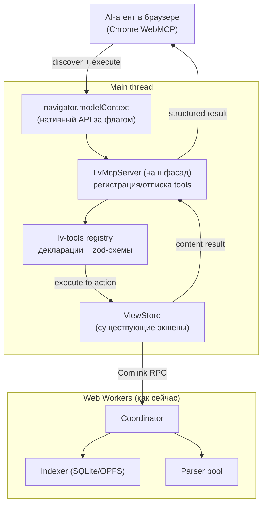
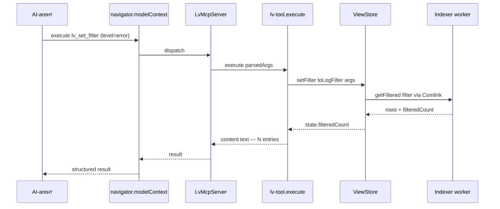
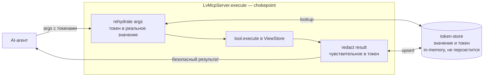

# Концепт: внедрение Web MCP в log-viewer

> Статус: **фантазия / исследование**. Это не план реализации с обязательствами, а проработка того, как новая
> технология Web MCP легла бы на текущую архитектуру PWA. Решения здесь сознательно «на вырост» — реальный
> ADR пишется, только когда дойдём до сборки.

## Context

Web MCP (WebMCP, Web Model Context Protocol) — это спецификация W3C (Web Machine Learning Community Group,
draft от февраля 2026), которая позволяет **веб-странице самой объявлять свои возможности как структурированные
«tools»**, которые AI-агент в браузере вызывает напрямую — не скрапя DOM и не кликая по UI вслепую. Страница
фактически становится MCP-сервером, живущим во фронтенде.

Зачем это нам. Log-viewer — это инструмент, в котором пользователь выполняет много полуручных аналитических
действий: загрузить файл, отфильтровать по уровню/времени/сервису, сгруппировать, найти trace_id, выгрузить
срез. Все эти действия уже реализованы как чистые методы `ViewStore` поверх воркеров. Web MCP даёт возможность
дать к ним доступ агенту: вместо «прочитай 50k строк глазами» пользователь говорит агенту «покажи все ошибки
по trace abc123 за последний час и выгрузи в JSONL» — а агент выполняет это **через наши же tools**, на нашем
индексаторе, с нашей фильтрацией. Ключевое: тяжёлые данные (логи) остаются в браузере, в OPFS/SQLite, наружу
уходят только результаты вызовов.

### Что важно знать про технологию

- **Где работает:** только в браузере, во фронтенд-JS. Прямого доступа к бэкенду нет (для бэкенда — обычный
  серверный MCP). Для нас это идеально: у log-viewer и так нет бэкенда, вся логика во фронте и воркерах.
- **Статус и поддержка:** ранний preview в Chrome 146 Canary за флагом (`chrome://flags/#enable-webmcp-testing`).
  Edge — ожидается, Firefox/Safari — без планов. Нативная поддержка Chrome/Edge — ориентир на 2-ю половину 2026.
  Значит: **фича строго опциональная, за флагом, с graceful-degradation, когда API нет.**
- **API в движении.** В источниках три разных написания: `navigator.registerTool`, `navigator.modelContext.registerTool`,
  и `document.modelContext.registerTool` (последнее — в W3C-эксплейнере). Отписка от tool — через `AbortSignal`,
  дискавери — через `getTools()`. Для отладки Chrome даёт `navigator.modelContextTesting.{listTools,executeTool}`.
  **Вывод для нас:** нельзя завязываться на сырой API напрямую — он переименуется. Прячем за свой фасад (см. ниже).

Канонический пример регистрации tool (форма из эксплейнера W3C):

```js
const controller = new AbortController();

await navigator.modelContext.registerTool(
  {
    name: 'lv_set_filter',
    description:
      'Apply a filter to the active log tab (level, time range, text query, services).',
    inputSchema: {
      type: 'object',
      properties: {
        level: {
          type: 'array',
          items: {
            type: 'string',
            enum: ['trace', 'debug', 'info', 'warn', 'error', 'fatal'],
          },
        },
        query: {
          type: 'string',
          description: 'Substring / FTS / regex search text',
        },
      },
    },
    annotations: { readOnlyHint: false },
    async execute(args) {
      viewStore.getState().setFilter(toLogFilter(args));
      const { filteredCount } = viewStore.getState();
      return {
        content: [
          {
            type: 'text',
            text: `Filter applied. ${filteredCount} matching entries.`,
          },
        ],
      };
    },
  },
  { signal: controller.signal },
);
// отписка: controller.abort()
```

Источники по технологии:

- [WebMCP — W3C explainer (webmachinelearning/webmcp)](https://github.com/webmachinelearning/webmcp)
- [Scalekit — WebMCP: the missing bridge between AI agents and the web](https://www.scalekit.com/blog/webmcp-the-missing-bridge-between-ai-agents-and-the-web)
- [Nearform — WebMCP: turning web pages into tools for AI agents](https://nearform.com/digital-community/webmcp-turning-web-pages-into-tools-for-ai-agents/)
- [Zuplo — WebMCP: How Websites Will Expose Tools to AI Agents](https://zuplo.com/blog/what-is-webmcp)
- [MCP Blog — 2026-07-28 Specification Release Candidate](https://blog.modelcontextprotocol.io/posts/2026-07-28-release-candidate/)

---

## 1. Пользовательские сценарии

Главная ценность — превратить уже существующие действия `ViewStore` в команды на естественном языке, не теряя
ручной UI. Поскольку логи остаются в браузере, агент работает с приватными данными без выгрузки наружу.

**Навигация и фильтрация (read-mostly):**

- «Покажи только ошибки и fatal за последний час» → `lv_set_filter`.
- «Найди все записи с trace_id = abc123» → `lv_set_filter` по логическому полю `~trace_id`.
- «Сгруппируй по сервису и покажи, где больше всего ошибок» → `lv_group_by` + `lv_get_group_counts`.
- «Сколько всего строк сейчас в выборке?» → чтение `filteredCount` через `lv_get_stats`.

**Разбор инцидента (агентный, многошаговый):**

- «Вот стектрейс — найди в логах связанные записи и покажи таймлайн вокруг них» → агент комбинирует
  `lv_set_filter` → `lv_get_histogram` → `lv_get_entries`.
- «Что происходило за 30 секунд до первой ошибки?» → агент сам сужает time-range итеративно.

**Источники данных:**

- «Загрузи этот URL с логами и распарси как pino» → `lv_add_source` (url-adapter уже есть).
- «Открой live-tail вот этого WebSocket-стрима» → `lv_add_source` (stream-adapter).

**Логические поля и кастомные парсеры (мощь именно нашего приложения):**

- «Извлеки HTTP-статусы из этих логов и сгруппируй по ним» → `lv_suggest_logical_fields` + активация поля.
- «Создай логическое поле user_id из JSON-пути ctx.userId» → `lv_define_logical_field`.

**Экспорт и шеринг результата:**

- «Выгрузи текущую выборку в JSONL» → `lv_export` (buildJsonl/buildCsv уже есть).
- «Сохрани этот фильтр как „prod 5xx errors“» → `lv_save_search`.

**Обратный сценарий (мы как клиент, не как сервер) — на будущее, вне MVP:**

- Если в браузере появится Prompt API с tool-use, log-viewer мог бы сам звать внешние tools («объясни этот
  стектрейс»). Это отдельная история, в концепт внедрения «мы-как-сервер» не входит.

Принцип охвата: **сначала read-only и безопасные tools** (фильтр, группировка, чтение, экспорт),
write-действия (добавление источников, создание логических полей, очистка данных) — с явной отметкой
`readOnlyHint: false` и, где нужно, подтверждением.

---

## 2. Как это работает под капотом

Хорошая новость: архитектура уже почти идеальна для Web MCP. Есть единый слой команд — `ViewStore`
([src/worker-client/log-client.ts](src/worker-client/log-client.ts)) с чистыми экшенами (`setFilter`,
`selectEntry`, `getEntry`, `getGroupCounts`, `getHistogram`, `getFieldSchema`, `addFile`, `addUrl`, `addStream`,
`exportFiltered`, `setLogicalFields`…). Эти экшены — естественные кандидаты в tools 1:1. Вся тяжёлая работа уже
в воркерах (coordinator/parser/indexer) и в OPFS/SQLite, поэтому MCP-слой остаётся тонким адаптером в main-потоке.



Поток вызова одного tool:



Ключевые механики:

- **Регистрация по жизненному циклу.** WebMCP-tools регистрируются/отписываются по mount/unmount, как и
  рекомендует спека. Привязываем регистрацию к жизни приложения через хук (например `useLvMcp()` в
  [src/App.tsx](src/App.tsx) или `LvAppContainer`), отписка — через `AbortController` при unmount.
- **Контекстная доступность tools.** Часть tools имеет смысл только при определённом состоянии: `lv_export`
  бессмысленен без открытого таба, `lv_define_logical_field` — без источника. Регистрируем/снимаем такие
  tools реактивно, подписавшись на `ViewStore`/`useWorkspace`. Это прямо ложится на declarative-модель WebMCP.
- **Schema из одного источника.** Описания полей фильтра уже есть в `FieldDescriptor`
  ([src/core/filter/field-descriptor.ts](src/core/filter/field-descriptor.ts)). `inputSchema` для tools
  генерируем из тех же контрактов (`LogFilter`, `FieldKey`, каталог логических полей), чтобы не дублировать.
- **Безопасность.** Tools исполняются с уже залогиненным контекстом страницы (у нас секретов нет — всё локально).
  Главные риски — деструктивные действия (`clearAll`, удаление источника). Эти tools либо не публикуем в MVP,
  либо помечаем `readOnlyHint: false` и требуем подтверждения. Размер результата ограничиваем (агенту незачем
  получать 50k строк — отдаём срез + счётчики, как делает виртуальный скроллер).
- **Приватность на egress.** Логи часто содержат PII и секреты (email, токены, IP). Прежде чем результат
  любого tool уйдёт агенту, он проходит через единый redactor, который подменяет чувствительные данные на
  стабильные токены. Это отдельная важная подсистема — см. раздел 4.
- **Graceful degradation.** Если `navigator.modelContext` нет (любой браузер кроме свежего Chrome за флагом) —
  фасад просто no-op, приложение работает как обычно. Никакой деградации основного UX.

---

## 3. Как организовать код, чтобы он легко сопровождался

Архитектурная цель — **изолировать нестабильный браузерный API и не размазать MCP-логику по компонентам**.
Поскольку сырой API ещё переименовывается (`navigator` vs `document`, `modelContext` vs нет), прямые вызовы
в коде = технический долг. Всё прячем за свой узкий фасад.

Предлагаемая структура (новый модуль `src/mcp/`, по аналогии с тем, как изолированы `sources/`, `parsers/`):

```
src/mcp/
├── platform/
│   ├── model-context.ts      # ЕДИНСТВЕННОЕ место, где трогаем navigator/document.modelContext.
│   │                         # detectModelContext(): MCPHost | null — нормализует разные написания API.
│   └── model-context.types.ts# Наши типы McpToolDef, McpResult — не зависят от браузерных.
├── server/
│   ├── lv-mcp-server.ts       # LvMcpServer: register(tools[]) / dispose(). Держит AbortController.
│   │                         # ВСЕ результаты tools проходят через redactor (egress-chokepoint).
│   └── use-lv-mcp.ts          # React-хук: монтирует сервер, реактивно (un)регистрирует контекстные tools.
├── privacy/
│   ├── redactor.ts            # redact(result) на выходе + rehydrate(args) на входе. Единая точка перехвата.
│   ├── detectors.ts           # Детекторы PII/секретов (email, IP, JWT, bearer, API-key, карты, телефоны).
│   │                         # Переиспользуют regex-машинерию логических полей.
│   ├── token-store.ts         # Двусторонний Map значение↔токен (<EMAIL_1>). In-memory, не персистится.
│   └── policy.ts              # RedactionPolicy: режим (denylist/allowlist), активные детекторы, overrides.
├── tools/
│   ├── tool-def.ts            # defineTool({ name, description, schema(zod), execute }) — единый билдер.
│   ├── filter.tools.ts        # lv_set_filter, lv_clear_filter
│   ├── query.tools.ts         # lv_get_entries, lv_get_stats, lv_get_histogram
│   ├── group.tools.ts         # lv_group_by, lv_get_group_counts
│   ├── source.tools.ts        # lv_add_source (write — за подтверждением)
│   ├── logical-field.tools.ts # lv_suggest/define_logical_field
│   ├── export.tools.ts        # lv_export, lv_save_search
│   └── index.ts               # collectTools(ctx): McpToolDef[] — собирает по фиче-флагу/состоянию
└── schema/
    └── from-contracts.ts      # генерация inputSchema из LogFilter/FieldDescriptor (single source of truth)
```

Принципы сопровождаемости:

1. **Один адаптерный слой к браузеру.** Весь грязный union сырого API живёт в `platform/model-context.ts`.
   Когда API стабилизируется/переименуется — правим один файл. Остальной код работает с нашими типами.
2. **Tools — тонкие, без бизнес-логики.** Каждый tool — это `{декларация + маппинг args→экшен ViewStore}`.
   Реальная работа уже в воркерах. Tool НЕ должен парсить логи или ходить в SQLite напрямую — только звать
   существующий экшен `ViewStore`. Это держит MCP-слой проверяемым и не дублирует ядро.
3. **Декларативный билдер `defineTool`.** Единый помощник принимает zod-схему (для рантайм-валидации входа от
   агента) и сам генерирует `inputSchema` (JSON Schema) для браузера. Совпадает по духу с тем, как описаны
   логические поля и парсеры — декларация + компиляция.
4. **Реестр, собираемый по состоянию.** `collectTools(ctx)` решает, какие tools публиковать (фиче-флаг,
   есть ли открытый таб, есть ли источники). `useLvMcp` переподписывается на изменения и (un)регистрирует —
   так контекстная доступность не растекается по компонентам.
5. **Тестируемость без браузера.** Поскольку `execute` зовёт `ViewStore`, tools тестируются Vitest'ом
   с мок-стором — ровно как уже тестируется [log-client.test.ts](src/worker-client/log-client.test.ts).
   `platform/` мокается одной заглушкой `MCPHost`.
6. **Фиче-флаг.** Включение — через тот же механизм, что и прочие настройки (`useUiPrefs`/env), по умолчанию
   off. На несовместимом браузере `detectModelContext()` вернёт `null`, и весь слой — no-op.
7. **ADR при реальной сборке.** На момент реального внедрения завести ADR: «Web MCP как агентный интерфейс»
   (выбор фасадного слоя, граница read/write tools, политика размера результатов). Сейчас — рано, технология
   в инкубации.

### Что переиспользуем (а не пишем заново)

- `ViewStore` экшены — [src/worker-client/log-client.ts](src/worker-client/log-client.ts) — ядро для `execute`.
- `LogFilter` / `EMPTY_FILTER` / `filtersEqual` — [src/core/types/log-filter.ts](src/core/types/log-filter.ts).
- `FieldDescriptor` / `FieldKey` — [src/core/filter/field-descriptor.ts](src/core/filter/field-descriptor.ts),
  [src/core/filter/field-key.ts](src/core/filter/field-key.ts) — для генерации схем.
- Каталог логических полей и discovery — [src/core/logical-fields/catalog.ts](src/core/logical-fields/catalog.ts),
  [src/core/logical-fields/discovery.ts](src/core/logical-fields/discovery.ts).
- `buildCsv` / `buildJsonl` — [src/core/util/export.ts](src/core/util/export.ts) — для `lv_export`.
- Source-controller действия — [src/hooks/use-source-controller.ts](src/hooks/use-source-controller.ts).

---

## 4. Приватность: редакция/обфускация данных перед отправкой агенту

Идея: log-viewer работает с реальными логами, в которых часто лежат PII (email, телефоны, IP) и секреты
(JWT, bearer-токены, API-ключи, номера карт). Если агент в браузере — внешний (а в общем случае он может
проксировать данные на сторонний LLM), то **результат любого tool — это egress конфиденциальных данных**.
Поэтому перед отправкой агенту log-viewer подменяет чувствительные значения. Это превращает приватность из
«надежды, что пользователь не отправит лишнего» в архитектурную гарантию на уровне one chokepoint.

### Где перехватывать

Единственная правильная точка — обёртка `execute` в `LvMcpServer`. Тогда **физически невозможно** забыть
прогнать какой-то tool через редакцию: новый tool автоматически защищён. Перехват двусторонний:

- **Outbound (egress):** `result = await tool.execute(args)` → `redactor.redact(result)` → агент.
- **Inbound (ingress):** агент зовёт tool с args, где может быть токен (`<EMAIL_1>`) → `redactor.rehydrate(args)`
  → реальные значения → `execute`. Без этого агент не смог бы, например, отфильтровать по обнаруженному email.



### Стратегия подмены: токенизация, а не маскирование

Простое маскирование (`****`) ломает аналитику: агент не сможет понять, что две строки относятся к одному
пользователю. Поэтому рекомендуемый дефолт — **консистентная псевдонимизация (токенизация)**: одно и то же
значение в рамках сессии всегда даёт один и тот же токен.

| Подход                      | Что видит агент       | Можно ли коррелировать | Round-trip (фильтр по значению) |
| --------------------------- | --------------------- | ---------------------- | ------------------------------- |
| Masking                     | `****`                | нет                    | нет                             |
| **Токенизация (рекоменд.)** | `<EMAIL_1>`           | да, по равенству       | да, через `rehydrate`           |
| Format-preserving fake      | `jane@acme.io` (фейк) | да                     | да                              |

`token-store` хранит двусторонний Map значение↔токен **только в памяти**, не персистится и не покидает браузер;
сбрасывается по `clearAll`. Это и есть граница: реальные значения никогда не сериализуются наружу.

### Что и как детектируем (переиспользуем логические поля)

У нас уже есть машинерия извлечения полей по regex/JSON-path: каталог и discovery логических полей
([catalog.ts](src/core/logical-fields/catalog.ts), [discovery.ts](src/core/logical-fields/discovery.ts),
[resolver.ts](src/core/logical-fields/resolver.ts)). Редакция переиспользует её, а не изобретает свою:

- **Denylist (по паттернам, дефолт):** встроенные детекторы — email, IPv4/IPv6, JWT, `Authorization: Bearer …`,
  типовые API-ключи, номера карт (с проверкой Luhn), телефоны. Это те же regex-экстракторы, что и у логических
  полей. Прогоняются и по структурным полям, и по free-text (`message`/`raw`) — именно там обычно утекают секреты.
- **Allowlist («параноидальный» режим, opt-in):** наружу уходят только поля, явно помеченные безопасными;
  всё остальное токенизируется/вырезается. Надёжнее для строго конфиденциальных логов, но требует настройки.

Естественное расширение модели логических полей — добавить полю атрибут `sensitivity: 'public' | 'pii' | 'secret'`.
Тогда конфиг редакции «бесплатно» опирается на уже существующие поля и их discovery.

### UX и сопровождаемость

- **Safe by default:** базовый набор детекторов включён сразу; отключение — осознанное действие.
- **Панель «Privacy / что увидит агент»:** список найденных чувствительных полей, тумблеры, превью результата
  с подменёнными значениями. Переиспользует паттерны панели логических полей
  ([LvLogicalFieldsPanel.tsx](src/ui/components/panels/LvLogicalFieldsPanel.tsx)).
- **Политика в сторе** (`RedactionPolicy`) — персистится по аналогии с [use-ui-prefs.ts](src/hooks/use-ui-prefs.ts).
- **Тестируемость:** `redact`/`rehydrate` — чистые функции над структурой результата, тестируются Vitest'ом
  без браузера; детекторы — табличными тестами на known-PII фикстурах.
- **Производительность:** редакция идёт в main-потоке только по уже урезанному срезу результата (мы и так не
  отдаём 50k строк), поэтому дёшево; при необходимости переносится в воркер.

### Честная оговорка

Редакция по denylist — это **defense-in-depth, а не 100%-гарантия**: нестандартно отформатированный секрет в
свободном тексте детектор может пропустить. Для критичных данных честнее allowlist-режим (отправляем только
явно безопасное). Этот компромисс — кандидат №1 в ADR при реальной сборке.

## Verification (когда/если дойдёт до сборки)

Это концепт, кода нет. Если двинемся в реализацию MVP, проверка выглядела бы так:

1. **Без браузерной поддержки:** `pnpm dev` в обычном Chrome → приложение работает как раньше, MCP-слой no-op
   (лог в консоли «modelContext unavailable»). Регресса UX нет.
2. **Юнит-тесты tools:** Vitest с мок-`ViewStore` — каждый `execute` зовёт правильный экшен с корректными
   args, валидация zod отбивает мусорный вход. Запуск `pnpm test`.
3. **С браузерной поддержкой:** Chrome 146 Canary + `chrome://flags/#enable-webmcp-testing`. Через
   `navigator.modelContextTesting.listTools()` убедиться, что наши tools видны; `executeTool('lv_set_filter', …)`
   реально меняет выборку в UI. Скриншоты — в [.tmp/screenshots/](.tmp/screenshots/).
4. **Сценарный прогон:** на фикстуре `large.jsonl` (`pnpm gen:fixtures`) прогнать связку
   фильтр → группировка → экспорт через tools и сверить с ручным UI.
5. **Редакция:** фикстура с заведомыми PII/секретами (email, JWT, карта). Через
   `navigator.modelContextTesting.executeTool(...)` убедиться, что в результате реальных значений нет — только
   токены; затем фильтр по токену `<EMAIL_1>` через `rehydrate` возвращает те же строки, что и фильтр по
   реальному email в UI. Проверить, что `clearAll` обнуляет token-store.

## Трекинг

Задача заведена в GitHub Project **Log Viewer** в статусе **Planned** (Area: `ai`). Концепт — этот документ;
ADR пишется при переходе к реальной сборке.

## Открытые вопросы (на будущее, не блокируют концепт)

- Финальное написание API (`navigator` vs `document`) — ждём стабилизации спеки.
- Нужен ли confirm-UI для write-tools, или достаточно `readOnlyHint` и доверия агенту.
- Лимит размера результата `lv_get_entries` (сколько строк отдавать агенту за раз).
- Стоит ли публиковать deep-сценарии (создание логических полей) или ограничиться read + filter в MVP.
- Дефолтный режим редакции: denylist (удобнее) vs allowlist (безопаснее) — и какой набор детекторов «из коробки».
- Нужно ли давать агенту явно знать, что данные редактированы (метка в результате), чтобы он не принимал
  токены за настоящие значения и не галлюцинировал по ним.
